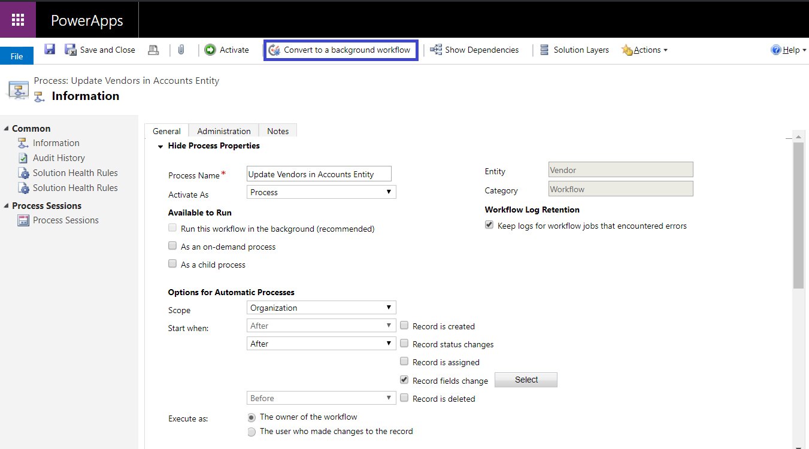

---
# required metadata

title: Switch between vendor designs
description: This topic describes how to switch between vendor data integration between Finance and Operations apps and Common Data Service.
author: RamaKrishnamoorthy 
manager: AnnBe
ms.date: 09/20/2019
ms.topic: article
ms.prod: 
ms.service: dynamics-ax-applications
ms.technology: 

# optional metadata

ms.search.form: 
# ROBOTS: 
audience: Application User, IT Pro
# ms.devlang: 
ms.reviewer: rhaertle
ms.search.scope: Core, Operations
# ms.tgt_pltfrm: 
ms.custom: 
ms.assetid: 
ms.search.region: global
ms.search.industry: 
ms.author: ramasri
ms.dyn365.ops.version: 
ms.search.validFrom: 2019-09-20

---

# Switch between vendor designs

[!include [banner](../../includes/banner.md)]

[!include [preview-banner](../../includes/preview-banner.md)]

## Vendor data flow 

If you choose to use the **Account** entity for storing vendor organizations and the **Contact** entity for storing vendor persons, then configure the following workflows. Otherwise this is not required.  

## Use the extended vendor design for vendors of type Organization

The **Dynamics365FinanceExtended** solution package contains these workflow process templates. You will create a workflow for each of these templates.

+ Create Vendors in Accounts Entity.
+ Create Vendors in Vendors Entity.
+ Update Vendors in Accounts Entity.
+ Update Vendors in Vendors Entity.

To create new workflow processes using the workflow process templates:

1. Create a new workflow process for the **Vendor** entity. Choose the **Create Vendors in Accounts Entity** workflow process template and click **OK**. This workflow handles the vendor creation scenario for the **Account** entity.

    

2. Create a new workflow process for the **Vendor** entity using the **Update Vendors in Accounts Entity** workflow process template and click **OK**. This workflow handles the vendor update scenario for the **Account** entity.

3. Create a new workflow process from the **Create Vendors in Vendors Entity** created on the **Account** entity.

4. Create a new workflow processes from the **Update Vendors in Vendors Entity** created on the **Account** entity.

5. You can configure the workflows as real-time or background workflows based on your requirements. To configure a background workflow, click **Convert to a background workflow**.

    

6. Activate the workflows that you created on the **Account** and **Vendor** entities to start using the **Account** entity for storing vendor information.

## Use the extended vendor design for vendors of type Person

The **Dynamics365FinanceExtended** solution package contains the following workflow process templates. You will create a workflow for each of these templates.

+ Create Vendors of type Person in Vendors Entity.
+ Create Vendors of type Person in Contacts Entity.
+ Update Vendors of type Person in Contacts Entity.
+ Update Vendors of type Person in Vendors Entity.

To create new workflow processes using the workflow process templates:

1. Create a new workflow process on the **Vendor** entity using the **Create Vendors of type Person in Contacts Entity** workflow process template and click **OK**. This workflow handles the vendor creation scenario for the **Contacts** Entity.
2. Create a new workflow process on the **Vendor** entity using the **Update Vendors of type Person in Contacts Entity** workflow process template and click **OK**. This workflow handles the vendor update scenario for the **Contacts** entity.
3. Create a new workflow process on the **Contact** entity using the **Create Vendors of type Person in Vendors Entity** template.
3. Create a new workflow process on the **Contact** entity using the **Update Vendors of type Person in Vendors Entity** template.
4. You can configure the workflows as real-time or background workflows based on your requirements. To configure a background workflow, click **Convert to a background workflow**.
5. Activate the workflows that you created on the **Contact** and **Vendor** entities to start using the **Contact** entity for storing **vendor of type Person** information.
