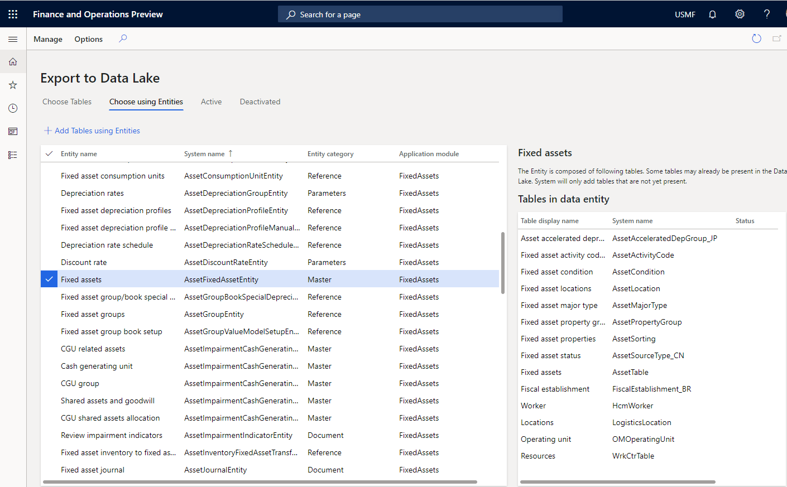
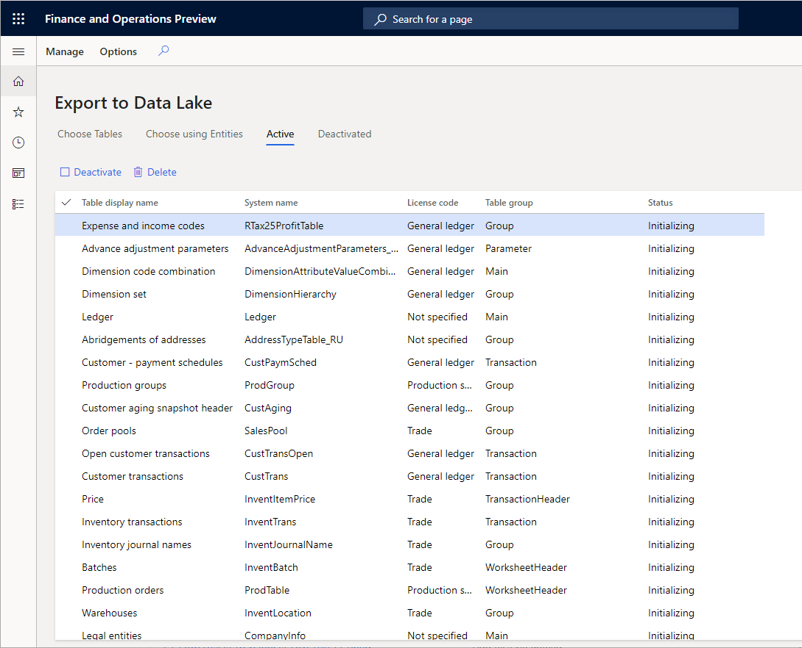

---
# required metadata

title: Finance and Operations apps data in Azure Data Lake
description: This topic explains how to configure your Finance and Operations apps environment so that it has a data lake.
author: MilindaV2
manager: AnnBe
ms.date: 06/10/2020
ms.topic: article
ms.prod: 
ms.service: dynamics-ax-platform
ms.technology: 

# optional metadata

# ms.search.form: 
# ROBOTS: NOINDEX, NOFOLLOW
audience: Developer, IT Pro
# ms.devlang: 
ms.reviewer: kfend
ms.search.scope: Operations

# ms.tgt_pltfrm: 
ms.custom: 96283
ms.assetid: 
ms.search.region: Global
# ms.search.industry: 
ms.author: milindav
ms.search.validFrom: 2020-03-01
ms.dyn365.ops.version: Platform Update 34

---

# Finance and Operations apps data in Azure Data Lake

[!include [banner](../includes/banner.md)]

> [!NOTE]
    > **Export to Azure Data Lake** feature may not be available in all regions and/or all environments supported by Finance and Operations. If you are not able to see the Export to Data Lake functionality in Life cycle services (LCS) or in Finance and Operations, this feature is not available in your environment at this point in time.
    > At this point, Export to Data lake feature is not available in developer (ie. Tier-1) environments. You need a cloud based Tier-2 or higher environment to enable this feature  
    > To make aggregate measurements available in a data lake, continue to use the feature in the manner that is described in [Make entity store available as a Data Lake](entity-store-data-lake.md).
 
 
**Export to Azure Data Lake** feature lets you copy data from Finance and Operations apps into your own Azure Data lake (Gen 2). System let's you choose Tables and Entities. After you choose the desired data, system will make an initial copy. After the initial copy, system keeps the chosen data upto date by applying changes, deletions and additions. There may be a delay of a few minutes between data changes in Finance and Operations and the time when the data is available in your data lake. 

Before you can use this feature, you need to **configure Export to Data lake**. For more information, see [Configure export to Azure Data lake](configure-export-data-lake.md).

## Turn on the Export Data to Azure Data Lake feature

As for all new features in Finance and Operations apps, an administrator must turn on the **Export to Azure Data Lake** feature before it can be activated.

- In the **Feature management** workspace, find and select the **Export Data to Azure Data lake** feature, and then select **Enable**.

After the feature is turned on, you should see the **Export to Azure Data Lake** option under **System administration**.

## Select data

You can select the tables and entities that should be staged in Data Lake.

1. In your environment, go to **System Administration** \> **Export to Azure Data Lake**.
2. Select **Configure Data feeds for export to Lake**.
3. On the **Configure data feeds to Data lake** page, on the **Choose Tables** tab, select the data tables that should be staged in Data Lake. You can search for tables by display name or system name. You can also see whether a table is already being synced. When you've finished, select **Add Tables** to add the selected tables to Data Lake.

    

4. Choose **Activate data feed** option (This option is activated by default) and select **ok**
5. The system may show the Status of this table as **Initializing** when you add the table. This means, the system is making an initial copy of data. When the initial copy is complete, the system changes the status to **Running**
6. In case of an error, the system shows the status **Deactivated**
6. You can consume data in the lake when you see the **Running** state. If you consume data in the lake while **Initializing** or **Deactivated** status, you may not see all the data. 

    If you aren't familiar with the specific tables that you require, you can select tables by using entities. Entities are a higher-level abstraction of data and might include multiple tables. By selecting entities, you're also selecting the tables that include them.
    
7. On the **Choose using Entities** tab, select entities, and then select **Add Tables using Entities**.

    
    
    Regardless of the method that you use to select tables, the tables will be staged in Data Lake.

## Monitor the tables in Data Lake

You don't have to monitor or schedule data exports, because the system keeps the data updated in Data Lake. However, you can view the status of ongoing data exports on the **Active** tab of the **Configure data feeds to Data lake** page.

## Troubleshooting common issues and error conditions
You may 

###Export to Data lake feature is not available
This feature is not available in developer (ie. Tier 1) environments. You need a sandbox environments (Tier 2 or higher) with platform update PU36 or higher.

This feature may not be available in all Azure regions where Finance and Operations is available or this feature may not be available for your environment. If you would like to get access to this feature, you can send a mail to the feature team at <..>. We will try and make this feature available soon

