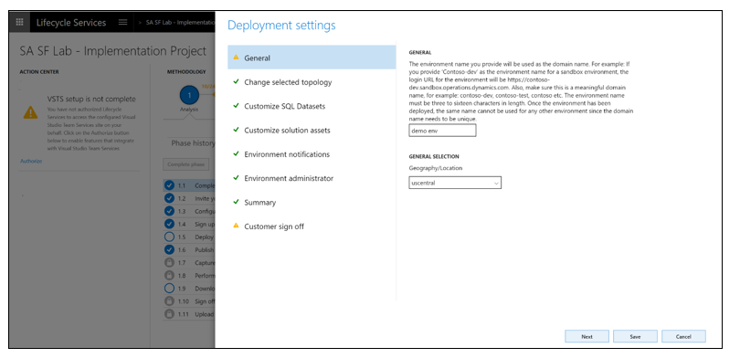
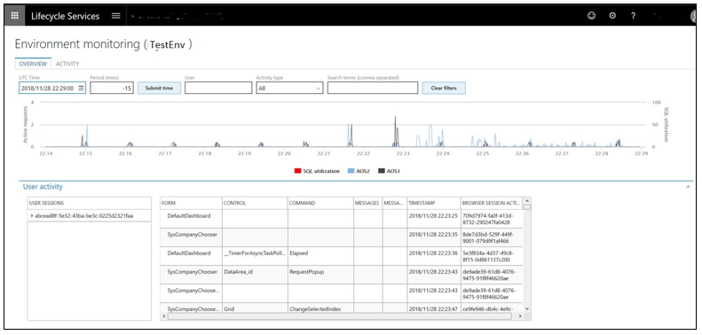

---
# required metadata

title: Self-service deployment overview
description: This topic provides an overview of self-service deployment.
author: sarvanisathish
manager: AnnBe
ms.date: 09/20/2019
ms.topic: article
ms.prod: 
ms.service: dynamics-ax-applications
ms.technology: 

# optional metadata

# ms.search.form:  [Operations AOT form name to tie this topic to]
audience: IT Pro
# ms.devlang: 
ms.reviewer: sericks
ms.search.scope: Operations
# ms.custom: [used by loc for topics migrated from the wiki]
ms.search.region: Global 
# ms.search.industry: 
ms.author: sarvanis
ms.search.validFrom: 2018-12-31
ms.dyn365.ops.version: 8.1.1

---

# Self-service deployment overview

[!include[banner](../includes/banner.md)]
[!include [banner](../includes/limited-availability.md)]

Self-service deployment is available for cloud environments. Self-service deployment enables easier deployment and significantly reduced deployment times.

> [!IMPORTANT]
> The functionality for this feature will be released incrementally, based on your Microsoft Azure country/region. However, this functionality is currently available only for **new customers** who are in the process of signing up for Finance and Operations apps. There is no change in existing environments for current customers.
>
> Note that not all new customers will see this functionality. However, the number of new customers who have access to it will gradually increase. 

## What’s new or changed

Customers using the self-service capabilities will see the following changes in their LCS experience. 

- Deployment is self-service and can be completed within an average time of 30 minutes. There are no longer lead times and wait times for deployment. You can control when you deploy, and verify that the environment is deployed. This experience is the same as the current experience. For more information, see [Self-service deployment FAQ](deploymentFAQ.md).

   

- You will no longer have remote desktop access to the Tier 2+ sandbox environments. All operations that need remote desktop access are now available as self-service actions. The following image shows some of the operations in the environment’s **Maintain** \> **Move database menu option**. For more information, see [Maintenance operations for deployments](maintenanceoperationsguide-newinfrastructure.md).

    > [IMPORTANT]
    > Remote desktop access will be restricted only to environments deployed using the self-service deployment. There is no change to existing environments or existing customers. 

   

- The diagnostics capabilities will remain the same, which enables troubleshooting without remote desktop access. For more information, see [Troubleshoot environments deployed through self-service deployment](troubleshoot-newinfrastructure.md). 

   

- You will not have SQL Server access on Tier 2+. You will continue to have SQL database access using just-in-time access.

- You will need to provide a combined deployable package for customizations. That is, all custom extension packages, including ISV packages, must be deployed as a single software deployable package. You will not be able to deploy one module at a time. This was always a recommended best practice and is now enforced.
