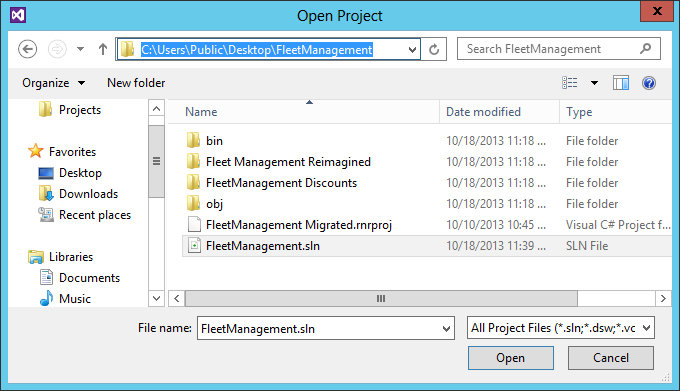
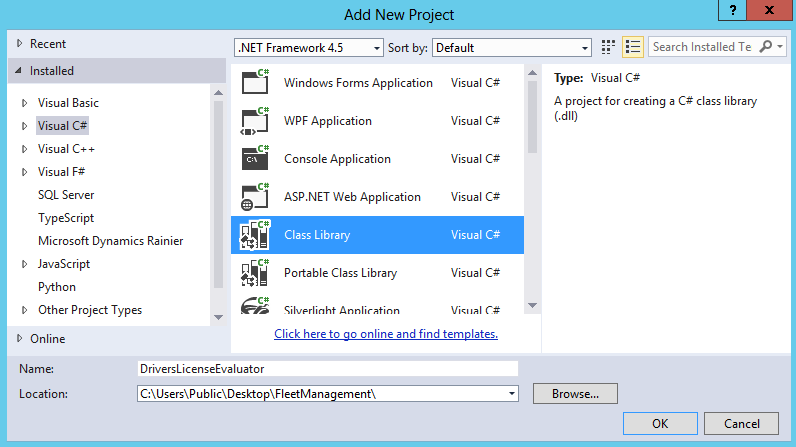
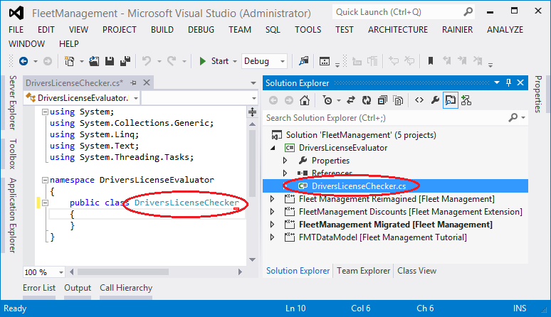
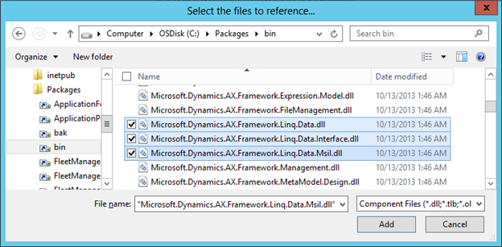
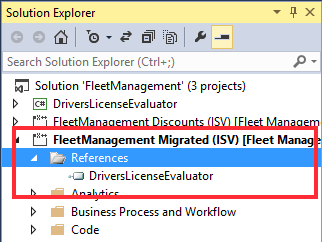
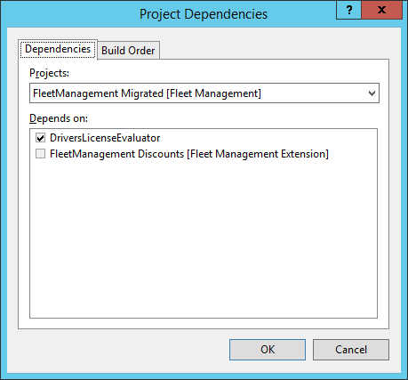
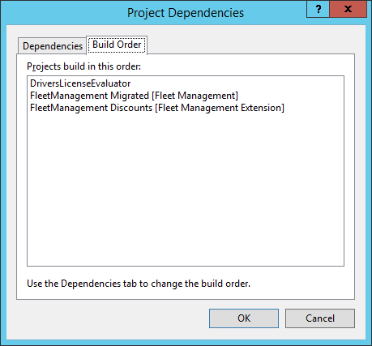
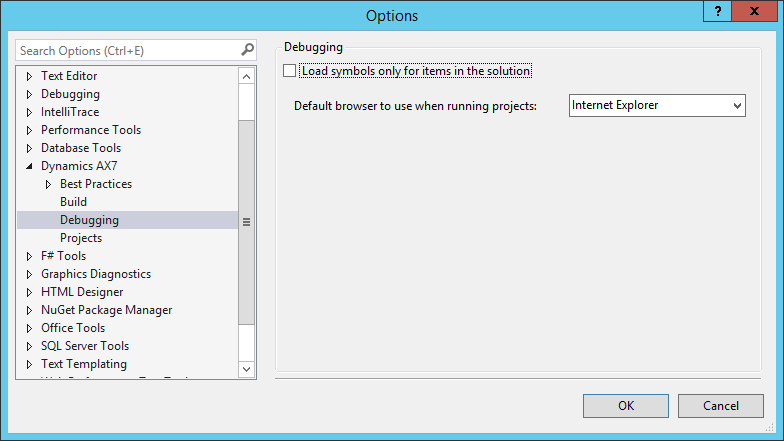
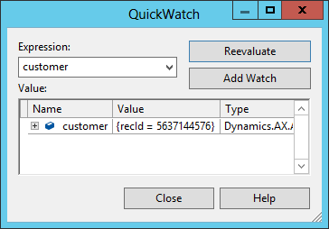

---
# required metadata

title: Write business logic by using C# and X++ source code
description: The primary goal of this tutorial is to illustrate the interoperability between C# and X++ in Microsoft Dynamics AX. In this tutorial, you’ll write business logic in C# source code and in X++ source code. 
author: pvillads
manager: AnnBe
ms.date: 11/26/2019
ms.topic: article
ms.prod: 
ms.service: dynamics-ax-platform
ms.technology: 

# optional metadata

# ms.search.form: 
# ROBOTS: 
audience: Developer
# ms.devlang: 
ms.reviewer: rhaertle
ms.search.scope: Operations
# ms.tgt_pltfrm: 
ms.custom: 26821
ms.search.region: Global
# ms.search.industry: 
ms.author: pvillads
ms.search.validFrom: 2016-02-28
ms.dyn365.ops.version: AX 7.0.0

---

# Write business logic by using C# and X++ source code

[!include [banner](../includes/banner.md)]

The primary goal of this tutorial is to illustrate the interoperability between C# and X++. In this tutorial, you’ll write business logic in C# source code and in X++ source code. 

In this tutorial, you’ll write business logic in C\# source code and in X++ source code. You'll get experience with the following:

-   New tools in Visual Studio.
-   The handling of events in C\#.
-   The use of Language Integrated Query (LINQ) in C\# to fetch data.

## Prerequisite
This tutorial requires that you access the environment using Remote Desktop, and be provisioned as an administrator on the instance. 

> [!NOTE]
> Debugging support for the C\# project does not work if the **Load symbols only for items in the solution** check box is selected. Since this option is selected by default, it must be changed prior to running the lab. In Visual Studio, click **Dynamics 365** &gt; **Options**, and clear the **Load symbols only for items in the solution** check box.

## Scenario
Too many cars have been rented to drivers who have a history of unsafe driving habits. The Fleet Management rental company needs to check driving records from external sources. Upper management has decided to subscribe to a service that is hosted by the Department of Transportation (DOT), which is the legal entity that manages drivers’ licenses and associated information. This service retrieves the number of citations for the given unique license number. It’s not easy to call external services directly from X++ source code. Visual Studio has tools for generating the “code-behind” (in C\#) that calls the services, and these tools make the development effort easy. The obvious choice would be to leverage Visual Studio to write the code. However, in this tutorial your code won’t actually call an external service, because the logistics are beyond the scope of the simple lab environment. Instead, we provide a mock implementation of a service call. The goal of this tutorial is to teach an understanding of the current state of C\# and of interoperability with X++.

## Create a C\# class library
You can create a reference from a project to the C\# class library, or to any other type of C\# project that generates an assembly. Such references affect the build order. The C\# project is built before the project that references and depends on it. The infrastructure understands the references, and will make sure that the C\# assemblies are deployed correctly to the cloud before execution. Follow these steps to create a C\# class library in the Fleet Management solution:

1.  In Visual Studio, click **File** &gt; **Open project/solution**.
2.  In the **Open Project** dialog box, in the **File name** text box, type the following path, and then press **Enter**: *C:\\users\\public\\desktop\\FleetManagement*.
3.  Select the file named FleetManagement.sln, and then click **Open**. If the solution file is not on your computer, the steps to create it are listed in [Tutorial: Create a Fleet Management solution file out of the Fleet Management models in the AOT](https://community.dynamics.com/ax/b/newdynamicsax/archive/2016/05/19/tutorial-create-a-fleet-management-solution-file-out-of-the-fleet-management-models-in-the-aot).

    [](./media/openproject_linqc2.png)

4.  Right-click the **FleetManagement** solution, and then click **Add** &gt; **New Project**. The **Add New Project** dialog is displayed.
5.  In the left pane, click **Visual C\#**, and then in the middle pane, click **Class Library**.
6.  At the bottom in the **Name** text box, type the name **DriversLicenseEvaluator**.
7.  In the **Location** text box, type the following directory path: *C:\\users\\public\\desktop\\FleetManagement*.
8.  Verify that your project is set to “.NET Framework 4.5” in the drop-down list at the top.
9.  Click **OK** to create the project. 

    [](./media/addnewproject_linqc2.png)

10. In **Solution Explorer**, under the DriversLicenseEvaluator project, right-click the file name Class1.cs and rename it DriversLicenseChecker.cs.
11. Click **Yes**, when prompted to rename all references to the class. 

    [](./media/renameclass_linqc1.png)

## Write a C\# method named CheckDriversLicense
In this section, you add C\# code for a method named CheckDriversLicense. The method must validate the driver’s license. To do this, the method must retrieve the driver’s license number, which is stored in the customer table. The method is given the RecId value for the customer record that contains the information required by the method. Your C\# code uses the LINQ provider to read from the customer table. For LINQ to work, you must first add references pointing to the LINQ assemblies. You add these references to the C\# project named DriversLicenseEvaluator.

1.  In **Solution Explorer**, expand the DriversLicenseEvaluator project node, right-click **References**, and then click **Add Reference**.
2.  Click **Browse** and then enter the following path: C:\\Packages\\bin

    Note that in some environments, the location of the packages folder is not on the c: drive.

3.  In the **File name** field, type the pattern \*LINQ\*.dll and then press **Enter**. You'll see a list of assemblies with the name LINQ in them. From that list, select the following files, and then click **Add**:
    -   Microsoft.Dynamics.AX.Framework.Linq.Data.dll
    -   Microsoft.Dynamics.AX.Framework.Linq.Data.Interface.dll
    -   Microsoft.Dynamics.AX.Framework.Linq.Data.Msil.dll

    [](./media/selectreferences_linqc1.png)
    
4.  You must also add the support assemblies that contain the Common type that you'll use in the code below. Click **Browse** again, and then type the following file name into the field:
    -   Microsoft.Dynamics.AX.Xpp.Support.dll
    -   Microsoft.Dynamics.AX.Data.Core.dll

5.  Click **Add**, and then click **OK**. The assemblies now appear under the references node in the project.
6.  Repeat the **Add Reference** process, except this time, add the following DLL file from the indicated path:
    -   Dynamics.Ax.FleetManagement.dll, in C:\\Packages\\FleetManagement\\bin

7.  In **Solution Explorer**, select the reference Dynamics.Ax.FleetManagement.dll reference and set the property **Copy Local = False**.
8.  In **Solution Explorer**, right-click **DriversLicenseChecker.cs**, and then click **View Code**.
9.  Add the following three using statements to the **DriversLicenseEvaluator** namespace, to reduce the verbosity of code that references external classes. using Dynamics.AX.Application; using Microsoft.Dynamics.AX.Framework.Linq.Data; using Microsoft.Dynamics.AX.Xpp; Your C\# code should now look something like the following example.

    ```C#
    using System;
    using System.Collections.Generic;
    using System.Linq;
    using System.Text;
    using System.Threading.Tasks;

    namespace DriversLicenseEvaluator
    {
        using Dynamics.AX.Application;
        using Microsoft.Dynamics.AX.Framework.Linq.Data;
        using Microsoft.Dynamics.Ax.Xpp;

        public class DriversLicenseChecker
        {
        }
    }
    ```

10. Replace the class CheckDriversLicense with the following code. 

    > [!TIP] 
    > If you prefer, you can paste in the code from the DriversLicenseChecker.cs file in the C:\\FMLab directory.

    ```C#
    public class DriversLicenseChecker
    {
        public static bool CheckDriversLicense(long customerId)
        {
            // Use LINQ to get back to the information about the license number
            FMCustomer customer;
            QueryProvider provider = new AXQueryProvider(null);
            var customers = new QueryCollection<FMCustomer>(provider);

            // Build the query (but do not execute it)
            var query = from c in customers 
                where c.RecId == customerId 
                select c;

            // Execute the query:
            customer = query.FirstOrDefault();
            if (customer == null)
            {
                throw new ArgumentException
                    ("The customerId does not designate a customer");
            }

            if (string.IsNullOrEmpty(customer.DriverLicense))
            {
                // No driver's license was recorded. Veto the rental.
                return false;
            }

            // Call the DOT web service to validate the license number.
            // This is not practical for this lab, because all the service providers
            // charge for this service. Instead, just assume that any license number
            // that contains the sequence "89" is valid.
            // In the demo data, this is true for Adrian Lannin,
            // but not for Phil Spencer.
            return customer.DriverLicense.Contains("89");
        }
    }
    ```

### Understand the LINQ code

Before proceeding with more C\# code, verify that you understand the LINQ code you just added. More details about LINQ are provided in the [Technical Concepts Guide](developer-home-page.md), so only the basics are described below.

-   First, a *provider* is created. It provides access to all the tables.
-   Next, a *collection* of all customers is created. The customer of interest is retrieved from this collection.
-   Then, a *query* is created with a where clause that designates the requested customer by **RecId**.
-   The call to the FirstOrDefault method forces execution of the query.
-   The method assigns the single matching customer to the customer variable. (Null is assigned if the RecId value matches no customer.)
-   Finally, the customer data is tested to see if the associated driver's license is valid. (Does the license contain "89"?)

## Handle the event when a record is added
The following subsections provide the following:

-   Explain the upcoming code items and their inter-relationships.
-   Show the code for an event handler.
-   Associate the handler with the event occurrences.

### Preparatory overview

When an attempt is made to add a record to a table, the OnValidateWrite event is raised before the record is written to the database. You want your CheckDriversLicense method to be called each time on the OnValidateWrite event is raised for the FMRental table. To do this, you now need to write a C\# method that is invoked by the event, and which calls your checkDriversLicense method. In other words, you need to write an event handler that calls your CheckDriversLicense method. The event handler method receives a parameter of the type, DataEventArgs. The event handler can set a value in the DataEventArgs structure to accept or reject the record. After you write your event handler method, you connect it to the event by assigning, or adding it to the OnValidatedWrite delegate that is a member of the FMRental table. You write this assignment in the init method of the data source of the FMRental form. This assignment to a delegate might seem odd. After all, we're modifying existing code (FMRental) to add handlers, which contradicts the main value proposition of loose coupling that eventing is supposed to offer. This assignment step is temporary. We'll eventually have the same story in C\# as we do in X++, where an attribute is applied to the C\# event handler as the mechanism that ties the delegate to the handler. 

> [!NOTE]
> The data source init method is called when the form is opened. Technically, the init method is inherited from the FormDataSource class.

### Write an event handler method

In C\#, write the following event handler method and add it to the DriversLicenseChecker class.

```C#
public static void OnValidatedWriteHandler(Common table, DataEventArgs args)
{
    var validateEventArgs = args as ValidateEventArgs;

    // Do not check if already rejected.
    if (validateEventArgs.parmValidateResult())
    {
        var rentalTable = table as FMRental;
        if (rentalTable == null)
        {
            throw new ArgumentNullException("table");
        }

        var result = CheckDriversLicense(rentalTable.Customer);
        validateEventArgs.parmValidateResult(result);
    }
}
```

Build the DriversLicenseEvaluator project by right-clicking the project node and then clicking **Build**.

### Add a reference pointing to the DriversLIcenseEvaluator project

Create a reference from the X++ project named **FleetManagement Migrated** to the C\# project named **DriversLicenseEvaluator**, by completing the following steps.

1.  Right-click the FleetManagement Migrated project, click **Add**, and then click **Reference**. Select the row for the DriversLicenseEvaluator project in the **Projects** references tab, and then click **OK**. 

    

2.  Under the FleetManagement Migrated project, expand the **References** node, and there you see new reference to the **DriversLicenseEvaluator** project.

    

#### Build sequence

Your C\# DriversLicenseEvaluator project will be built before the FleetManagement Migrated project is built. This is because the added reference makes the Fleet project dependent on your project. The build sequence is easy to see if you right-click the FleetManagement solution, click **Project Build Order**, and then click **Dependencies**.





### Add your event handler to a delegate

1.  In **Solution Explorer**, navigate to **FleetManagement Migrated &gt; User Interface &gt; Forms &gt; FMRental**.
2.  Double-click the **FMRental** form. The Visual Studio designer opens to the form.
3.  Expand the **Data Sources** node to show the data sources used in the form.
4.  Expand the **FMRental** data source, and then the **Methods** node to list the methods defined on the data source.
5.  Right-click **Methods**, and then click **Override &gt; init**. The list displays all of the methods on the data source that haven't yet been overridden. When you select **init**, this opens the file **FMRental.xpp** in the X++ code editor with the cursor near the template for the init method.
6.  At the end of the **init** method body, use the += operator to add one assignment to a delegate.

    ```xpp
    FMRental.onValidatedWrite += eventhandler
        (DriversLicenseEvaluator.DriversLicenseChecker::OnValidatedWriteHandler);
    ```

7.  Click to save, and then build the entire solution.

## Final test
In this section, you set breakpoints and run the Fleet application under the Visual Studio debugger. This enables you to prove the following:

-   Your LINQ query runs when the OnValidateWrite event is raised.
-   Your LINQ query successfully retrieves the data for one customer.

### Prepare the test

1.  In **Solution Explorer**, navigate to **FleetManagement Migrated &gt; User Interface &gt; Forms.**
2.  Right-click **FMRental**, and then click **Set as Startup Object**.
3.  In the code editor for DriversLicenseChecker.cs, find the OnValidateWriteHandler method. Find the following line of code.

    ```xpp
    var result = CheckDriversLicense(rentalTable.Customer);
    ```
    
4.  Set a breakpoint on that line of code. You do this by clicking in the left margin at that line. A red dot displays when the breakpoint is set.
5.  In the CheckDriversLicense method, set another breakpoint at the following line.

    ```C#
    if (string.IsNullOrEmpty(customer.DriverLicense))
    ```
### Run the test

For this test, we'll be debugging the C\# code that we've written. To do this, we need to inform Visual Studio to load the symbols for the assembly that contains the C\# code. Go to **Dynamics 365 &gt; Options &gt; Debugging** and verify that the **Load symbols only for items in the solution** check box is not selected. 



> [!TIP] 
> If you're unable to get to the breakpoint in the C\# code, you may want to open the **Modules** window (**Debug &gt; Windows &gt; Modules**), find the C\# module and load it explicitly.

1.  Click **Debug &gt; Start Debugging**. This starts the Fleet application, and a browser window with the **FMRental** form is displayed.
2.  Click on any **Vehicle rental ID** to view details.
3.  Click the **Edit** icon near the top left of the form. The icon looks like a pencil.
4.  In the **To** field of the **Rental** section, increase the date by one day.
5.  Click the **Save** button. This causes the focus to shift to Visual Studio at your highlighted breakpoint. This line shows that the OnValidatedWrite event was raised, and that your handler method was called.
6.  Press **F5** to continue the run. Instantly, your other breakpoint becomes highlighted.
7.  Find the variable customer a few lines above your breakpoint.
8.  Right-click the customer variable, and then click **QuickWatch**. Any long integer value proves that your LINQ query worked. 

    

9.  Press **F5** to complete the **Save** operation.

