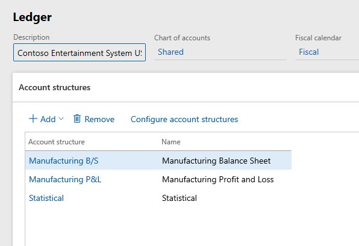
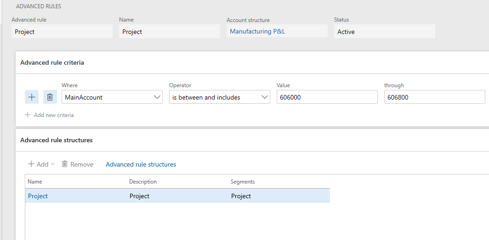
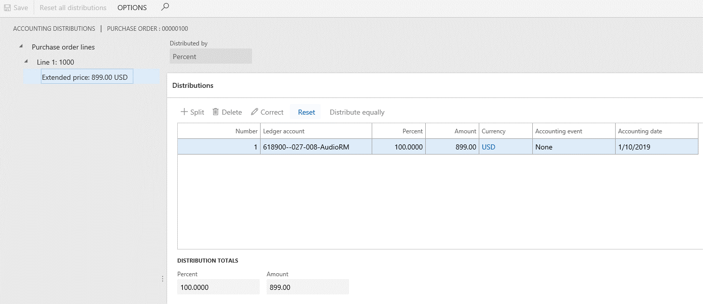
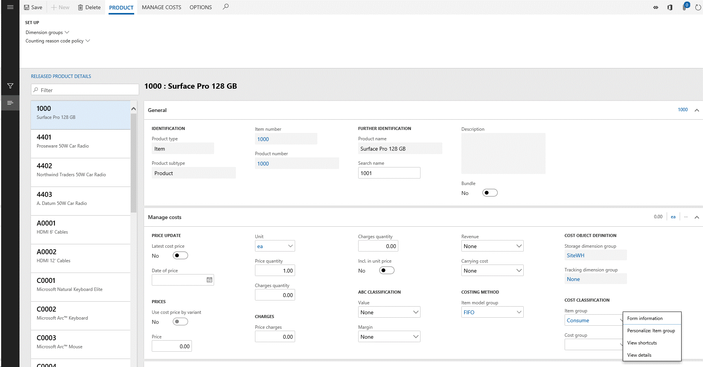
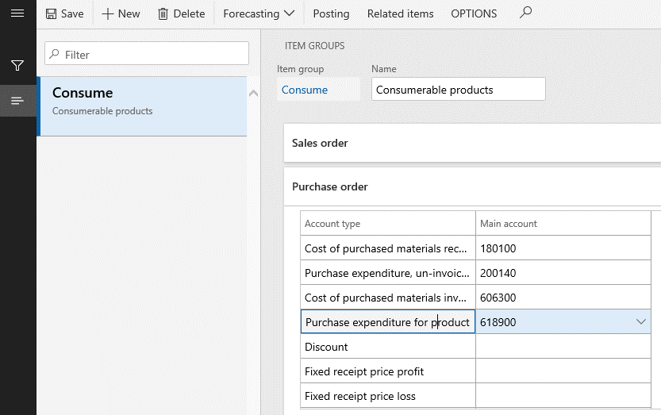

---
# required metadata

title: Default financial dimensions
description: This topic describes default financial dimensions. It explains where the dimensions originate, the APIs that are used to merge them, and how they are used to create ledger dimensions.
author: jasonsto
manager: annbe
ms.date: 10/02/2019
ms.topic: article
ms.prod: 
ms.service: dynamics-ax-platform
ms.technology: 

# optional metadata

# ms.search.form: 
# ROBOTS: 
audience: Developer
# ms.devlang: 
ms.reviewer: rhaertle
ms.search.scope: Operations
# ms.tgt_pltfrm: 
# ms.custom: 
# ms.assetid: 
ms.search.region: Global
# ms.search.industry: 
ms.author: rbrow
ms.search.validFrom: 2019-01-16
ms.dyn365.ops.version: AX 7.0.0

---
# Default financial dimensions
[!include [banner](../includes/banner.md)]

This topic explains default financial dimensions for developers. It explains where the dimensions originate, the application programming interfaces (APIs) that are used to merge them, and how they are used to create ledger dimensions. The topic includes examples that show the user interface (UI), SQL table queries, and the output of those queries. It also includes some explanation of APIs and examples of how they are used.

This topic uses examples from the **USMF** demo data company.

For conceptual information about financial dimensions and how they affect business processes, see [Financial dimensions](../../../finance/general-ledger/financial-dimensions.md).

### Entering default dimensions

More than 250 pages let you enter default financial dimensions. The dimensions are shown on a FastTab that lists them together with values and descriptions. In standard demo data, more than 30 dimensions are available. However, the following example of a **Financial dimensions** FastTab shows just five dimensions: BusinessUnit, CostCenter, Department, ItemGroup, and Project. 


### Dimensions list

The dimensions are first filtered based on the list of all active account structures that are associated with the ledger of the current company or the company that is specified on the page. Next, a union of all the dimensions in those account structures, plus all active advanced rules that are associated with those structures, is obtained. 


### Ledger page

On the **Ledger** page (**General Ledger \> Setup \> Ledger**), you can maintain the account structures for a company. 



### Account structures where the number of dimensions varies

To determine how many dimensions an account structure uses, select it on the **Ledger** page, select **Configure account structure** above the grid, and then count the columns. The following illustrations show one account structure that uses three dimensions and another account structure that uses five dimensions.

**Account structure that uses three dimensions**


**Account structure that uses five dimensions**


Between the two account structures that are shown in the preceding illustrations, there are four unique dimensions: BusinessUnit, Department, CostCenter, and ItemGroup. These four dimensions will appear in the list of default dimensions. In addition, dimensions from advanced rule structures that are linked to the account structures through advanced rules are examined. In this example, the examination of dimensions from advanced rule structures causes a fifth dimension, Project, to be added to the list of default dimensions.

The following illustration shows the advanced rule that causes the Project dimension to be included in the list of default dimensions.



The following illustration shows the rule structure.


Note that the MainAccount dimension isn't shown in most lists of default dimensions. However, Budgeting is the exception. It does explicitly include the MainAccount dimension in the list of default dimensions.

### API for the list of default dimensions

The default dimension controller, **DimensionDefaultingController**, uses the **DimensionCache::getDimensionAttributeSetForLedger()** API to determine which dimensions are applicable to a company.

## Control uptake and storage

### Form uptake and the dimensions data model

All pages that show default dimensions use the **DimensionDefaultingController** controller. This controller automatically shows dimensions, and loads and saves values and user interactions. For information about these uptake patterns, see the [Implementing the Account and Financial Dimensions Framework for Microsoft Dynamics AX 2012 Applications](https://go.microsoft.com/fwlink/?linkid=213133) white paper.

### Storage of default dimension values

The values that are associated with the dimensions are stored in a table that is separate from the primary table that references those dimension values. For example, the LedgerJournalTable table has a **DimensionDefault** column that holds a foreign key reference to a record in the DimensionAttributeValueSet table. This record is the parent record that represents the set of values that is shown.


Each value is stored as a separate row in the DimensionAttributeValueSetItem table and has the same parent record foreign key.


The data can be queried directly through these tables. Alternatively, it can be queried by using **DimensionAttributeValueSetItemView**, as shown in the following illustration.


### Empty values

The dimension framework stores rows only for dimensions that a value has been entered for. No data is stored for empty rows. Therefore, after data is persisted, the framework can't distinguish a dimension that didn't have a value from a dimension that did have a value, but it was cleared by a user. To save an empty value, you must create a real value and give it a name that indicates that it's empty. For example, name it **empty**, **n/a**, **\<cleared\>**, or **\*blank\***. Users can then select this value at entry time to affect the defaulting behavior as they desire.

### Immutable data

Like most dimension data, the records that are inserted into the tables that were mentioned earlier are immutable. They are initially written, but then never subsequently updated or deleted. For example, a user adds a project ID as a dimension and then saves the change.


In this case, the SQL query will still return the same three rows as shown previously even though a new row was added. When a new value was added the dimension framework created a new value set record and four additional value set item records that are linked to the new value set rather than change the previous dimension set.

 output for all default dimension values in the new set")

## Copy patterns

This section explains how default dimensions are copied between entities.

### Copy vs. merge

Default dimensions are typically copied or merged with other dimension combinations to create ledger account dimensions. The dimension framework doesn't set the precedence for defaulting behavior. Each page or process determines the precedence, based on the requirements of its business logic.

A hypothetical order document will serve as the basis for the examples that follow. This document might be a customer sales order that contains services as line items. Alternatively, it might be a vendor purchase order that contains inventory items as line items. Default dimensions can be entered or overridden at various points in the processing, as the following illustration shows.


For an order document, multiple default dimensions are available for the business logic to consider. The document header might have a set of default dimensions, as in the case of the purchase order that is used in this example. The customer or, in this example, the vendor for the order also has a set of default dimensions. Depending on the business logic of the order, these various sets of default dimensions might have different precedence when they are combined. Some default dimensions might have higher precedence and replace other default dimensions. However, some default dimensions might be merged together.

### Copying default dimensions

The following illustration shows a default dimension that is entered on a specific vendor account.


The following illustration shows the SQL query for the default dimension reference on the vendor record.


The following illustration shows the default dimension that is created.


The following illustration shows a new purchase order that is created for this vendor. The default dimension is copied to the document header.

")

The following illustration shows the SQL query and default dimension reference on the header record. 


As the following illustration shows, as soon as a vendor is selected, the dimensions from the vendor replaces any dimensions that were already on the purchase order header.


Therefore, the default dimension foreign key just had to be copied. The following illustration shows the code that is used to copy default dimensions from the vendor to the purchase order.


The following illustration shows the header dimensions after a user enters a value for the Project dimension. 

")

The following illustration shows the SQL query for the default dimension reference on the header record.


The following illustration shows the default dimension that is created.


When the user switches to the **Line** view to enter lines, default dimensions are copied from the purchase order header, as the following illustration shows.

")

The following illustration shows the code that is used to copy the foreign key reference to the line. In this case, the line hasn't yet been saved. Therefore, the default dimension foreign key appears only in the table buffer in memory.


## Merging patterns

This section explains how default dimensions are merged between entities.

### Merging default dimensions

In the following illustration, the user has manually cleared the BusinessUnit dimension on the line. Therefore, a new default dimension foreign key is created, and the purchase order header is updated. 

")

Because the header hasn't yet been saved, the updated foreign key appears only in the table buffer in memory. However, as the following illustrations show, the new default dimension can be queried and found.


Now consider the item that the user will enter on the purchase order line. The following illustration shows the default financial dimensions on the released product.


The following illustration shows the SQL query for those default dimensions in the database.


The following illustration shows the results of the query.


Next, the user enters the item on the purchase order line. The following illustration shows the item selected on the purchase order line and the resulting default dimensions. In this case, the default dimension values were merged by the purchase order logic.


The following illustrations show the SQL query and the resulting default dimensions from the item record on the purchase order line.

[](./media/DefaultDimension4-6SQLOnItem.png)

[](./media/DefaultDimension4-6SQLResultOnItem.png)

When the item is specified for a purchase order line, the purchase order logic merges the default dimensions from three different sources. Consider the following information:

- Default dimensions on the order header are merged with default dimensions on the order line to yield "merged result 1" default dimensions.

    |                  | Order line | Order header | Merged result 1 | Description |
    |------------------|------------|--------------|-----------------|-------------|
    | **BusinessUnit** |            |              |                 | The value is blank in both sources. |
    | **CostCenter**   |            |              |                 | The value is blank in both sources. |
    | **Department**   |            | 027          | 027             | The value is blank on the order line. Therefore, the value is copied from the order header. |
    | **ItemGroup**    |            |              |                 | The value is blank in both sources. |
    | **Project**      | 000003     | 000003       | 000003          | The value is the same in both sources. |
    | **Foreign key**  | \*\*6190   | \*9574       | \*9574          | The merged result uses the same record as the order header. |

- Default dimensions on the item are merged with the "merged result 1" default dimensions to yield default dimensions on the final order line ("merged result 2" default dimensions). The following table shows the logical steps of the merge that occurs. However, these steps are combined during execution by using the APIs that the dimension framework provides.

    |                  | Merged result 1 | Item     | Merged result 2 | Description |
    |------------------|-----------------|----------|-----------------|-------------|
    | **BusinessUnit** |                 |          |                 | The value is blank in both sources. |
    | **CostCenter**   |                 | 008      | 008             | The value is blank in the header line merged result. Therefore, the value is copied from the item. |
    | **Department**   | 027             | 023      | 027             | The value is set in the header line merged result. Therefore, the item is skipped. |
    | **ItemGroup**    |                 | AudioRM  | AudioRM         | The value is blank in the header line merged result. Therefore, the value is copied from the item. |
    | **Project**      | 000003          |          | 000003          | The value is set in the header line merged result. |
    | **Foreign key**  | \*6190          | \*\*0324 | \*\*0325        | A new record ID is used for the merged result. |

The following illustration shows the code that is required in order to merge the dimensions from the three sources.

[](./media/DefaultDimension4-8CodeToMerge.png)

## Creating ledger dimensions

This section explains how default dimensions can be merged to create new ledger dimensions.

Default dimensions provide values that will be used later to create ledger account combinations that are used in journals and accounting distributions. According to the definition in the [Ledger account combinations series of blog posts](https://blogs.msdn.com/b/ax_gfm_framework_team_blog/archive/2013/02/15/ledger-account-combinations-part-5-_2800_ledger-dimensions_2900_-.aspx), a ledger account combination is just a set of MainAccount and dimension values that structure and order are applied to.

Default dimensions provide all the dimensions, except MainAccount, that are required for a ledger account combination. Default dimensions can be combined with a default account, or they can be combined another ledger dimension to produce a ledger dimension.

The following illustrations show an example where accounting distributions are being done from the purchase order line. The user selects **Financials \> Distribute amounts** from the purchase order line to open the **Accounting distributions** page. On that page, a default ledger account combination, **618900--027-008-AudioRM**, is already entered.

[](./media/DefaultDimension5-1AccountingDistributions.png) 

[](./media/DefaultDimension5-1AcctDistForm.png)

The values for the Project, CostCenter, ItemGroup, and Department dimensions have been filled in to the accounting distrobution. Additionally, the default MainAccount value from the posting item group has been entered on the item as the purchase expenditure for expense account for a purchase order, as the following illustration shows. The project isn't shown because it isn't part of the applicable account structure.

[](./media/DefaultDimension5-1SourceofMainAccountOnPO.png) 

[](./media/DefaultDimension5-1SourceOfMAonPO2.png) 

The following illustrations show the query and the resulting default account source.


The following illustration shows the code that is required in order to merge the default dimension on the purchase order line with the default account from the item group. 


After the merge is completed, a new ledger account combination is created, as the query in the following illustration shows. This behavior resembles the behavior when default dimensions are merged with each other.


## Common pattern APIs

This section describes the APIs that are used for the most common defaulting patterns.

### Default dimension APIs

The **DimensionDefaultFacade** and **LedgerDimensionDefaultFacade** classes provide the APIs that are required for defaulting scenarios. The **LedgerDimensionFacade** class contains methods for working with ledger dimensions. The methods are highly optimized for performance.

### Default dimensions

#### serviceMergeDefaultDimensions()

The **serviceMergeDefaultDimensions()** API is the most frequently used API for default dimensions. It should be called whenever a new default dimension must be created from two to four other default dimensions. If more than four default dimensions must be merged, this API can be called multiple times. In this case, the result of the previous call should be used as the first parameter for each subsequent call. This method will blindly merge all values, regardless of whether they are valid.

**Example: DimensionDefaultFacade::serviceMergeDefaultDimensions()**

```
public static DimensionDefault serviceMergeDefaultDimensions(
    DimensionDefault _value1,
    DimensionDefault _value2,
    DimensionDefault _value3 = 0,
    DimensionDefault _value4 = 0)
```

#### serviceReplaceAttributeValue()

The **serviceReplaceAttributeValue()** API is useful if a single dimension value must be copied from one default set to another default set. The specified value will replace whatever value already exists in the source set.

**Example: DimensionDefaultFacade::serviceReplaceAttributeValue()** 

```
public static DimensionDefault serviceReplaceAttributeValue(
    DimensionDefault _target,
    DimensionDefault _source,
    RecId _dimensionAttributeId)
```

#### serviceMergeValidDefaultDimensions()

The **serviceMergeValidDefaultDimensions()** API is useful if you want the merge to merge only values that are valid for the current ledger. It works just like **serviceMergeDefaultDimensions** but includes a check for valid values.

**Example: DimensionDefaultFacade::serviceReplaceAttributeValue()** 

```
public static DimensionDefault serviceMergeValidDefaultDimensions(
    DimensionDefault _defaultDimension1,
    DimensionDefault _defaultDimension2,
    DimensionDefault _defaultDimension3 = 0,
    DimensionDefault _defaultDimension4 = 0)
```

### Ledger dimensions

#### serviceCreateLedgerDimension()

The **serviceCreateLedgerDimension()** API is the most frequently used API for ledger dimensions. It should be called whenever a new ledger account combination must be created from a default account or an existing ledger account combination and zero to three default dimensions. If more than three default dimensions must be merged, this API can be called multiple times. In this case, different sources take the result of the previous call as the first parameter for each subsequent call. The MainAccount dimension is retrieved only from the ledger dimension that is supplied.

**Example: LedgerDimensionFacade.serviceCreateLedgerDimension()**

```
public static LedgerDimensionAccount serviceCreateLedgerDimension(
    RecId            _ledgerDimensionId,
    DimensionDefault _dimensionDefault1 = 0,
    DimensionDefault _dimensionDefault2 = 0,
    DimensionDefault _dimensionDefault3 = 0)
    {
```

#### serviceCreateLedgerDimensionForType()

The **serviceCreateLedgerDimensionForType()** API resembles the **serviceCreateLedgerDimension()** API. However, instead of creating a ledger account combination, it can create other ledger dimension types, such as budget accounts or budget planning accounts. The **LedgerDimensionType** parameter is used to specify the type of ledger account that is created.

**Example: LedgerDimensionFacade.serviceCreateLedgerDimensionForType()**

```
public static LedgerDimensionBase serviceCreateLedgerDimensionForType(
    LedgerDimensionType _ledgerDimensionType,
    LedgerDimensionBase _ledgerDimensionId,
    DimensionDefault    _dimensionDefault1 = 0,
    DimensionDefault    _dimensionDefault2 = 0,
    DimensionDefault    _dimensionDefault3 = 0)
```

#### serviceCreateLedgerDimForDefaultDim()

The **serviceCreateLedgerDimForDefaultDim()** API resembles the **serviceCreateLedgerDimension()** and **serviceCreateLedgerDimensionForType()** APIs, but the values from the default dimension are copied directly to the new ledger dimension, whereas the dimension values from the ledger dimension are merged afterwards. (By contrast, for the previous two APIs, the ledger dimension values were copied, and the default dimension values were merged.)

**Example: LedgerDimensionFacade::serviceCreateLedgerDimForDefaultDim()**

```
public static LedgerDimensionBase serviceCreateLedgerDimForDefaultDim(
    DimensionDefault    _defaultDimension,
    LedgerDimensionBase _ledgerDimensionId)
```

#### serviceLedgerDimensionFromLedgerDims()

The **serviceLedgerDimensionFromLedgerDims()** API resembles the previous APIs, but it uses only ledger dimensions as sources to construct a new ledger dimension. The main account is retrieved only from the first ledger dimension.

**Example LedgerDimensionFacade::serviceLedgerDimensionFromLedgerDims()**

```
public static LedgerDimensionAccount serviceLedgerDimensionFromLedgerDims(
    LedgerDimensionBase _ledgerDimensionId1,
    LedgerDimensionBase _ledgerDimensionId2 = 0,
    LedgerDimensionBase _ledgerDimensionId3 = 0,
    LedgerDimensionBase _ledgerDimensionId4 = 0,
    LedgerDimensionBase _ledgerDimensionId5 = 0)
```

#### serviceMergeLedgerDimensions()

The **serviceMergeLedgerDimensions()** API resembles the **serviceLedgerDimensionFromLedgerDims()** API, but it's optimized to combine just two ledger dimensions. 

**Example: LedgerDimensionFacade::serviceMergeLedgerDimensions()**

```
public static LedgerDimensionBase serviceMergeLedgerDimensions(
    LedgerDimensionBase _ledgerDimension1,
    LedgerDimensionBase _ledgerDimension2,
    LedgerDimensionType _ledgerDimensionType = LedgerDimensionType::Account)
```

#### serviceCreateLedgerDimFromLedgerDim()

The **serviceCreateLedgerDimFromLedgerDim()** API is useful if you want to copy ledger dimensions from a historic posted document to a new unposted document, and you want to make sure that the current account structure configuration is used. In this way, you help prevent validation errors when the new ledger dimensions are validated during posting.

**Example: LedgerDimensionFacade::serviceCreateLedgerDimFromLedgerDim()**

```
public static LedgerDimensionAccount serviceCreateLedgerDimFromLedgerDim(LedgerDimensionAccount _ledgerDimension)
```
