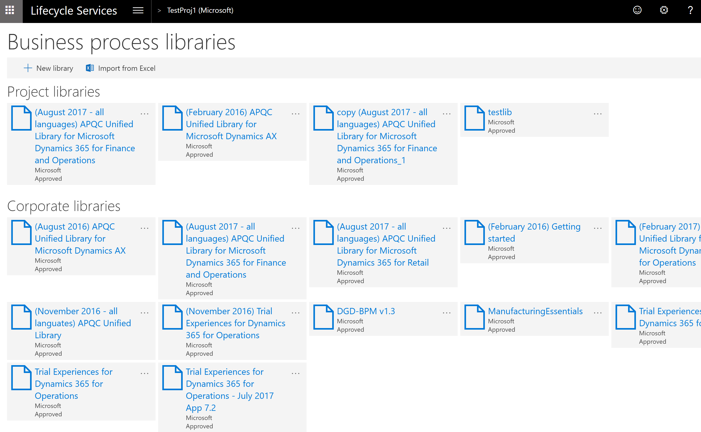
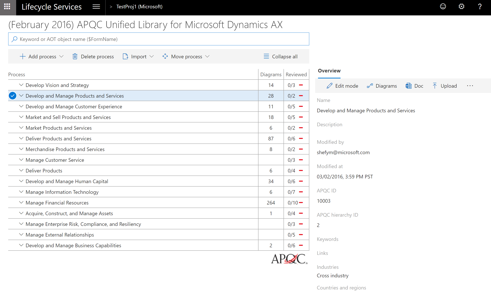
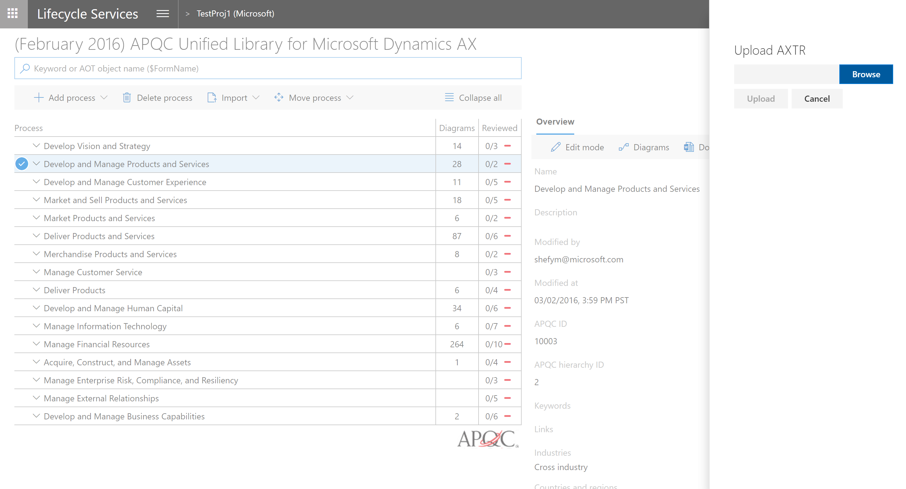
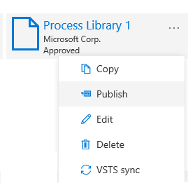

# Complete tasks in Business process modeler (BPM)

[!include [banner](../includes/banner.md)]

## Upload a task recording

1. In Microsoft Dynamics Lifecycle Services (LCS), in your project, on the **Business process libraries** page, select the library to upload the task recording to.

    

2. Select the process to upload the task recording to. 

    

3. From the Overview pane, select **Upload**. Select **Browse** to find and select the file to upload, and then select **Upload**.

    
    
## Download a task recording

You can download a task recording (AXTR file) that has been uploaded to a BPM process. 

1. In your LCS project, on the **Business process libraries** page, select the library to download the task recording.

2. Select the process to that has a the task recording uploaded. 

3. From the Overview pane, click **Download** to save the task recording (AXTR). 

    
    
## Export a methodology to Word

1. In your LCS project, on the **Business process libraries** page, select the library to export.
2. Select the process to export, and then, in the right pane, select **Doc** to begin the download.

    > [!NOTE]
    > The methodology will begin from the process step that you selected.

## Publish a BPM library

- In your LCS project, on the **Business process libraries** page, on the tile for the library that you want to copy, select the ellipsis button (…), and then select **Publish**.

    

## Distribute a BPM library

When you distribute a BPM library, the library will be available to all users who are a part of your organization. In other words, it will be available to all users who sign in to LCS by using your organization's domain (for example, all users who have an @contoso.com account).

1. Ask the customer to invite you to his or her project.
2. Sign in to the customer's LCS project by using your organization's account.
3. On the **Business process libraries** page, copy the library from the **Corporate libraries** pane to the customer's project.
