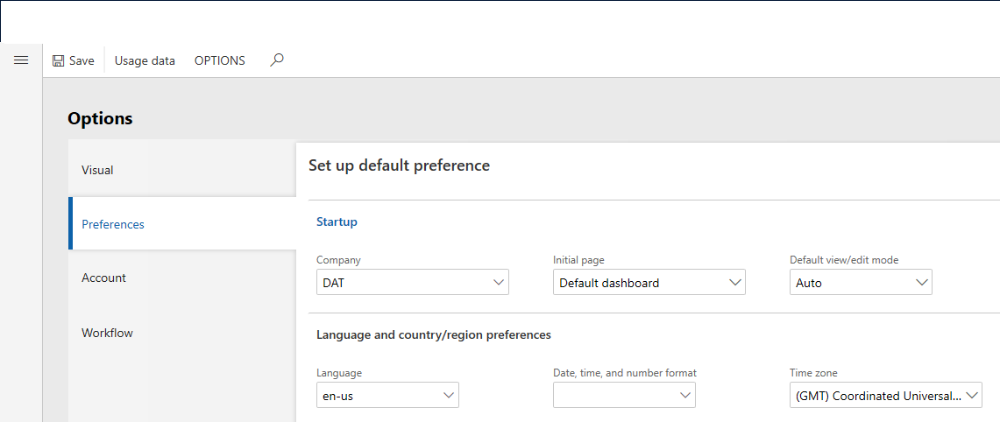
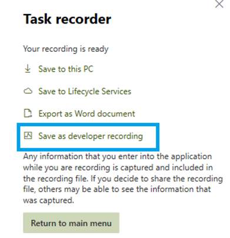

---
# required metadata

title: Regression suite automation tool best practices
description: This topic describes how to use the Regression suite automation tool (RSAT)/Task recorder to record client functions.
author: robadawy
manager: AnnBe
ms.date: 08/01/2019
ms.topic: article
ms.prod: 
ms.service: dynamics-ax-platform
ms.technology: 

# optional metadata

# ms.search.form: 
# ROBOTS: 
audience: Developer
# ms.devlang: 
ms.reviewer: rhaertle
ms.search.scope: Operations
# ms.tgt_pltfrm: 
ms.custom: 21631
ms.search.region: Global
# ms.search.industry: 
ms.author: robadawy
ms.search.validFrom: 2019-08-01
ms.dyn365.ops.version: AX 7.0.0

---

# Regression suite automation tool best practices

[!include [banner](../../includes/banner.md)]

This topic describes how to use the Regression suite automation tool (RSAT)/Task recorder to record client functions.

## Authoring test cases using the Task recorder

When authoring task recordings for RSAT, follow these practices:

1. Make sure all your recordings start on the main dashboard.
2. Keep individual recordings short and focus on a business task performed by one user, like creating a sales order. This simplifies maintainability and reusability of test cases.
3. Chart controls are not supported. Any task recording actions related to charts will be ignored by RSAT during test case playback.
4. When creating a recording make sure to select a tab header even if the tab is already open. For example, you can switch to another tab and then select the needed tab again to activate it before using a control on it. This will make your recording more reliable during test case playback.
5. RSAT cannot play back any test step that is not recognized by the task recorder. For example, you cannot upload a file from the local disk during play back of a test case.
6. RSAT cannot play back a **page refresh** step. Avoid refreshing a page while recording your test.

## Using the Regression suite automation tool 

1. Upon opening the tool for the first time, select **Settings** and ensure that you have all the needed settings. 
2. Before installing a new version of the tool, it is recommended to close and uninstall the previous version. 
3. When you install a new version of the tool, regenerate **all** test execution files.
 
    

    It is not necessary to regenerate Microsoft Excel parameter files unless you want to take advantage of new features available in a newer format of parameter files.

4. For test parameters that need a unique value, for example, the product receipt number in the **Product Receipt** form or the invoice number in the **Vendor Invoice** form, use the **RandBetween(a,b)** Excel function to generate a unique number every time the test case is executed.
5. The default values in Excel come from the task recording. For **Reference Group** controls such as storage dimensions or tracking dimensions, it stores the key of the lookup instead of the value, for example, **2** instead of **SiteWH**. We recommend that you update these fields with the actual value in Excel so that the test is more robust and resilient to changes.
6. It is recommended to set the same locale for **Language** and **Date ,time, and number format** settings of your environment prior to running RSAT. If these values are inconsistent, it may result in validation errors.  

  
   

## Management of local recording files

RSAT relies on Azure DevOps to store and manage test recording files (aka task recordings). When RSAT loads a
test plan from Azure DevOps, associated files are downloaded to the current **working directory** (defined in RSAT
settings) on your local machine.
As of version 1.200.42264.6, managing local recording files has become simpler. You can make changes in Task
recorder and test them with RSAT without going through BPM or Azure DevOps. Using task recorder, when you
complete authoring or modifying a recording, save it as a developer recording directly on your local disk.

Place the recording file under the working directory associated with the test case. For example, if your configured working directory is C:\Users\<username>\Documents\RSAT the recording file for test case 1234 will be located under C:\Users\<username>\Documents\RSAT\1234\attachments. You must name the developer recording file **Recording.xml**. Alternatively, you can name the recording file **-Test Case Title-.xml**, where -Test Case Title- is the DevOps title of the test case.

This is an example working directory folder structure. You can open this directory directly from RSAT by clicking the folder icon.

Each test case has its own folder, named after the ID of the test case. Test case attachments (recording files, automation files and Excel parameter files) are downloaded into attachments folder. Here’s an example: 

The generatorLogs directory contains logfiles and does not have any user modifiable files. It can be ignored unless you are specifically asked to provide logfiles from this directory by RSAT support.

### Commit a recording file to Azure DevOps
When a recording is tested and finalized, use RSAT to upload it and commit it to Azure DevOps. The upload button has two options “Upload automation files” or “Upload recording file”. The second option will only upload your recording file to Azure DevOps.

NOTE:
-	If you are on a version of RSAT older than 1.200.37255.0 and upgrade to the latest version, you will need to reload your test cases from Azure DevOps to download them into the correct directory. Unless you reload, RSAT will fail with a “file not found” error.
-	If you are working across several DevOps projects, it is recommended that you use a different working directory for each project. This is to prevent attachment files from multiple projects getting co-mingled in the same directory structure.

## How to modify a Task recording

If you want to modify an existing task recording, note these best practices. 

In the web client, open the Task recorder pane and start editing the recording using the **Edit Recording** option.

  
When you finish editing, play it back in the client and verify that all the steps work correctly.

 
After playing back an edited recording (Playback is required), save it. It is then ready to be used by RSAT.

