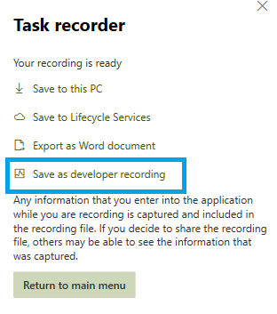

---
# required metadata

title: Regression suite automation tool
description: The Regression suite automation tool lets you record business tasks using the task recorder and convert them into a suite of automated tests without the need to write source code.
author: robadawy
manager: AnnBe
ms.date: 08/01/2019
ms.topic: article
ms.prod: 
ms.service: dynamics-ax-platform
ms.technology: 

# optional metadata

# ms.search.form: 
# ROBOTS: 
audience: Developer
# ms.devlang: 
ms.reviewer: rhaertle
ms.search.scope: Operations
# ms.tgt_pltfrm: 
ms.custom: 21631
ms.search.region: Global
# ms.search.industry: 
ms.author: robadawy
ms.search.validFrom: 2019-08-01
ms.dyn365.ops.version: AX 7.0.0

---

# Regression Suite Automation Tool

[!include [banner](../../includes/banner.md)]

## Overview
The Regression suite automation tool (RSAT) significantly reduces the time and cost of user acceptance testing (UAT). UAT is typically required before you take a Microsoft application update, or before you apply custom code and configurations to your production environment. RSAT lets functional power users record business tasks by using Task recorder and then convert the recordings into a suite of automated tests, without having to write source code. For more information about Task recorder, see [Task recorder resources](../../user-interface/task-recorder.md).

RSAT is fully integrated with Microsoft Azure DevOps for test execution, reporting, and investigation. Test parameters are decoupled from test steps and stored in Microsoft Excel files.

RSAT usage is described in these topics:

+ [Regression Suite Automation Tool (this topic)](rsat-overview.md)
+ [Regression Suite Automation Tool installation and configuration](rsat-install-configure.md)
+ [Run Regression Suite Automation Tool test cases](rsat-run.md)
+ [Validate expected values](rsat-validate-expected.md)
+ [Chain test cases](rsat-chain-test-cases.md)
+ [Derived test cases](rsat-derived-test-cases.md)
+ [Regression Suite Automation Tool best practices](rsat-best-practices.md)
+ [Troubleshoot the Regression Suite Automation Tool](rsat-troubleshooting.md)

## Getting started videos
These videos will help introduce RSAT and get you started.

+ [Use task recorder to create a test case for the Regression suite automation tool (RSAT)](https://youtu.be/bBr4BXAxTNI)
+ [Create a test plan in Azure DevOps to use with the Regression suite automation tool (RSAT)](https://youtu.be/3jIuBleAnQk)

## End-to-end flow
This tool is part of the end to end flow described below. The application, along with Microsoft Dynamics Lifecycle Services (LCS) and Azure DevOps, provide a set of tools for test case authoring (using Task recorder), configuration, execution, investigation, and reporting.

To learn more about this this process, see [Create and automate user acceptance tests](../../lifecycle-services/using-task-guides-and-bpm-to-create-user-acceptance-tests.md).

## LCS and BPM

You aren't required to use the Business process modeler (BPM) tool in LCS. However, BPM is the recommended tool if you want to enable the management and distribution of test libraries across projects and tenants. These capabilities are especially useful for Microsoft partners and independent software vendors (ISVs). BPM enables the distribution of test libraries as part of LCS solutions.

If you are not using BPM, you can manually create test cases in Azure DevOps and attach developer recording files to your Azure DevOps test cases. You can create developer recording files directly from the Task recorder pane.

You must name the developer recording file **Recording.xml** before attaching it to the Azure DevOps test case. Alternatively, you can name the recording file **-Test Case Title-.xml**, where **-Test Case Title-** is the DevOps title of the test case.

## Intended usage and test classification

### Business cycle (business process) testing
The Regression suite automation tool is intended to be used for business cycle tests and scenario tests (multiple component tests) that usually occur at the end of the development lifecycle. This is also referred to as *user acceptance testing*. Business cycle testing consists of a smaller number of test cases than component or unit testing. This is illustrated in the following graphic.

### Unit and component testing
For unit tests, we do not recommend that you use RSAT. Instead, use the SysTest framework and the build/test automation tools. For component tests, take advantage of the [Acceptance test library resources](../acceptance-test-library.md) (ATL). ATL is a library of X++ test helpers. When used with the SysTest framework, it offers the following benefits:
+ Lets you create consistent test data.
+ Increases the readability of test code.
+ Provides improved discoverability of the methods that are used to create test data.
+ Hides the complexity of setting up prerequisites.
+ Supports high performance of test cases.

For more details, see [Continuous delivery home page](../../dev-tools/continuous-delivery-home-page.md).

### Data integration testing
Do not use RSAT for integration tests, instead rely on the data management framework (also known as DIXF). The [Data task automation](../../data-entities/data-task-automation.md) framework enables you to configure and automate the testing of your data integration scenarios.
