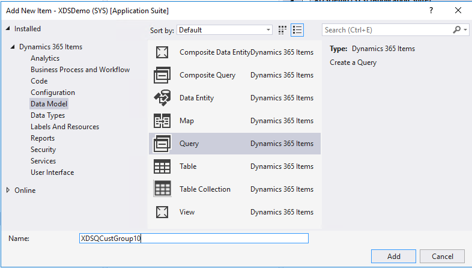
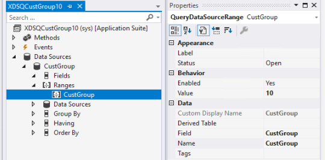
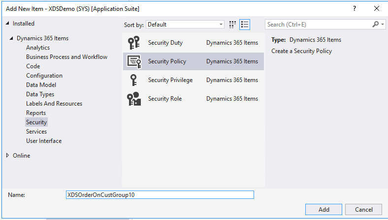
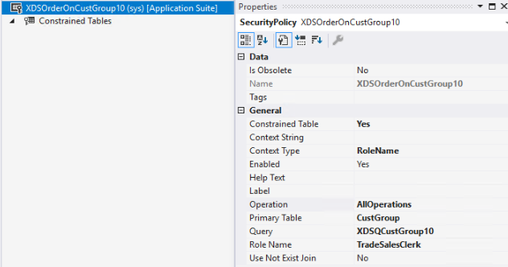

---
# required metadata

title: Create a simple security policy
description: This topic provides...
author: Peakerbl
manager: AnnBe
ms.date: 07/10/2020
ms.topic: article
ms.prod: 
ms.service: dynamics-ax-applications
ms.technology: 

# optional metadata

ms.search.form: 
audience: IT Pro
# ms.devlang: 
ms.reviewer: sericks
ms.search.scope: Operations
# ms.tgt_pltfrm: 
# ms.custom: NotInToc
ms.assetid: 
ms.search.region: Global
# ms.search.industry: 
ms.author: peakerbl
ms.search.validFrom: 2020-07-31
ms.dyn365.ops.version: 10.0.12

---

# Create a simple security policy
[!include [banner](../includes/banner.md)]

Creating a query for the policy

1.  In Visual Studio. Add a new query, e.g. XDSQCustGroup10 to your
    project/solution. The query will be used to restrict data access from the
    Constraint table:

>   A screenshot of a social media post Description automatically generated

1.  Right click on **Data Sources**, and click **New Data Source**.

2.  In the **Table** field, enter the Primary table name ‘CustGroup’.

3.  Right click **Ranges**, and click **New Range**.

4.  Set the **Enabled** field, to ‘Yes’.

5.  In the **Data Source** field, enter the Primary table name, in this case,
    ‘CustGroup’.

6.  In the **Value field**, enter ‘10’ to restrict access to data where
    CustGroup has value 10, by defining the Range for the CustGroup field:

>   A screenshot of a cell phone Description automatically generated

Creating a query for the policy

1.  Add a new Security policy, e.g. XDSCustTableOnCustGroup10:

>   A screenshot of a social media post Description automatically generated

1.  Set **Constrained Table** to ‘Yes’. This will secure access also to the
    primary table. In this example to the CustGroup table.

2.  Set the **Context Type** field, to ‘RoleName’.

3.  Set the **Enabled** field, to ‘Yes’.

4.  Set the **Operation** field to ‘AllOperations’. Other available values for
    Operation are ‘Select’, ‘Insert’, ‘Update’, ‘Delete’ or
    ‘InsertUpdateDelete’.

5.  Set **Primary Table** field, to ‘CustGroup’.

6.  Set the **Query** field, to the name of the query created in above, i.e.
    ‘XDSQCustGroup10’.

7.  Set the **Role Name** field, to ‘TradeSalesClerk’. Since Context type is set
    to RoleName for this policy, it is required to enter the AOT name for a user
    role.

>   A screenshot of a cell phone Description automatically generated

1.  Next add constrained table(s). In the simple example we will just add one
    table:

>   A screenshot of a cell phone Description automatically generated

1.  Right click on **Constrained tables**, and click **New \> Constrained
    Table**.

2.  Set **Constrained** to ‘Yes’.

3.  In the **Name** field, enter the Constrained table, i.e. ‘CustTable’.

4.  In the **Table Relation** field, enter the relationship to the primary
    table, in this case ‘CustGroup’.

5.  As final steps it is required to build and synchronize the solution in order
    to activate the policy.

