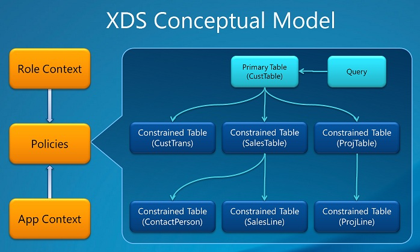

---
# required metadata

title: Extensible data security policies 
description: This topic provides...
author: Peakerbl
manager: AnnBe
ms.date: 07/10/2020
ms.topic: article
ms.prod: 
ms.service: dynamics-ax-applications
ms.technology: 

# optional metadata

ms.search.form: 
audience: IT Pro
# ms.devlang: 
ms.reviewer: sericks
ms.search.scope: Operations
# ms.tgt_pltfrm: 
# ms.custom: NotInToc
ms.assetid: 
ms.search.region: Global
# ms.search.industry: 
ms.author: peakerbl
ms.search.validFrom: 2020-07-31
ms.dyn365.ops.version: 10.0.12

---

# Extensible data security policies 
[!include [banner](../includes/banner.md)]

This topic provides an overview of Extensible Data Security (XDS) policies in
Finance and Operations. XDS allows developers to supplement role-based security
by restricting access to table records based on security policies. The query in
the policy applies a filter and only records that satisfies the conditions will
be accessible from the restricted tables.

## Data security policy components

-   **Constrained table(s)**: the table(s) or from which data is filtered or
    secured. For example, in a policy that secures access to customers based on
    customer group, the CustTable would be the constrained table.

-   **Primary table**: used to secure the content of the related constrained
    table. In the above example, the CustGroup table would be the primary table.
    Primary table must have an explicit relationship to the constrained table.

-   **Policy query**: used to secure the constrained tables content via a range
    condition on the primary table contents. Only records that are included in
    the range will be accessible. The range can for example be based on a
    specific value for Customer Group.

-   **Context** – controls the conditions under which a policy is applicable.
    Two main types of contexts are available:

    -   **Role context**: based on the role(s) the user is assigned. There are
        to sub-options for role context:

        -   **RoleName** – Indicates that the security policy is only applied to
            the application user assigned to the role equal to the value of
            RoleName.

        -   **RoleProperty** – This value is used in combination with the
            ContextString property to specify multiple user roles context. It is
            applied when the Context String value defined in the Role Property
            field for the policy is the same as the ContextString field value
            for the assigned user role(s).

    -   **Application context**: applied if the context string set by the
        application using the XDS::SetContext API is the same as the value
        defined in the Context String field for the policy.

        

In the Application Object Tree (AOT), policies are their components are
displayed under **Security \> Policies.**

## Important considerations

The policy query is added to the WHERE clause, or ON clause, on SELECT, UPDATE,
DELETE and INSERT operations involving the specified constrained tables. Unless
carefully designed and tested, policy queries can have a significant performance
impact. Therefore, make sure to follow simple but important guidelines when
developing an extensible data security policy, see the Developing efficient
extensible data security policies section in the, Developing Extensible Data
Security Policies (White paper) link below.

When two or more security policies apply – The intersection (not the union) of
the records that are included by each policy are the only records that can be
accessed. This means that a record must satisfy all the applicable security
policies before access to the record is allowed.

## Additional resources

For information for how to debug, create more advanced policies, including
chaining of restricted tables, Table relations based on expressions and much
more please refer to these resources:

### From Microsoft:

- [Create a simple security policy](create-simple-security-policy.md)

- [Developing Extensible Data Security Policies (White paper) [AX
2012]](https://technet.microsoft.com/en-us/library/hh272862.aspx)

- [Securing Data by Dimension Value by using Extensible Data Security (White
paper) [AX 2012]](https://technet.microsoft.com/en-us/library/hh335188.aspx)

### From our MVPs:

- [Extensible Data Security examples – by Andre Arnaud De
Calavon](https://dynamicspedia.com/tag/xds/)

- [Extensible Data Security (XDS) Framework in D365FO - by Alex
Meyer](https://alexdmeyer.com/2019/02/20/extensible-data-security-xds-framework-in-d365fo/)

