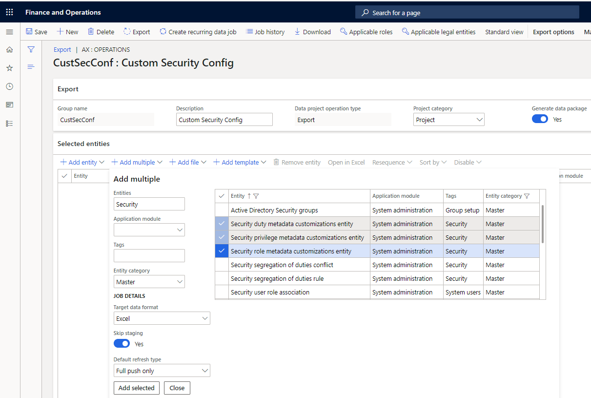

---
# required metadata

title: Import or export customized security configuration using Data management 
description: The topic provides an overview of how customized security configuration can be exported and imported across environments using the Data management framework.
author: tonyafehr
manager: Peakerbl
ms.date: 07/15/2020
ms.topic: article
ms.prod:
ms.service: dynamics-ax-applications
ms.technology: 

# optional metadata

# ms.search.form:
audience: IT Pro
# ms.devlang: 
ms.reviewer: sericks
ms.search.scope: Operations, Core
# ms.tgt_pltfrm: 
# ms.custom: NotInToc
ms.search.region: Global
# ms.search.industry:
ms.author: peakerbl
ms.search.validFrom: 2020-07-31
ms.dyn365.ops.version: 10.0.12
---

# Import or export customized security configuration using Data management 

[!include[banner](../includes/banner.md)]

The topic provides an overview of how customized security configuration can be
exported and imported across environments using the [Data management
framework](../data-entities/data-entities-data-packages.md).
This can be used, for example, when there is a need to move customized, security
configuration from a test environment to a production environment.

The following entities hold the customized, role-based security, i.e.
privileges, duties and roles that has been added or modified using Security
configuration:

-   **Security privilege metadata customization entity**

-   **Security duty metadata customization entity**

-   **Security role metadata customization entity**

## Export customized security configuration

1.  Go to **System administration \> Workspaces \> Data management**.

2.  Click the **Export** tile.

3.  Enter a group name and set **Generate data package** to **Yes**.

    

4.  Select the **Add multiple** menu.

5.  Filter the entities by setting the following fields:

    - In the **Entities** field, enter **Security**.
    - In the **Entity category** field, select **Master**.

6.  In the **Target data format** field, select **Excel**.

7.  Select the applicable security customization entities.

8.  Click **Add selected**.

    From version 10.0.12, ignore any warning messages about data length, as those messagges are
    not applicable since the included entities use containers in data package
    mode.

9.  Click **Close**.

10.  Make sure that the **Sequence** field value is set in order of the entity
    dependencies, i.e. first Privileges, then Duties and last Roles.

11.  Click **Export**.

12.  Click **Close**.

13. Wait for the job to complete. Click **Refresh** to see the status.

14. Click **Download package**.

15. Save the package

## Import customized security configuration

1.  Go to **System administration \> Workspaces \> Data management**.

2.  Click the **Import** tile.

3.  Enter a name in the **Group name** field.

4.  Click **Add file**.

5.  Click **Upload and add**.

6.  Locate the exported package, and then click **Open.**

    From version 10.0.12, ignore any warning messages about data length, as those messages are
    not applicable since the included entities use containers in data package
    mode.

7.  Click **Close**.

8.  Click **Import**.

9.  Click **Close**.

10. Wait for the job to complete. Click **Refresh** to see the status.

## Related security configuration entities

-   **SystemSecurityUserRoleOrganizationEntity**: Assignment of organizations to
    security roles.

-   **Security segregation of duties rule**: Segregation of duties rules.

-   **Security segregation of duties conflict**: Segregation of duties
    conflicts. This entity has unresolved, but also reviewed conflicts.

## Additional resources

-   [Data import and export jobs overview](../data-entities/data-import-export-job.md)

-   [Move all user and security settings with data entities - By Andre Arnaud De
    Calavon
    (blog)](https://dynamicspedia.com/2020/05/move-all-user-and-security-settings-with-data-entities/)
