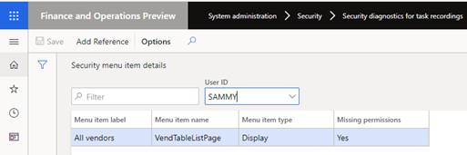

--- 
# required metadata 
 
title: Security diagnostics for task recordings
description: This topic provides information about how to analyze and manage security permission requirements based on a task recording.
author: Peakerbl
manager: AnnBe 
ms.date: 05/05/2020
ms.topic: business-process 
ms.prod:  
ms.service: dynamics-ax-applications 
ms.technology:  
 
# optional metadata 
 
ms.search.form:    
audience: Application User 
# ms.devlang:  
ms.reviewer: kfend
ms.search.scope: Core, Operations 
# ms.tgt_pltfrm:  
# ms.custom:  
ms.search.region: Global
# ms.search.industry: 
ms.author: maertenm
ms.search.validFrom: 
ms.dyn365.ops.version: Version 10.0.9 
---
# Security diagnostics for task recordings

[!include [banner](../../includes/banner.md)]

## Before you begin

Before you complete the steps in this topic, you must have a task recording of the user process being analyzed. To record a business process, see, [Task recorder resources](../../user-interface/task-recorder.md). 

## Diagnose security for a task recording

1. Go to **System administration** > **Security** > **Security diagnostic for task recording**.
2. Open the task recording from its location, (select **Open from this PC** or **Open from Lifecycle Services**), and then select **Close**.
3. This will open the **Security menu item details** page that lists the security objects required for the process.

 > [!NOTE]
 > The **Action** and **Output** menu items are not included in the list.

4. In the **User ID** field, select a user. If the user is missing permissions for menu items, the **Missing permissions** field will update to **Yes**.
  
  

5. Select **Add Reference**, to see a list of the security objects, including roles, duties, and privileges, that grant the missing permission.
6. Select a security object from the list:

	- If **Role** is selected, select **Add role to user**. This will open the [**Assign users to roles**](assign-users-security-roles.md) page.
	- If **Duty** is selected, select **Add duty to role**, select the roles that the duty should be added to, and then select **OK**.
	- If **Privilege** is selected, select **Add privilege to duties**, select the roles that the duty should be added to, and then select **OK**.
