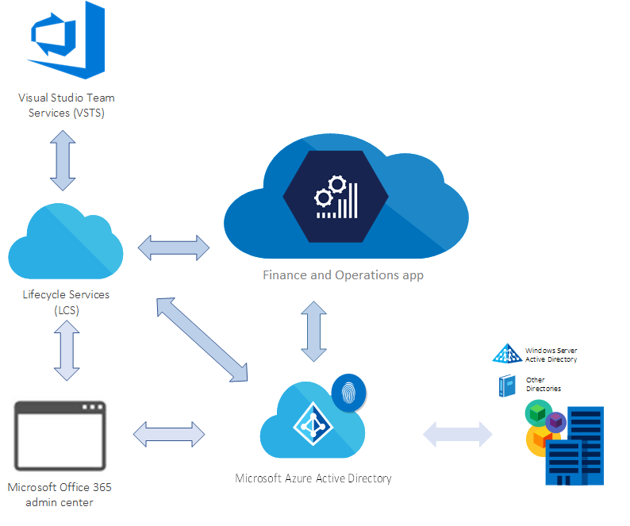

---
# required metadata

title: Finance and Operations application architecture
description: This topic provides an overview of the architecture of Finance and Operations applications.
author: ClaudiaBetz-Haubold
manager: AnnBe
ms.date: 06/04/2018
ms.topic: article
ms.prod: 
ms.service: dynamics-ax-platform
ms.technology: 

# optional metadata

# ms.search.form: 
# ROBOTS: 
audience: IT Pro
# ms.devlang: 
ms.reviewer: kfend
ms.search.scope: Operations
# ms.tgt_pltfrm: 
ms.custom: 56551
ms.assetid: d876e8de-d547-43e5-9259-f095821dc758
ms.search.region: Global
# ms.search.industry: 
ms.author: chaubold
ms.search.validFrom: 2018-05-30
ms.dyn365.ops.version: AX 7.0.0

---

# Finance and Operations application architecture

[!include [banner](../includes/banner.md)]

The Finance and Operations application cloud architecture contains all the elements that are common to all Microsoft cloud offerings, as described in [Subscriptions, licenses, accounts, and tenants for Microsoft's cloud offerings](https://docs.microsoft.com/office365/enterprise/subscriptions-licenses-accounts-and-tenants-for-microsoft-cloud-offerings). Beyond this, it also includes services that automate software deployment and provisioning, operational monitoring and reporting, and seamless application lifecycle management.

The cloud architecture consists of these conceptual areas:

- **Subscription** – A subscription to Finance and Operations apps gives you an online cloud environment (or multiple environments) and experience.
- **Licenses** – Customers must purchase subscription licenses (SLs) for their organization, or for their affiliates' employees and on-site agents, vendors, or contractors who directly or indirectly access Finance and Operations apps. These apps are licensed through Microsoft Volume Licensing and the Microsoft Cloud Solution Provider (CSP) program. For more information, download the latest [Microsoft Dynamics 365 Licensing Guide from Dynamics 365 pricing](https://dynamics.microsoft.com/pricing/).
- **Tenant** – In Microsoft Azure Active Directory (AAD), a tenant represents an organization. It's a dedicated instance of the AAD service that an organization receives and owns when it creates a relationship with Microsoft (for example, by signing up for a Microsoft cloud service, such as Azure, Microsoft Intune, or Microsoft Office 365). Every AAD tenant is distinct and separate from other AAD tenants. For more information about AAD tenants, see [How to get an Azure Active Directory Tenant](https://docs.microsoft.com//azure/active-directory/develop/active-directory-howto-tenant).

    A tenant houses the company's user information. This information includes passwords, user profile data, permissions, and related information. The tenant also contains groups, applications, and other information that pertains to an organization and its security.

    The tenant is created when customers sign up for their first subscription to any Microsoft online service, such as Office 365, Microsoft Dynamics 365, or Azure. Any later subscriptions to the same online services or other online services can be grouped within the same tenant.

    An organization can have multiple AAD tenants. If there are multiple tenants, make sure that any subscriptions for Finance and Operations apps are associated with the correct tenant.

- **Azure Active Directory (AAD)** – AAD is the multi-tenant, cloud-based directory and identity management service from Microsoft that combines core directory services, application access management, and identity protection in a single solution. For more information, see [Azure Active Directory](https://docs.microsoft.com/azure/active-directory/). Finance and Operations apps use AAD as the store for identity. Access to AAD is provided as part of a subscription to Finance and Operations apps.
- **Office 365 admin center** – Office 365 admin center is the subscription management portal that Office 365 provides for administrators. It's used to provide management functions for users (AAD) and subscriptions. As part of these management functions, it provides information about service health. For more information, see [About the Office 365 admin center](https://support.office.com/article/about-the-office-365-admin-center-758befc4-0888-4009-9f14-0d147402fd23).

    > [!NOTE]
    > You don't have to have an Office 365 license to deploy Finance and Operations apps. However, you might require a license for specific Office integration scenarios. For more information, see [Office integration](../../dev-itpro/office-integration/office-integration.md).

- **Microsoft Dynamics Lifecycle Services (LCS)** – LCS is a collaboration portal that provides an environment and a set of regularly updated services that can help you manage the application lifecycle of your implementations. For more information, see [Lifecycle Services for Finance and Operations](../../dev-itpro/lifecycle-services/lcs.md). After you purchase and activate a subscription for a Finance and Operations app, an **Implementation project** workspace is provisioned in LCS when the tenant administrator signs in for the first time.

    > [!NOTE]
    > An implementation project is an LCS project for the cloud service. As a Microsoft partner, you can also provision non-implementation LCS projects for your own purposes. For more information, see [Lifecycle Services for Finance and Operations apps partners](../../dev-itpro/lifecycle-services/getting-started-lcs.md).

- **Finance and Operations apps** – Finance and Operations apps are deployed through LCS. Various topologies are available: development/test/build, acceptance test, performance test, and high-availability production. For more information about the various topologies, download the [latest Microsoft Dynamics 365 Licensing Guide from Dynamics 365 pricing](https://dynamics.microsoft.com/pricing/).
- **Microsoft Azure DevOps** – Azure DevOps is used primarily for code version control, development and to deploy a build environment. Azure DevOps is also used to track support incidents, such as work items in Azure DevOps that are submitted to Microsoft through Cloud-powered support, and to integrate the Business process modeler (BPM) library hierarchy into your Azure DevOps project as a hierarchy of work items. Azure DevOps is also used during code upgrade.

"Under the hood," Finance and Operations apps use many features of the Azure platform, such as Azure Storage, networking, monitoring, and Azure SQL Database, to name just a few. Shared services put into operation and orchestrate the application lifecycle of the environments for participants. Together, Azure functionality and LCS offer a robust cloud service.

> [!NOTE]
> Although many features of the Azure platform are used, you don't have to have an Azure subscription to deploy Finance and Operations apps in the Microsoft-managed cloud. You must have an Azure subscription only if you want to deploy Finance and Operations apps cloud-hosted environments in your own Azure subscription.
