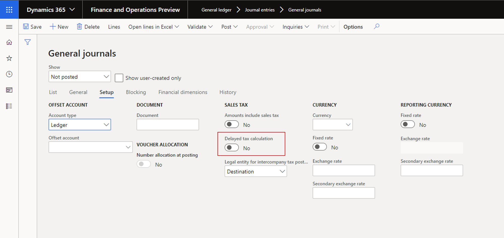

---
# required metadata

title: Enable delayed tax calculation on journal
description: This topic explains how to use the **Enable delayed tax calculation on journal** feature to improve tax calculation performance when the volume of journal lines is huge.

author: ericwang
manager: Ann Beebe
ms.date: 09/18/2019
ms.topic: article
ms.prod: 
ms.service: dynamics-ax-applications
ms.technology: 

# optional metadata

ms.search.form: TaxTable
# ROBOTS: 
audience: Application User
# ms.devlang: 
ms.reviewer: roschlom
ms.search.scope: Core, Operations

# ms.tgt_pltfrm: 
ms.custom: 4464
ms.assetid: 5f89daf1-acc2-4959-b48d-91542fb6bacb
ms.search.region: Global
# ms.search.industry: 
ms.author: vstehman
ms.search.validFrom: 2019-09-18
ms.dyn365.ops.version: 10.0.7

---

# Enable delayed tax calculation on journal
[!include [banner](../includes/banner.md)]
[!include [preview banner](../includes/preview-banner.md)]

This topic explains the steps for delaying sales tax calculcations on journals. This capability helps improve the performance of tax calculations when there are a large number journal lines.

By default, sales tax amounts on journal lines are calculated whenever tax related fields are updated, such as sales tax groups or item sales tax group. Any update to a journal line will cause tax amounts to be recalculated for all journal lines. It helps user to see real-time calculated tax amount but it could also bring performance issue if the volume of journal lines is huge.

This feature provides an option to delay tax calculation to solve performance issue. If this feature is turned on, tax amount will only be calculated when user clicks "Sales Tax" command or posts the journal.

You can delay the calculation of sales taxes at three levels:
- By legal entity
- By journal name
- By journal header

The system gives priority to the setting of the journal header. The parameter setting for the journal header defaults from the journal name. The setting of the journal name defaults from the setting on the **General ledger parameters** page when the journal name is created. The following sections list the steps for enabling delayed tax calculation for legal entities, journal names, and journal headers.

## Enable delayed tax calculation by legal entity

1. Go to **General ledger > Ledger setup > General ledger parameters**.
2. Open the **Sales tax** tab.
3. In the **General** FastTab, locate the **Delayed tax calculation** field and set it to **On**.

## Enable delayed tax calculation by journal name

1. Go to **General ledger > Journal setup > Journal names**.
2. In the **General** FastTab, locate the **Delayed tax calculation** field and set it to **On**.

## Enable delayed tax calculation by journal

1. Go to **General ledger > Journal entries > General journals**.
2. Click **New**.
3. Select a journal name.
4. Click **Setup**.
5. Locate the **Delayed tax calculation** field and set it to **On**. 

