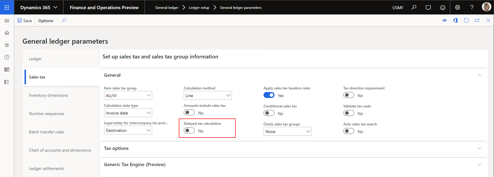
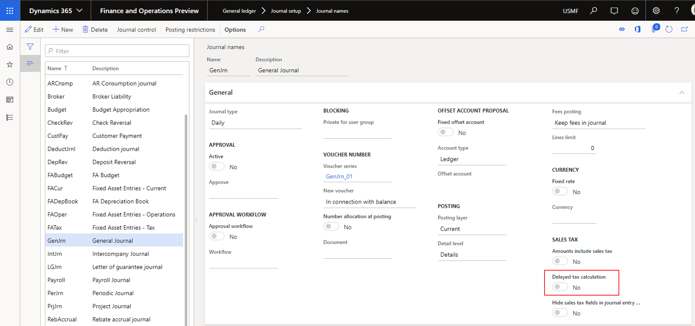

---
# required metadata

title: Enable delayed tax calculation on journal
description: This topic explains how to use the **Enable delayed tax calculation on journal** feature to improve tax calculation performance when the volume of journal lines is huge.

author: ericwang
manager: Ann Beebe
ms.date: 09/18/2019
ms.topic: article
ms.prod: 
ms.service: dynamics-ax-applications
ms.technology: 

# optional metadata

ms.search.form: TaxTable
# ROBOTS: 
audience: Application User
# ms.devlang: 
ms.reviewer: roschlom
ms.search.scope: Core, Operations

# ms.tgt_pltfrm: 
ms.custom: 4464
ms.assetid: 5f89daf1-acc2-4959-b48d-91542fb6bacb
ms.search.region: Global
# ms.search.industry: 
ms.author: vstehman
ms.search.validFrom: 2019-09-18
ms.dyn365.ops.version: 10.0.7

---

# Enable delayed tax calculation on journal
[!include [banner](../includes/banner.md)]
[!include [preview banner](../includes/preview-banner.md)]

This topic explains how to use the **Enable delayed tax calculation on journal** feature to improve tax calculation performance when the volume of journal lines is huge.

Current sales tax calculation behavior on journal is real-time triggered when user updates tax related fields, e.g. sales tax group/item sales tax group. Any update at journal line level will re-calculate tax amount on all journal lines. It helps user to see real-time calculated tax amount but it could also bring performance issue if  the volume of journal lines is huge.

This feature provides an option to delay tax calculation to solve performance issue. If this feature is turned on, tax amount will only be calculated when user clicks "Sales Tax" command or posts the journal.

User can turn on/off the parameter at three levels:
- By legal entity
- By journal name
- By journal header

System will take the parameter value on journal header as final. Parameter value on journal header will be defaulted from journal name. Parameter value on journal name will be defaulted from general ledger parameter when the journal name is created.

"Actual sales tax amount" and "Calculated sales tax amount" fields on journal will be hided if this parameter is turned on. The purpose is not to confuse user because the value of these two fields will always show 0 before user trigger the tax calculation.

## Enable delayed tax calculation by legal entity

1. Go to **General ledger > Ledger setup > General ledger parameters**
2. Click **Sales tax** tab
3. Under **General** fast tab, find parameter **Delayed tax calculation**, turn on/off it

## Enable delayed tax calculation by journal name

1. Go to **General ledger > Journal setup > Journal names**
2. Under **General** fast tab, find parameter **Delayed tax calculation**, turn on/off it

## Enable delayed tax calculation by journal

1. Go to **General ledger > Journal entries > General journals**
2. Click **New**
3. Select a journal name
4. Click **Setup**
5. Find parameter **Delayed tax calculation**, turn on/off it

