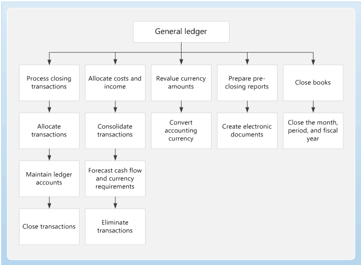

---
# required metadata

title: General ledger and Financial reporting overview
description: Use General ledger to define and manage the legal entity’s financial records.  
author: ShylaThompson
manager: AnnBe
ms.date: 08/31/2017
ms.topic: article
ms.prod: 
ms.service: dynamics-ax-applications
ms.technology: 

# optional metadata

ms.search.form: GeneralJournalEntryWorkspace
# ROBOTS: 
audience: Application User
# ms.devlang: 
ms.reviewer: roschlom
ms.search.scope: Core, Operations
# ms.tgt_pltfrm: 
ms.custom: 65431
ms.assetid: d2c604df-daae-42cd-82d9-c80e3dee4a60
ms.search.region: Global
# ms.search.industry: 
ms.author: shylaw
ms.search.validFrom: 2016-02-28
ms.dyn365.ops.version: AX 7.0.0

---

# General ledger overview

[!include [banner](../includes/banner.md)]

Use General ledger to define and manage the legal entity’s financial records. The general ledger is a register of debit and credit 
entries. These entries are classified using the accounts that are listed in a chart of accounts. 

 - [Plan your chart of accounts](plan-chart-of-accounts.md)
 - [Main account types](main-account-types.md)

You can allocate, or distribute, monetary amounts to one or more accounts or account and dimension combinations based on allocation 
rules. There are two types of allocations: fixed and variable. You can also settle transactions between ledger accounts and revalue 
currency amounts. At the end of a fiscal year, you must generate closing transactions and prepare your accounts for the next fiscal year. You can use the consolidation functionality to combine the financial results for several subsidiary legal entities into results for a single, consolidated organization. The subsidiaries can be in the same database or in separate databases.

- [Consolidation and elimination overview](../budgeting/consolidation-elimination-overview.md)
- [General ledger account balances](general-ledger-account-balances.md)
- [Financial dimensions](financial-dimensions.md)

## Sales tax
Every company collects and pays taxes to various tax authorities. The rules and rates vary by country/region, state, county, and city.
In addition, the rules must be updated periodically when tax authorities change their requirements. Sales tax codes contain the basic 
information about how much you collect and pay to the authorities. When you set up sales tax codes, you define the amounts or 
percentages that must be collected. You also define the various methods by which those amounts or percentages are applied to 
transaction amounts. The topics in this section provide information about how to set up sales tax codes for the methods and rates that 
your tax authorities require.

 - [Sales tax overview](indirect-taxes-overview.md)
 - [Sales tax rates based on the Marginal base and Calculation methods](marginal-base-field.md)
 - [Sales tax payments and rounding rules](round-sales-tax-payments.md)

## Additional resources

#### What's new and in development

Go to the [Microsoft Dynamics 365 Release Notes](https://go.microsoft.com/fwlink/?linkid=2010158) to see what new features have been planned. 

#### Blogs

You can find opinions, news, and other information on the [Microsoft Dynamics 365 blog](https://community.dynamics.com/b/msftdynamicsblog?c=Enterprise) and the [Microsoft Dynamics 365 Finance and Operations - Financials blog](https://community.dynamics.com/365/financeandoperations/b/financials).

The [Microsoft Dynamics Operations Partner Community Blog](https://community.dynamics.com/partner/b/operationspartnercommunityblog) gives Microsoft Dynamics Partners a single resource where they can learn what is new and trending in MBS Operations.

### Videos

Check out the how-to videos that are now available on the 
[Microsoft Dynamics 365 YouTube Channel](https://www.youtube.com/channel/UCJGCg4rB3QSs8y_1FquelBQ).

#### Community blogs

- [What you should know about ledger in Dynamics 365 for Finance and Operations](https://financefunction.tech/2018/04/29/what-you-should-know-about-ledger-in-dynamics-365-for-finance-and-operations)

