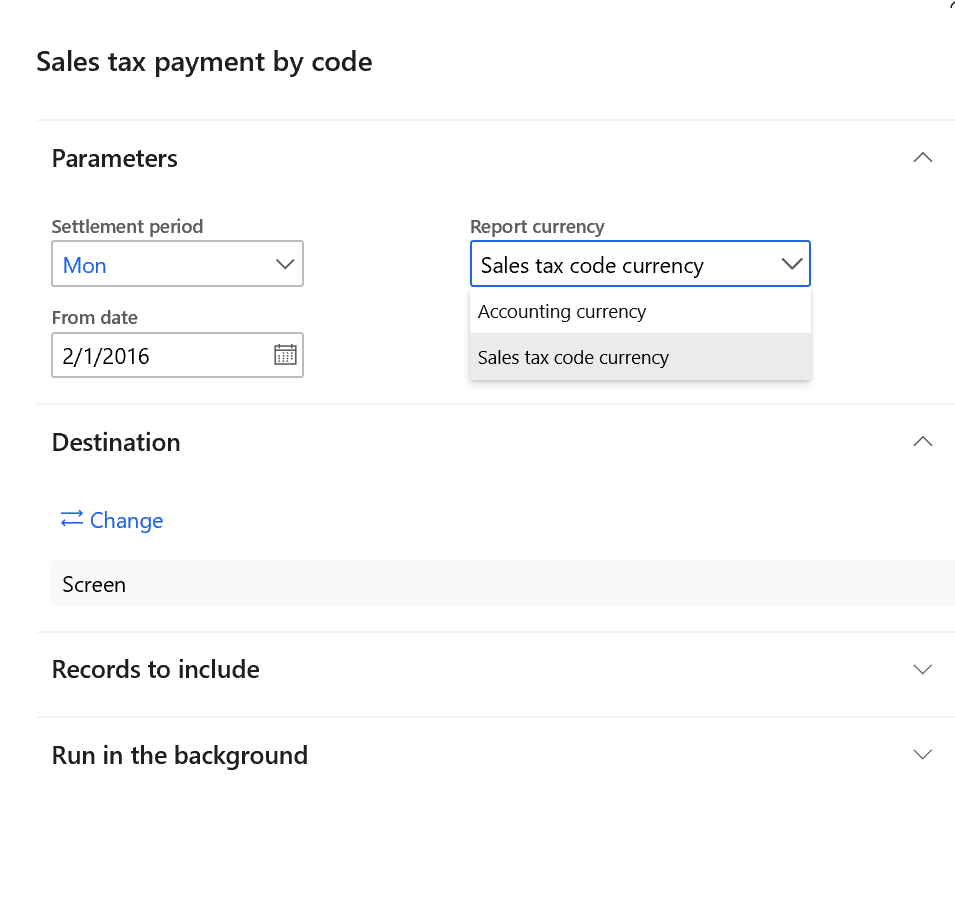
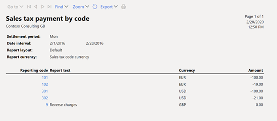

---
# required metadata
title: Print the Sales tax payment by code report 
description: This topic provides information about the settings and actions that are required to print the Sales tax payment by code report in the accounting or tax code currency.
author: anasyash
manager: AnnBe
ms.date: 04/08/2020
ms.topic: article
ms.prod: 
ms.service: dynamics-ax-applications
ms.technology: 

# optional metadata
ms.search.form:  
audience: Application User
# ms.devlang: 
ms.reviewer: kfend
ms.search.scope: Core, Operations
# ms.tgt_pltfrm: 
# ms.custom: 
ms.search.region: Global
# ms.search.industry: 
ms.author: anasyash
ms.search.validFrom: 2020-04-08
ms.dyn365.ops.version: 10.0.11

---

# Print the Sales tax payment by code report 

[!include [banner](../includes/banner.md)]
[!include [banner](../includes/preview-banner.md)]

To print the **Sales tax payment by code** report, navigate to **Tax** \> **Inquiries and reports** \> **Sales tax reports** \> **Sales tax payment by code**. By default, report amounts are generated in the accounting currency of the legal entity for all reporting codes that are set up on the **Sales tax reporting codes** page.

You can also generate this report to show the sales tax payment amounts in the currencies of sales tax codes for all reporting codes that are assigned to sales tax codes on the **Sales tax codes** page.

## Enable the feature

In the **Feature management** workspace, enable the feature, **Generate the Sales tax payment by code report in the sales tax code currency**.

## Run the report

1. Go to **Tax** \> **Inquiries and reports** \> **Sales tax reports** \> **Sales tax payment by code**.

2. In the **Report currency** field, select one of the following:

- **Accounting currency**: Print the report amounts in the accounting currency.
- **Sales tax code currency**: Print the report amounts in the currencies of sales tax codes.

    The following graphic shows an example of the generated report. The report identifies that **Reporting code 101** has the currency **EUR** if the sales tax code to which the reporting code is assigned, has the **Sales tax currency** field set to **EUR**.

    

