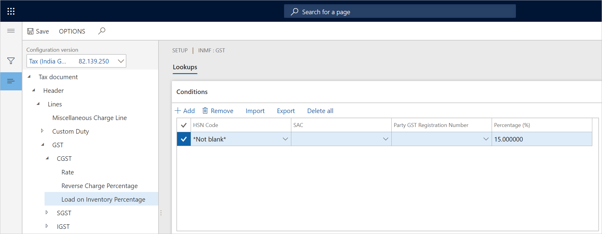

---
# required metadata

title: Set up rate and percentage tables
description: This topic explains how to set up rate and percentage tables.
author: EricWang
manager: RichardLuan
ms.date: 06/05/2019
ms.topic: article
ms.prod: 
ms.service: dynamics-365-applications
ms.technology: 

# optional metadata

# ms.search.form: 
audience: Application User
# ms.devlang: 
ms.reviewer: kfend
ms.search.scope: Core, Operations
# ms.tgt_pltfrm: 
# ms.custom: 
ms.search.region: India
# ms.search.industry: 
ms.author: EricWang
ms.search.validFrom: 2019-06-01
ms.dyn365.ops.version: 10.0.4

---

# Set up rate and percentage tables

[!include [banner](../includes/banner.md)]

1. Expand the **Tax component** node, and select the **Rate** node.
2. In the **Value** field, enter the tax rate. All the other fields are for determining the rate. In the standard GST configuration, there are lots of pre-defined fields like HSN, SAC, Consumption State,etc.. You can pick the ones which are relevant to your business to determine the rate. 

    

    Leaving any input fields as empty means it accepts all values. Take the simplifed rate table below as an example, the rate is 12% if *HSN* is 998313 no matter what is the value of *Party GST Registration Number*. 

    | HSN    | Party GST Registration Number | Value |
    | ------ | ----------------------------- | ----- |
    | 998313 |                               | 12%   |

    > [!NOTE]
    > It's suggested to use [Tax rate type](apac-ind-GST-create-tax-rate-type.md) instead of HSN/SAC to determine the tax rate. You can either import the [standard GST configurations](apac-ind-gst.md#gst-configurations) which support tax rate type, or you extend the earlier configuration by adding tax rate type into the lookup. Please note tax rate type is supported from 10.0.5.

2. Select the **Reverse Charge Percentage** node.
3. In the **Value** field, enter the reverse charge percentage.

    

4. Select the **Load on Inventory Percentage** node.
5. In the **Value** field, enter the load on inventory percentage.

    

6. Select **Save**, and then select **Close**.
7.  On the **Companies** FastTab, select **Parameters**.
8.  Enter the parameter values, and then select **OK**.

    

## Import/export tax setup

It's suggested to prepare the tax setup in excel and import into the tax setup. 

1. Click **Export** in rate table, or reverse charge percentage, etc.. 
2. Open the exported CSV file in excel, and prepare the tax setup there.
3. Click **Import** in the rate table, choose the file and load the data into the setup.

## Tax setup validation

Any incorrect tax setup can cause severe problems afterward, and it's hard to detect. Common mistakes in tax setup are duplicates tax setup record, entering non-exist master data. 

### Duplicate tax setup records

Duplicate tax setup mean records with same input fields. Following is an example, the two records have the same input fields *HSN:998313, Party GST Registration Number:*, but they result into different value.

    | HSN    | Party GST Registration Number | Value |
    | ------ | ----------------------------- | ----- |
    | 998313 |                               | 12%   |
    | 998313 |                               | 15%   |

To resolve and prevent such issue, you need to turn on **Tax setup validation** in the [Feature Management](../../fin-ops-core/fin-ops/get-started/feature-management/feature-management-overview.md).

With the feature turned on, system will check whether there are duplicates when you entering new data via UI or import tax setup from CSV file. 

You can click **Show Duplicates** to check whether ther are existing duplicates, and delete the unwanted records.

### Entering non-exist master data

With **Tax setup validation** turned on, system will check the existance of entered/imported master data, like HSN, SAC, etc..