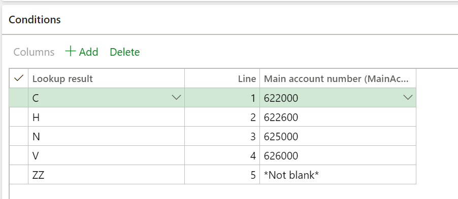

# DAS-2 report

French legal entities doing business with self-employed professionals must provide to the tax authorities the DAS-2 declaration report  
The DAS-2 is an annual fiscal declaration that includes all payments of these type of vendors > 1200 EUR  and it should be generated in Excel format. Once the report is generated, the legal entity save this file in the ETAFI (CEGID) environment, then the file is validated and converted into to EDI structure to be finally transmitted.   

The DAS-2 excel report  is generated by using by using electronic reporting tool and include the following sheets:

- **Details:** All vendor invoices paid by the select period and vendor profile with DAS-2 classification
- **Summary by vendor:** This is the DAS-2 declaration grouped by vendor where each column represent the amounts per DAS-2 classification
- **DAS-2 form:** Summary of declaration for each vendor. One form per vendor.

Before to generate the report for the first time, you need to download the following models and formats from LCS. Note: Downloading ER format instructions are detailed here: https://docs.microsoft.com/en-us/dynamics365/unified-operations/dev-itpro/analytics/download-electronic-reporting-configuration-lcs 
	
1. Statistics on invoices.version.32.xml or higher versions 
2. Statistics on invoices model mapping.version.32.31.xml or higher versions
3. DAS-2 report.version.32.14 (FR) or a higher versions. 
4. DAS-2 form.version.32.14.6 (FR) or a higher versions. 
	

After you've finished downloading the ER configurations from LCS, follow these steps.

1. In Microsoft Dynamics 365 Finance, select the related French company.
2. Go to **Workspaces > Electronic reporting**, and set the Microsoft provider to Active.
3. Select **Configurations > Exchange**, and load the configuration from the XML file to import the tax declaration model and GST report format file.
4. In the **Electronic reporting** workspace, select **Configurations > Setup.**
5. On the **Conditions** tab, select version 32.14, and create the configuration that will let you set up the mapping between main accounts that are configured in your company and the related tax authority classification of the DAS-2 report:

-In the Lookup result field, select the related classification
-In the Main account field, select the main account used to post the related transactions that belongs to this classification
-Set the **Status** parameter to *Completed*.

### Example

In the above configuration line 2,  the main account 622600 that is used to post fee expense transactions is mapped with the classification **H : Fees and Vacations**  established by the tax authority. 
The line 1 includes the configuration with the classification ZZ is used when the invoice journal has another expense transactions that will not be detailed in DAS-2 report. 

*Note: Create the same configuration for DAS-2 form

## Vendor configuration

Since the report includes the SIRET registration, the tax registration ID that represents the SIRET uses registration category “VAT ID”
1. Go to **Organization administration > Global address book > Registration types > Registration types** page to create the SIRET registration type
2. Use the page **Organization administration > Global address book > Registration types > Registration categories** to assign registration type SIRET to VAT ID category.
3. Go to **Accounts payable > Vendors > All vendors** 
4. Find the vendor record for which you want to enter the register ID, and then click Registration IDs on forms related vendor to open the Manage addresses page. On the **Tax registration** tab, click **Add**, and enter the related  information about the registration ID as registration type SIRET and number
		

## DAS2 report generation
The tax declaration report is generated by using the following steps
1. Go to **Accounts payable> Inquires and reports > DAS-2 report**
2. Select the format : 
	a. **DAS-2 report (FR)** to generate a detailed report with all transactions or;
	b. **DAS-2 form (FR)** to generate a separate report per vendor
3. Select From and To dates
4. Select the vendor posting profile. Vendor posting profiles enable you to group all vendors, a group of vendors, or a single vendor with the purpose to include vendors transactions in the generation of this report. Create an specific posting profile to be used in these reports.
