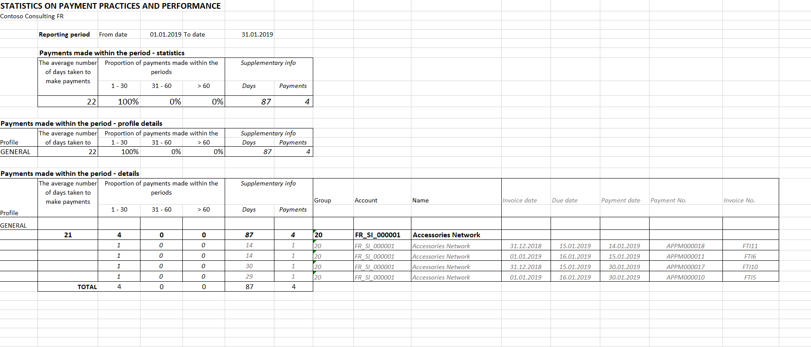

---
# required metadata
title: Statistics on payment practices report
description: This topic provides information about statistics on payment practices report
author: anasyash
manager: AnnBe
ms.date: 02/12/2020
ms.topic: article
ms.prod: 
ms.service: dynamics-ax-applications
ms.technology: 

# optional metadata

# ms.search.form:  
audience: Application User
# ms.devlang: 
ms.reviewer: kfend
ms.search.scope: Core, Operations
# ms.tgt_pltfrm: 
# ms.custom: 
ms.search.region: United Kingdom
# ms.search.industry: 
ms.author: anasyash
ms.search.validFrom: 2020-12-02
ms.dyn365.ops.version: 10.0.8

---

# Overview

Businesses in UK in scope of reporting requirement must prepare and publish
information about their payment practices and performance in relation to
qualifying contracts, for each reporting period in the financial year. The
information for each reporting period must reflect the policies and practices
which have applied during that period, and the business's performance for that
period.

The report must be published on a web-based service provided by or on behalf of
the government within 30 days of the end of the reporting period.

In scope of report, there are some narrative descriptions of reporting practices
as well as the following statistics:

-   (1) The average number of days taken to make payments in the reporting
    period, from the date of receipt of invoice.

-   (2) The percentage of payments made within the reporting period which were
    paid in 30 days or fewer, between 31 and 60 days, in 61 days or longer.

-   (3) The percentage of payments due within the reporting period which were
    not paid within agreed terms.

# Report

The report **Statistics on payment practices (UK)** is available which is
exported in Excel format and has two tabs:

>   **Payments_made** – contains statistics of types (1) and (2) above and
>   details per vendor account. In detailed view, it also contains details per
>   payment made within a reporting period.

>   **Payments_due** – contains statistics of type (3) above and details per
>   vendor account. In detailed view, it also contains details per invoice due
>   within a reporting period.

You should download the latest version of ER configuration **Statistics on
payment practices (UK)** along with **Statistics on invoices** (ER model) and
**Statistics on invoices model mapping** (ER model mapping), before using this
report.

Review fix downloading instructions in the topic [Download Electronic reporting configurations from Lifecycle Services](https://docs.microsoft.com/en-us/dynamics365/unified-operations/dev-itpro/analytics/download-electronic-reporting-configuration-lcs)

# Post documents and define the date of receiving the invoice.

Before generating the report, you should post invoices and payments and settle
them properly. Not settled payments can't be exported in the Payments_made tab,
since there is no information about invoice to be paid with this payment and
number of days taken to make payments can't be calculated.

You can identify the date when purchase invoice was received and further use
this date for calculating the number of days taken to make payments. Fill a new
field **Receive document date** in the following pages:

When creating / posting the new **Vendor invoice**, you can define **Receive
document date** on the **Vendor invoice** page, in the **Vendor invoice header**
tab, **Invoice dates** group of fields. The value is pre-defaulted from the
**Invoice date** field.

When creating **Vendor invoice journal** line, you can define **Receive document
date** on the **General** tab.

Also, you can fill the **Receive document date** after the vendor invoice is
posted and before it’s fully settled, on **Vendor transactions** page, on the
**General** tab.

# Generate report

Go to **Accounts payable \> Inquiries and reports \> Statistics \> Report on
payment deadlines.** In the opened dialog select **Statistics on payment
practices (UK)** in the field **Format mapping.** In the dialog **Electronic
report parameters**, fill in the fields:

| **Field**                  | **Details**                                                                                                                                                                                                                                                                                                                                        |
|----------------------------|----------------------------------------------------------------------------------------------------------------------------------------------------------------------------------------------------------------------------------------------------------------------------------------------------------------------------------------------------|
| **Date criteria**          | Select one of the following options: **Invoice accounting date**, **Invoice date**, **Invoice receive date** Depending on user's choice, the number of days taken to make payments will be calculated between **Payment date** and respective type of date chosen on the dialog: **Transaction date**, **Invoice date**, **Receive document date** |
| **From date**, **To date** | Fill in start and end dates of reporting period.                                                                                                                                                                                                                                                                                                   |
| **Vendor posting profile** | Select vendor profile to generate report only for the selected profile                                                                                                                                                                                                                                                                             |
| **Print document details** | Select **Yes** to export details of invoice/payment documents on the report.   |

Click **OK** to generate the report.

Review **Payments made** tab:

Review **Payments due** tab:

# Publish reporting on payment practices

After generating the **Statistics report on payment practices** report in Excel,
you should use the data presented on the report for preparing the final report
on payment practices for publication.
