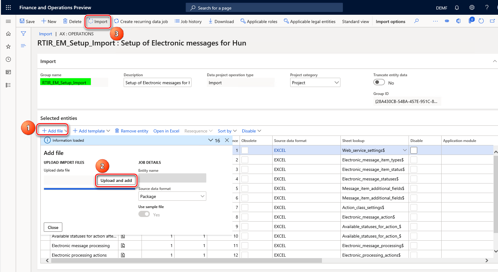
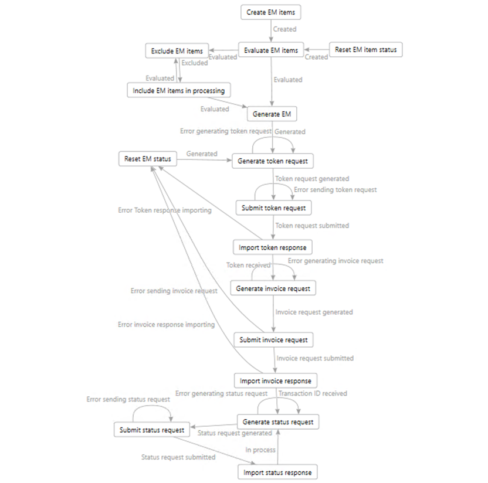
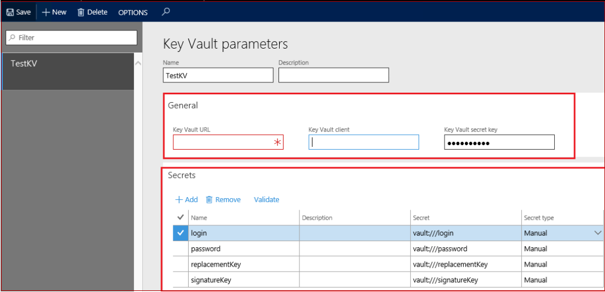
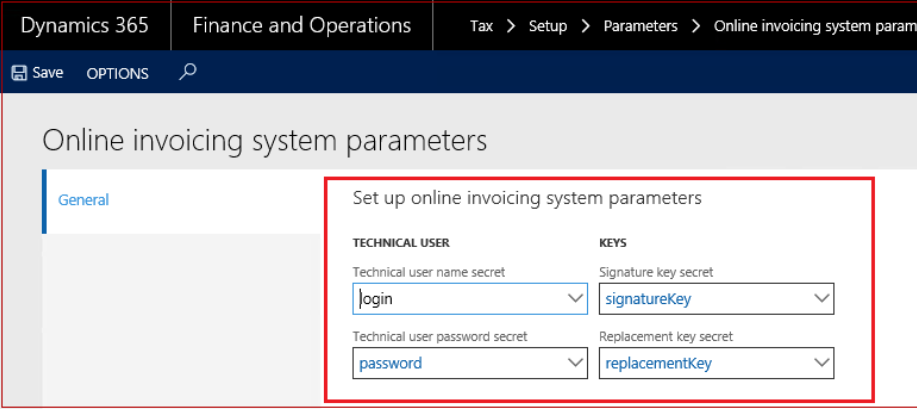
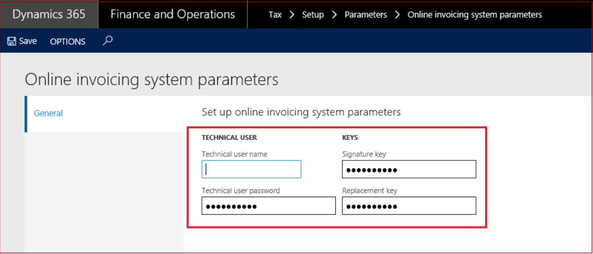
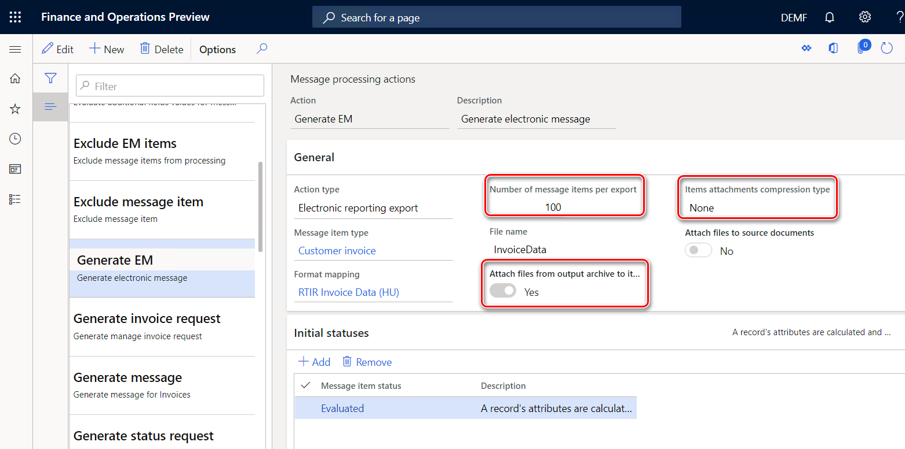

# Online invoicing system

The National Tax and Customs Administration of Hungary has announced that,
starting July 1, 2018, companies in Hungary are required to supply data of their
issued invoices to the Real-time invoice reporting (RTIR) platform of the Online
invoicing system.

For more information, see https://onlineszamla.nav.gov.hu.

This topic describes how to set up Electronic reporting (ER) configurations, and
how to set up and use electronic messaging (EM) functionality for RTIR.

The topic includes information about how to complete the following tasks:

-   Import ER configurations, and set up application-specific parameters.

-   Set up EM functionality.

-   Work with EM functionality for RTIR.

## Import ER configurations

To prepare your Microsoft Dynamics 365 Finance application for RTIR, you must
import the following ER configurations.

| **Number** | **Configuration name**                 | **Configuration type** | **Description**                                                                                                 |
|------------|----------------------------------------|------------------------|-----------------------------------------------------------------------------------------------------------------|
| 1          | Invoices Communication Model           | Model                  | The model that represents data for reporting incoming and outgoing invoices.                                    |
| 2          | RTIR mapping                           | Model mapping (export) | The model mapping configuration that collects data from Finance in accordance with Hungarian RTIR requirements. |
| 3          | RTIR Invoice Data (HU)                 | Format XML (export)    | The format for exporting RTIR invoice data.                                                                     |
| 4          | RTIR Token Exchange Request (HU)       | Format XML (export)    | The format for exporting RTIR token exchange requests.                                                          |
| 5          | RTIR Manage Invoice Request (HU)       | Format XML (export)    | The format for exporting RTIR manage invoice requests.                                                          |
| 6          | RTIR Query Invoice Status Request (HU) | Format XML (export)    | The format for exporting RTIR query invoice status requests.                                                    |
| 7          | Electronic Messages framework model    | Model                  | The model for the EM framework.                                                                                 |
| 8          | RTIR import model mapping              | Model mapping (import) | The importing model mapping configuration that provides updates of EM data during RTIR.                         |
| 9          | RTIR import format (HU)                | Format XML (import)    | The importing format configuration that parses responses from RTIR in the data structure of the EM framework.   |

**Important:** Be sure to import the most recent versions of these
configurations. The version description usually includes the number of the
Microsoft Knowledge Base (KB) article that explains the changes that were
introduced in the configuration version.

**Note:** After all the ER configurations from the preceding table are imported,
set the **Default for model mapping** option to **Yes** for the **RTIR mapping**
and **RTIR import model mapping** configurations.

For more information about how to download ER configurations from Microsoft
Dynamics Lifecycle Services (LCS), see Download Electronic reporting
configurations from Lifecycle Services.

## Set up application-specific parameters

The format that is used to report invoice data to the Hungarian Online Invoicing
System requires specific values from enumerated lists for some elements (for
example, units of measure or line expression indicators). For these elements,
before you start to use RTIR, you must set up application-specific parameters
that the **RTIR Invoice Data (HU)** format will use.

### Line expression indicator

The **lineExpressionIndicator** element of the Boolean type must be reported to
the Online invoicing system for invoice lines. For natural units of measure, a
value of **true** must be reported for the **lineExpressionIndicator** element.
If the unit of measure isn't indicated for an invoice line, a value of **false**
must be reported for the **lineExpressionIndicator** element.

1.  In the **Electronic reporting** workspace select the most recent imported
    version of the **RTIR Invoice Data (HU)** format.

2.  On the Action Pane, on the **Configurations** tab, in the **Application
    specific parameters** group, select **Setup**.

3.  On the **Lookups** FastTab, select **UnitOfMeasureTypeLookup** for the most
    recent version of the format, and then define which units of measure must be
    reported as natural (that is, a value of **true** must be reported for the
    **lineExpressionIndicator** element in the Online invoicing system).

4.  Match all the units in your Legal entity. For example, for kilometers, add
    the following line:

-   **Lookup result:** Natural

-   **Line:** 1

-   **Unit of measure code:** km
    This value is the value from the **Units** page for your legal entity (**Organization administration** \> **Setup** \> **Units**).

**Important**: At the end of the list, add the following two lines.

| **Lookup result** | **Line**                                   | **Unit of measure** |
|-------------------|--------------------------------------------|---------------------|
| NONE              | This line must be next to last in the list | \*Blank\*           |
| Other             | This line must be last in the list.        | \*Not blank\*       |

The **lineDescription** element must be reported when the
**lineExpressionIndicator** element is reported. If there is no value for the
**lineDescription** element on the related line of the invoice, this element
will indicate the voucher of the related invoice. We recommend that you define
the description on all invoices lines of all types, except invoices that are
posted from a sales order. In that case, the **lineDescription** element will
report the item.

### Unit of measure

For the **unitOfMeasure** element, one of the values from the enumerated list
that is defined by the XSD schema of the **Invoice Data** format must be
reported.

1.  In the **Electronic reporting** workspace, select the most recent imported
    version of the **RTIR Invoice Data (HU)** format.

2.  On the Action Pane, on the **Configurations** tab, in the **Application
    specific parameters** group, select **Setup**.

3.  On the **Lookups** FastTab, select **UnitOfMeasureLookup** for the most
    recent version of the format, and then define the correspondence between the
    reference units of measure and the enumerated list of the Online invoicing
    system. For example, for kilometers, add the following line:

-   **Lookup result:** KILOMETER

-   **Line:** 1

-   **Unit of measure code:** km

    (This value is the value from the **Units** page for your legal entity.)

Match all the units in your legal entity that you can find a related value for
in the enumerated list.

| **UnitOfMeasureType** | **Description (hu)**               | **Description (en-us)** |
|-----------------------|------------------------------------|-------------------------|
| PIECE                 | Darab                              | Piece                   |
| KILOGRAM              | Kilogramm                          | Kilogram                |
| TON                   | Metrikus tonna                     | Metric ton              |
| KWH                   | Kilowatt óra                       | Kilowatt hour           |
| DAY                   | Nap                                | Day                     |
| HOUR                  | Óra                                | Hour                    |
| MINUTE                | Perc                               | Minute                  |
| MONTH                 | Hónap                              | Month                   |
| LITER                 | Liter                              | Liter                   |
| KILOMETER             | Kilométer                          | Kilometer               |
| CUBIC_METER           | Köbméter                           | Cubic meter             |
| METER                 | Méter                              | Meter                   |
| LINEAR_METER          | Folyóméter                         | Linear meter            |
| CARTON                | Karton                             | Carton                  |
| PACK                  | Csomag                             | Pack                    |
| OWN                   | Saját mennyiségi egység megnevezés | Own unit of measure     |

**Important**: Instead of adding all the **own** values to the list you can
define **\*Not blank\*** for the **OWN** lookup result. All the other values
will then be reported as **OWN**. The **OWN** lookup result must be added, and
it must be last in the list.

The **unitOfMeasureOwn** element must report information about any unit of
measure that there is no value for in the enumerated list of the
**unitOfMeasure** element. This element must be reported when the
**unitOfMeasure** element has a value of **OWN**.

You can export the setup of application-specific parameters from one version of
the report and import it into another version. You can also export the setup
from one report and import it into another report, provided that both reports
have the same structure of lookup fields.

When you've finished setting up conditions, change the value of the **State**
field to **Completed**, save your changes, and close the page.

## Import a package of data entities that includes a predefined EM setup

EM functionality is provided to maintain different electronic reporting
processes for different document types. For more information about electronic
messages, see Electronic messaging.

The process of setting up the EM functionality for RTIR has many steps. Because
the names of some predefined entities are used in the ER configurations, it's
important that you use a set of predefined values that are delivered in a
package of data entities for the related tables.

1.  In LCS, go to the Shared asset library, and select the **Data package**
    asset type.

2.  In the list of data package files, find **HU RTIR setup.zip**, and download
    it to your computer. There might be several versions of the package. Be sure
    to download the most recent version.

3.  After the HU RTIR setup.zip file is downloaded, open Finance, select the
    company that you will interoperate with the Hungarian Online invoicing
    system from, and then go to **Workspaces** \> **Data management**.

4.  In the **Data management** workspace, go to **Framework parameters** \>
    **Entity settings**, and then select **Refresh entity list**. Wait for
    confirmation that the refresh has been completed. For more information about
    how to refresh the entity list, see Entity list refresh.

5.  Validate that the source data and target data are correctly mapped. For more
    information, see the section about validation in Data import and export
    jobs.

6.  Before the data entities are used for the first time to import the data from
    the package, sync the mapping of source data and target data. In the list
    for the package, select a data entity, and then, on the Action Pane, select
    **Modify target mapping**.

7.  Above the grid for the package, select **Generate mapping** to create a
    mapping from scratch, and then save the mapping.

8.  Repeat steps 6 through 7 for each data entity in the package before you
    start the import.

    For more information about data management, see Data management.

9.  You must now import data from the HU RTIR setup.zip file into the selected
    company. In the **Data management** workspace, select **Import**.

10.  Select **Upload and add**, select the **HU RTIR setup.zip** file on your
    computer, and upload it.

11.  After the data entities are uploaded, on the Action Pane, select **Import**.

You will receive a notification in **Messages**, or you can manually refresh the
page to view the data import progress. When the import process is completed, the
**Execution summary** page shows the results.

The HU RTIR setup.zip package provides the setup for **Online invoicing**
processing in the EM functionality that supports interoperation with the
Hungarian Online invoicing system. The following illustration shows the schema
for **Online invoicing** processing.

The following table describes the processing actions of **Online invoicing**
processing.

| **Action**                     | **Type**                            | **Description**                                                                                                                                                                                                                                                                                                                                                                                                    |
|--------------------------------|-------------------------------------|--------------------------------------------------------------------------------------------------------------------------------------------------------------------------------------------------------------------------------------------------------------------------------------------------------------------------------------------------------------------------------------------------------------------|
| Create EM items                | Message item execution level        | This action runs the **EMCreateItemsController_HU** executable class to generate electronic message items for issued invoices that were posted. Additional setup of the **EMCreateItemsController_HU** executable class parameters is required.                                                                                                                                                                    |
| Evaluate EM items              | Message item execution level        | This action runs the **EMAdditionalFieldsEvaluationController_HU** executable class to calculate additional field values for electronic message items. These values include the invoice operation, the reference to the original invoice, and the last line number.                                                                                                                                                |
| Generate EM                    | Electronic reporting export         | This action runs the **RTIR Invoice Data (HU)** format to create a package of invoices that can be submitted to the Online invoicing system.                                                                                                                                                                                                                                                                       |
| Generate token request         | Electronic reporting export message | This action runs the **RTIR Token Exchange Request (HU)** format to create the exchange token file in XML format.                                                                                                                                                                                                                                                                                                  |
| Submit token request           | Web service                         | This action submits the token file in XML format to the **Token exchange** web service.                                                                                                                                                                                                                                                                                                                            |
| Import token response          | Electronic reporting import         | This action imports the response from the Online invoicing system and stores the token that is received in the **Message additional fields** FastTab by using the **RTIR import format (HU)** configuration.                                                                                                                                                                                                       |
| Generate invoice request       | Electronic reporting export message | This action runs the **RTIR Manage Invoice Request (HU)** format to create the **ManageInvoiceRequest.xml** file by encoding invoices, inserting a token in the request, and so on.                                                                                                                                                                                                                                |
| Submit invoice request         | Web service                         | This action submits the **ManageInvoiceRequest.xml** file to the **Manage invoice** web service.                                                                                                                                                                                                                                                                                                                   |
| Import invoice response        | Electronic reporting import         | This action imports the response from the Online invoicing system and stores the transaction ID that is received in the **Message additional fields** FastTab by using the **RTIR import format (HU)** configuration.                                                                                                                                                                                              |
| Generate status request        | Electronic reporting export message | This action runs the **RTIR Query Invoice Status Request (HU)** format to create the **QueryInvoiceStatusRequest.xml** file.                                                                                                                                                                                                                                                                                       |
| Submit status request          | Web service                         | This action submits the **QueryInvoiceStatusRequest.xml** file to the **Query invoice status** web service.                                                                                                                                                                                                                                                                                                        |
| Import status response         | Electronic reporting import         | This action imports the response from the Online invoicing system. If the status of the EM item is **Received** (which indicates that the invoice was received by the Online invoicing system) or **Processing** (which indicates that the invoice is being processed in the Online invoicing system), the system will send the status request again, until the status of the EM item is updated to **Processed**. |
| Exclude EM items               | User processing                     | This manual user action resets the status of the EM item from **Evaluated** to **Excluded** and excludes the item from processing.                                                                                                                                                                                                                                                                                 |
| Include EM items in processing | User processing                     | This manual user action resets the status of the EM item from **Excluded** or **Manual editing** to **Evaluated**,.                                                                                                                                                                                                                                                                                                |
| Reset EM item status           | User processing                     | This manual user action resets the status of the EM item from **Rejected** to **Created**.                                                                                                                                                                                                                                                                                                                         |
| Reset EM status                | Message level user processing       | This manual user action resets the status of the electronic message from **Error invoice response importing**, **Error sending invoice request**, or **Error Token response importing** to **Generated** so that processing for the electronic message can continue.                                                                                                                                               |

For more information about the predefined setup that is included in the data
entities in the package for RTIR, see [Appendix 1: Electronic messages setup for
RTIR](appendix1) later in this topic.

## Set up EM for RTIR

After the data entities are imported into the database, follow these steps to
make the EM functionality ready to use.

1.  Go to **Tax** \> **Setup** \> **Electronic messages** \> **Executable class
    settings**, and select the **Message items creation** executable class that
    is associated with the **EMCreateItemsController_HU** executable class name.

2.  On the Action Pane, select **Parameters**.

3.  In the dialog box, on the **Records to include** FastTab, define values for
    the parameters of the query.

4.  Select **OK**.

5.  On the **Executable class settings** page, select the **Additional fields
    evaluation** executable class that is associated with the
    **EMAdditionalFieldsEvaluationController_HU** executable class name, select
    **Parameters** on the Action Pane, and then, in the dialog box, define
    values for the parameters of the executable class.

The following values must be set for the parameters.

| **Parameter name**                        | **Value**                            |
|-------------------------------------------|--------------------------------------|
| Report period start date                  | The date when you want to start RTIR |
| Status for excluded items                 | Excluded                             |
| Status for items requiring manual editing | Manual editing                       |
| Operation field                           | Operation                            |
| Original message item field               | Original message item                |
| Last line reference number field          | Last line reference number           |
| Modification index                        | Modification index                   |

6. Select **OK**.

Interoperation with the Hungarian Online invoicing system requires a technical user name and password, and signature and replacement keys. There are two options for storing this sensitive data:

-   Azure Key Vault storage

-   Local storage

7.  Go to **System administration** \> **Setup** \> **System parameters**, and
    set the **Use advanced certificate store** option to **No** to store
    sensitive data locally. Set the option to **Yes** to use Key Vault storage.
    For more information about how to set up Key Vault, see Setting up Azure Key
    Vault Client and Maintaining Azure Key Vault storage.

8.  If you set the **Use advanced certificate store** option to **Yes** on the
    **System parameters** page, you must set up the Key Vault parameters at
    **System administration** \> **Setup** \> **Key Vault parameters**.

9.  Go to **Tax** \> **Setup** \> **Parameters** \> **Online invoicing system
    parameters**, and specify the following information:

-   Technical user name

-   Technical user password

-   Signature key

-   Replacement key

10.  If you set the **Use advanced certificate store** option to **Yes** on the
    **System parameters** page, select related secrets on the **General** tab of
    the **Online invoicing system parameters** page.

Alternatively, if you set the **Use advanced certificate store** option to **No**, manually enter the technical user name and password, signature key, and replacement key that you obtained for interoperation with the Hungarian Online invoicing system. For more information, see the information about the registration procedure.

11.  Go to **Tax** \> **Setup** \> **Parameters** \> **Electronic messages** \>
    **Web service settings**, and enter the following information to define the
    internet address for web services.

| **Web service name** | **Testing internet address**                                                      |
|----------------------|-----------------------------------------------------------------------------------|
| Manage invoices      | https://api-test.onlineszamla.nav.gov.hu/invoiceService/v2/manageInvoice          |
| Query invoice status | https://api-test.onlineszamla.nav.gov.hu/invoiceService/v2/queryTransactionStatus |
| Token exchange       | https://api-test.onlineszamla.nav.gov.hu/invoiceService/v2/tokenExchange          |

Internet addresses are subject to change by the Hungarian Online invoicing system. Therefore, we recommend that you check for actual internet addresses on the official web site of the Hungarian Online invoicing system.

The website also has information about the actual *production* internet addresses that you should set up.

12.  Go to **Tax** \> **Setup** \> **Parameters** \> **Electronic messages** \>
    **Message processing actions**, and select **Generate EM**.

13.  In the **Number of message items per export** field, define the number of
    message items that can be included in one message. This number should not
    exceed 100.

14.  In the **Items attached compression type** field, specify **None**, and set
    the **Attach files from output archive to items** option to **Yes**.

15.  Go to **Ta**x \> **Setup** \> **Electronic messages** \> **Electronic
    message processing**, select **Online invoicing** processing, and then, on
    the **Batch** FastTab, select **Create batch**.

16.  Set up security roles for **Online invoicing** processing. Different groups
    of users might require access to **Online invoicing** processing. You can
    limit access to the processing, based on security groups that are defined in
    the system. Go to **Tax** \> **Setup** \> **Electronic messages** \>
    **Electronic message processing**, select **Online invoicing** processing,
    and add the security groups that must work with this processing. If no
    security group is defined for the processing, only a system admin can see
    the processing on the **Electronic messages** page.

## Set up financial reasons for RTIR

For each invoice that is reported to the Hungarian Online invoicing system, a
specific operation type must be defined and transmitted in the
**\<invoiceOperation\>** element in the **ManageInvoiceRequest.xml** file. In
most cases, Finance automatically specifies the invoice operation type according
to the rules that are defined in requirements of the Hungarian Online invoicing
system:

-   **Create** – This invoice operation type is specified when Finance defines
    no reference to original invoice.

-   **Modify** – This invoice operation type is specified when Finance defines a
    reference to original invoice.

You can manually define the operation type for an invoice during invoice posting
by using the **Financial reasons** page.

-   Go to **Organization administration** \> **Setup** \> **Financial reasons**.
    In the **Operation** column, define operation types. The following values
    are allowed by the Hungarian Online invoicing system:

-   **Create** – The invoice in the given position is considered an original
    invoice.

-   **Modify** – The invoice is a modifying invoice.

-   **Storno** – The invoice is a canceling invoice.

By using the related financial reason during invoice posting, you can have a
specific operation type reported for an invoice.

For example, you want to submit an invoice of the **Storno** operation type to
the Online invoicing system. For this invoice, specify a financial reason that
has a value of **Storno** value in **Operation** field. To submit a corrective
invoice that has no reference to the original invoice, specify a financial
reason that has a value of **Modify** in the **Operation** field.

## RTIR process

Finance automatically runs actions that are included in the processing, based on
the status of messages and message items.

### Additional fields for message items

All message items have additional fields that are required for processing. The
system automatically fills in values for additional fields when it runs actions.

| **Additional field**       | **Description**                                                                                                                                                                                                                                                                                                                                                                                                                        |
|----------------------------|----------------------------------------------------------------------------------------------------------------------------------------------------------------------------------------------------------------------------------------------------------------------------------------------------------------------------------------------------------------------------------------------------------------------------------------|
| Operation                  | Values include **Create**, **Modify**, and **Storno**. Finance sets the value of this additional field during execution of the **Evaluate EM items** action. The value of the **Operation** additional field can be defined automatically or through a financial reason on the invoice. For more information, see the [Set up financial reasons for RTIR](\#financialreasons) section earlier in this topic.                           |
| Original invoice item      | If the **Operation** additional field is set to **Modify** or **Storno**, the **Original invoice item** additional field must be set. If the system can't set this field, it sets the status of the related message item to **Manual editing**, and you must manually set this field.                                                                                                                                                  |
| Index                      | This additional field specifies the invoice position in the request (package of invoices). The value is reported in the **\<index\>** element in the **ManageInvoiceRequest.xml** file. This additional field is automatically filled in when the **Generate invoice request** action is run.                                                                                                                                          |
| Last line reference number | For message items of the **Create** operation type, this additional field contains the last number (invoice line quantity) in the package. For message items of the **Modify** or **Storno** operation type, this additional field contains the **Index** value of the original invoice, as reported in the **\<modificationIndex\>** element. This additional field is automatically filled in when the **Evaluation** action is run. |

### Run Online invoicing processing

This procedure walks you through the RTIR process.

1.  Go to **Tax** \> **Inquiries and reports** \> **Electronic messages** \>
    **Electronic message items**.

2.  On the Action Pane, select **Run processing**.

3.  In the dialog box, in the **Processing** field, select **OnlineInvoicing**.

4.  If you want to run all the possible actions from **Online invoicing**
    processing, clear the **Choose action** check box. If you want to run only a
    specific action, select the **Choose action** check box, and then, in the
    **Action** field, select the action to run.

### Exclude invoice reporting in RTIR

To exclude an invoice from processing in RTIR, follow these steps.

1.  Go to **Tax** \> **Inquiries and reports** \> **Electronic messages** \>
    **Electronic message items**.

2.  On the Action Pane, select **Update status** to update the status of the
    message items to **Excluded**. Invoices that have a status of **Excluded**
    won't be included in the report.

3.  In the **Update status** dialog box, select **Online invoicing** processing.
    Then, in the **Action** field, select **Exclude message item**. In the **New
    status** field, select **Excluded**.

4.  Define additional criteria by using the **Records to include** FastTab to
    specify which invoices must be excluded from further processing.

### Postpone invoice reporting in RTIR**

To postpone reporting of an invoice in RTIR, follow these steps.

1.  Go to **Tax** \> **Inquiries and reports** \> **Electronic messages** \>
    **Electronic message items**.

2.  On the Action Pane, select **Update status** to update the status of the
    message items to **Postponed**. Invoices that have a status of **Postponed**
    won't be included in the report.

3.  In the **Update status** dialog box, select **Online invoicing** processing.
    Then, in the **Action** field, select **Update to Postponed** in the
    **Action** field. In the **New status** field, select **Postponed**.

4.  Define additional criteria by using the **Records to include** FastTab to
    specify which invoices reporting must be postponed for.

You can always reverse the status of **Excluded** or **Postponed** message items
by selecting **Update to initial status**.

## Appendix 1: Electronic message setup for RTIR

This appendix provides information about how the EM functionality should be set
up so that it supports **Online invoicing** processing. Use this information to
determine whether the EM functionality is set up correctly.

Although this appendix includes the most important information about the setup,
it doesn't include all the data. We recommend that you use a package of data
entities that provides a predefined setup of the functionality, and that
includes all the data that is required to set up the processing for RTIR.

### Web service settings

**Online Invoicing** processing use the following web services.

| **Web service name** | **Testing Internet address**                                                      |
|----------------------|-----------------------------------------------------------------------------------|
| Manage invoices      | https://api-test.onlineszamla.nav.gov.hu/invoiceService/v2/manageInvoice          |
| Query invoice status | https://api-test.onlineszamla.nav.gov.hu/invoiceService/v2/queryTransactionStatus |
| Token exchange       | https://api-test.onlineszamla.nav.gov.hu/invoiceService/v2/tokenExchange          |

### Additional fields

For a full description of the additional fields for **Online invoicing**
processing, see the [Message item additional fields](\#additionalfields) section
earlier in this topic.

**Note:** These fields can't be changed by the user.

### Electronic message item types

The setup of electronic messages for **Online Invoicing** processing uses one
type of electronic message item: **Customer invoice**.

### Electronic message item statuses

**Online Invoicing** processing uses the following electronic message item
statuses.

| **Status**                  | **Description**                                                                                      | **Records in this status can be deleted** |
|-----------------------------|------------------------------------------------------------------------------------------------------|-------------------------------------------|
| Accepted                    | The message item was accepted by the Online invoicing system.                                        | Yes                                       |
| Created                     | The message item was created.                                                                        | Yes                                       |
| Evaluated                   | The message item's additional fields were evaluated.                                                 | Yes                                       |
| Excluded                    | The message item is excluded from processing.                                                        | Yes                                       |
| In preprocessing            | The message item is undergoing preprocessing.                                                        | Yes                                       |
| Included in invoice request | The message item is included in the manage invoice request.                                          | Yes                                       |
| Included in message         | The message item is included in the message.                                                         | Yes                                       |
| Manual editing              | The message item requires manual editing.                                                            | Yes                                       |
| Pending status response     | The message item is waiting for a status response.                                                   | Yes                                       |
| Processed                   | The message item was processed.                                                                      | Yes                                       |
| Processing                  | The message item is being processed by the Online invoicing system.                                  | Yes                                       |
| Received                    | The message item was received by the Online invoicing system.                                        | Yes                                       |
| Rejected                    | The message item was rejected by the Online invoicing system.                                        | Yes                                       |
| Sent                        | The message item was sent to the Online invoicing system.                                            | Yes                                       |
| Saved                       | The message item was saved in the Online invoicing system, but processing hasn't yet been completed. | Yes                                       |

### Electronic message statuses

**Online Invoicing** processing uses the following electronic message statuses.

| **Status**                              | **Description**                                                                         | **Records in this status can be deleted** |
|-----------------------------------------|-----------------------------------------------------------------------------------------|-------------------------------------------|
| Error generating invoice request        | A technical error occurred when the invoice request was being generated.                | No                                        |
| Error generating status request         | A technical error occurred when the status request was being generated.                 | No                                        |
| Error generating token request          | A technical error occurred when the token request was being generated.                  | No                                        |
| Error invoice response importing        | A technical error occurred when the invoice response was being imported.                | No                                        |
| Error response import of status request | A technical error occurred when the response for the status request was being imported. | No                                        |
| Error sending invoice request           | A technical error occurred when the manage invoice request was being sent.              | No                                        |
| Error sending status request            | A technical error occurred when the invoice status request was being sent.              | No                                        |
| Error sending token request             | A technical error occurred when the token request was being sent.                       | No                                        |
| Error Token response importing          | A technical error occurred when the token response was being imported.                  | No                                        |
| Generated                               | The message was generated.                                                              | No                                        |
| In process                              | The message is being processed by the Online invoicing system.                          | No                                        |
| Invoice request generated               | The request to submit invoices was generated.                                           | No                                        |
| Invoice request submitted               | The request that includes invoices was submitted to the Online invoicing system.        | No                                        |
| Processed                               | The message was processed by the Online invoicing system.                               | No                                        |
| Sent                                    | The message was sent.                                                                   | No                                        |
| Status request generated                | The invoice status request was generated.                                               | No                                        |
| Status request submitted                | The invoice status request was submitted.                                               | No                                        |
| Token received                          | The token was received.                                                                 | No                                        |
| Token request generated                 | The token request was generated.                                                        | No                                        |
| Token request submitted                 | The token request was submitted.                                                        | No                                        |
| Transaction ID received                 | The invoice response that includes the transaction ID was received.                     | No                                        |

### Electronic message actions

For a full description of the electronic message actions of **OnlineInvoicing**
processing, see the [Import a package of data entities that includes a
predefined EM setup](\#import) section earlier in this topic.

### Electronic processing actions

**Online Invoicing** processing uses the following electronic processing
actions.

| **Name**                       | **Run separately** |
|--------------------------------|--------------------|
| Create EM items                | No                 |
| Evaluate EM items              | No                 |
| Exclude EM items               | Yes                |
| Generate EM                    | No                 |
| Generate invoice request       | No                 |
| Generate status request        | No                 |
| Generate token request         | No                 |
| Import invoice response        | No                 |
| Import status response         | No                 |
| Import token response          | No                 |
| Include EM items in processing | Yes                |
| Reset EM item status           | Yes                |
| Reset EM status                | Yes                |
| Submit invoice request         | No                 |
| Submit status request          | No                 |
| Submit token request           | No                 |
