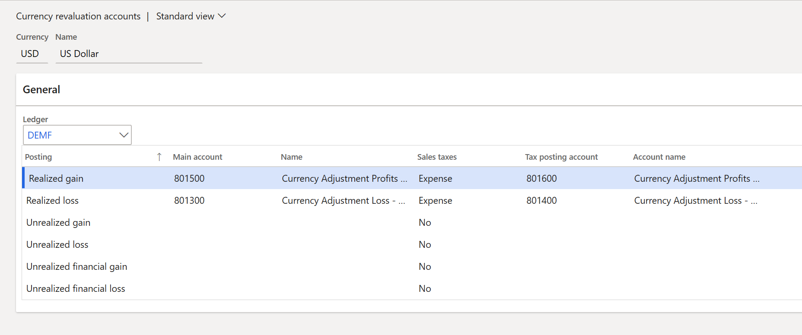

---
# required metadata

title: Split the realized exchange difference amount into the difference of the invoice net value and the VAT amount
description: This topic provides information about splitting the realized exchange difference amount into the difference of the invoice net value and the VAT amount.
author: anasyash
manager: 
ms.date: 04/07/2020
ms.topic: article
ms.prod: 
ms.service: dynamics-ax-applications
ms.technology: 

# optional metadata

# ms.search.form: 
audience: Application User
# ms.devlang: 
ms.reviewer: kfend
ms.search.scope: Core, Operations
# ms.tgt_pltfrm: 
ms.custom: 414136
ms.search.region: Poland
# ms.search.industry: 
ms.author: shylaw
ms.dyn365.ops.version: 
ms.search.validFrom: 2020-04-01

---

# Split the realized exchange difference amount into the difference of the invoice net value and the VAT amount

This feature allows you to split the Accounts payable and Accounts receivable foreign currency revaluation amount into two parts, the exchange difference related to net value of invoice (customer debts and vendor liabilities) and the exchange difference related to VAT invoice amount. You can also post the exchange differences, which are related to the VAT invoice amount, to a separate ledger account of realized gains and losses.

This feature is available only in legal entities with a Polish country context.

## Setup

### Activate the feature

In the **Feature management** workspace, enable the feature, **(Poland) Split the AP/AR realized exchange difference amount into the difference of the invoice net value and the VAT amount**.

### Set up ledger accounts

Set up a ledger account to post the exchange difference amount related to the tax amount of the invoice.

1. Go to **Modules** \> **General ledger** \> **Currencies** \> **Currency revaluation accounts**. 
2. On the **Currency revaluation accounts** page, select the currency code, and in the **Ledger** field, select the code of the legal entity.

2. Select the line that has **Realized gain** or **Realized loss** in the **Posting** field.
3. Set up the **Main account** and select the ledger account for posting the realized exchange difference.
4. In the **Sales taxes** field, select **Expense** to post a part of realized  exchange difference amount which is related to tax amount of invoice, to a separate expense ledger account. 
5. In the **Tax posting account** field, select the same expense ledger account.

## Post and settle customer and vendor transactions

Post and settle documents as usual. The exchange difference transaction created during settlement will generate a voucher where the exchange difference amount related to tax amount is posted separately to a ledger account. The ledger account is selected in the **Tax posting account** field of the **Currency revaluation accounts** page.

## Examples

The following are two examples that show the resulting ledger transactions.

### Example 1

Make the following settings in DEMF legal entity:

1. Change country to POL.
2. Validate on the **Ledger** page that the **Accounting currency** is set to **EUR**.
3. Set up currency exchange rates for the **Default** exchange rate type as shown in the table.

| Date       |     USD |     EUR |     Description    |
|------------|---------|---------|--------------------|
| 01.01.2020 | 100     | 80      | 100 USD for 80 EUR |
| 10.01.2020 | 100     | 90      | 100 USD for 90 EUR |

4. Set up ledger accounts for the realized exchange difference in the **Main account** and the **Tax posting account**.

Post the following transactions:

|   Document                     |   Date     |   Amount in USD                  |  Amount in EUR                       |   Voucher                                                                                                 |   Voucher amount   |
|--------------------------------|------------|----------------------------------|---------------------------------------|-----------------------------------------------------------------------------------------------------------|--------------------|
| Customer invoice               | 01.01.2020 | 119 USD, incl. VAT amount 19 USD | 95,20 EUR, incl. VAT amount 15,20 EUR | Debit *Accounts receivable*  Credit *Expense*  Credit *VAT*                                                 | 95,20  80,00  15,20  |
| Customer payment               | 10.01.2020 | 119 USD                          | 107,10 EUR                            | Debit *Bank*  Credit *AR*                                                                                  | 107,10  107,10      |
| Invoice and payment settlement | 10.01.2020 | 0 USD                            | 11,90 EUR                             | Debit *AR*  Credit *Exchange difference – main account*  Credit *Exchange difference – tax posting account* | 11,90  10,00  1,90   |

Where: 10,00 = 11,90 \* 80,00 / 95,20 (The exchange difference related to the net value of the invoice.)

1,90 = 11,90 – 10,00 (The exchange difference related to the tax amount of the invoice.)

### Example 2

In addition to settings in Example 1, implement the following settings:

1. On the **Ledger** page, in the **Bank exchange rate** field, select **Average**. This rate will be used to calculate VAT amounts.
2. Set up the currency exchange rate for the **Average** exchange rate type:

| Date       | USD | EUR |   Description       |
|------------|-----|-----|---------------------|
| 01.01.2020 | 100 | 100 | 100 USD for 100 EUR |
| 10.01.2020 | 100 | 110 | 100 USD for 110 EUR |

Post the following transactions:

|   Document                     |   Date     |   Amount in USD                  |   Amount in EUR                       |   Voucher                                                                                                                        |   Voucher amount            |
|--------------------------------|------------|----------------------------------|---------------------------------------|----------------------------------------------------------------------------------------------------------------------------------|-----------------------------|
| Customer invoice               | 01.01.2020 | 119 USD, incl. VAT amount 19 USD | 95,20 EUR, incl. VAT amount 19,00 EUR | Debit *Accounts receivable*  Credit *Expense*  Credit *VAT*  Debit *Accounts receivable tax difference*  Credit *VAT tax difference* | 95,20   80,00  15,20  3,80  3,80 |
| Customer payment               | 10.01.2020 | 119 USD                          | 107,10 EUR                            | Debit *Bank* Credit *AR*                                                                                                         | 107,10  107,10               |
| Invoice and payment settlement | 10.01.2020 | 0 USD                            | 11,90 EUR                             | Debit *AR* Credit *Exchange difference – main account*  Credit *Exchange difference – tax posting account*                        | 11,90  10,00  1,90            |

Where: 10,00 = 11,90 \* 80,00 / 95,20 (The exchange difference related to the net value of the invoice.)

1,90 = 11,90 – 10,00 (The exchange difference related to the tax amount of the invoice.)
