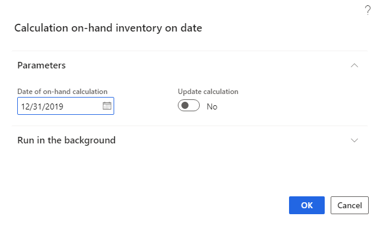
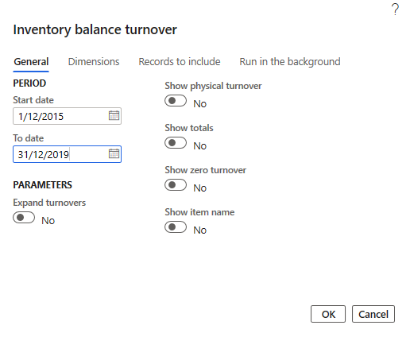
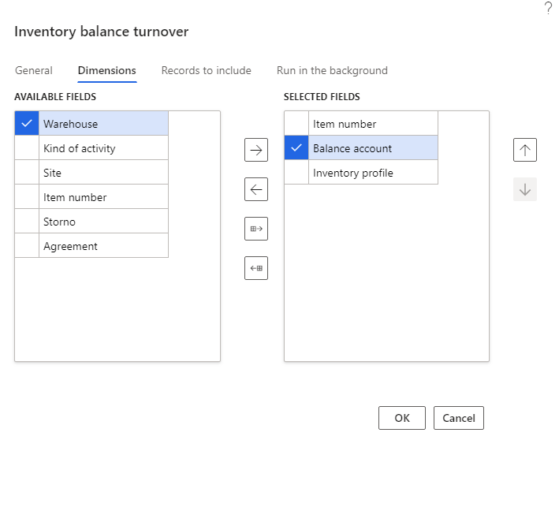
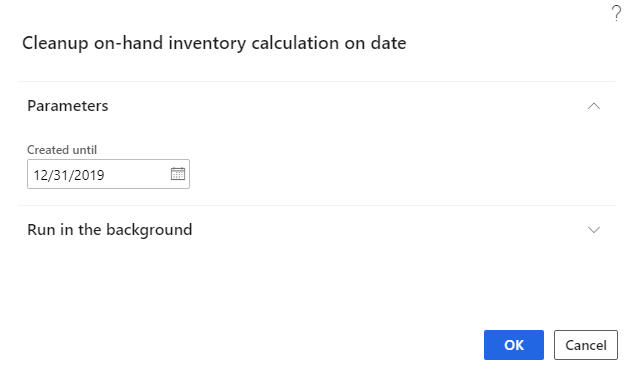
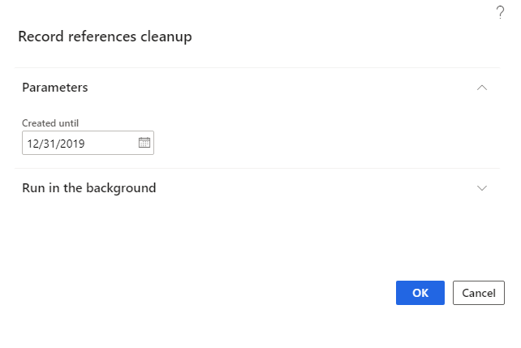
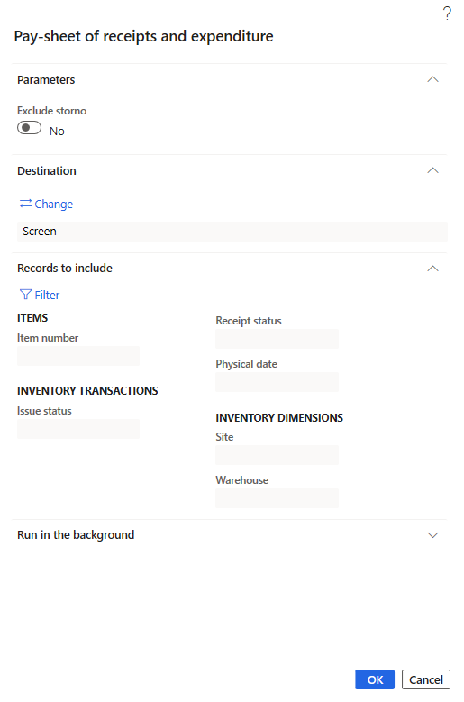
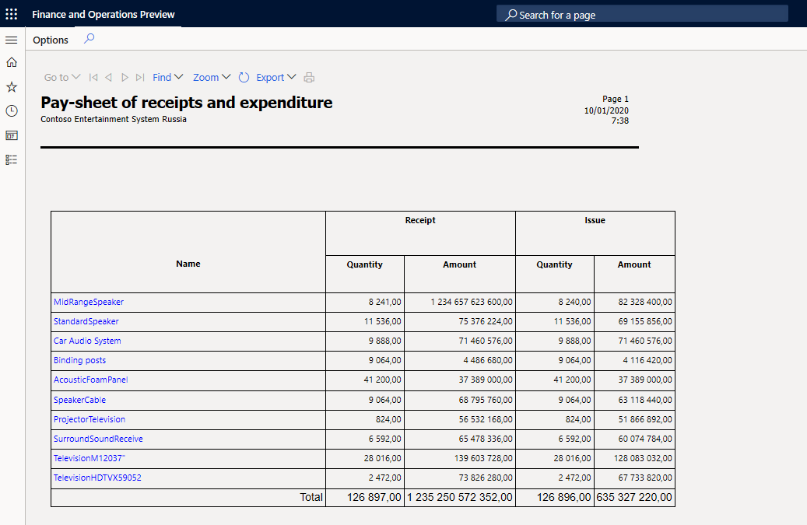

Inventory reports
=================

Introduction
------------

There are four local inventory reports available in Russia:

-   Inventory balance turnover

-   Pay-sheet of receipts and reports expenditure

-   Adjustments

-   Adjustment (cur.)

Preliminary setup
-----------------

Before you can generate the local inventory reports, complete the following
steps to set up number sequences for on-hand inventory dimension combination.

1.  Go to **Inventory management \> Setup \> Inventory and warehouse management
    parameters**.

2.  On the **Number sequences** tab, select a number sequence code for the
    **On-hand inventory on date dimension combination** reference, and then
    assign the number sequence in the **Number sequence code** field.

Inventory balance turnover
--------------------------

Using the **Inventory balance turnover** inquiry, you can view balances and
turnovers in the context of dimensions. You can select dimensions to include in
the report, and specify the selection criteria for dimensions when you use
filters.

### Calculate on-hand inventory on inventory closing date

To optimize the performance of the **Inventory balance turnover** inquiry, use
the periodic procedure, **On-hand inventory on date**. It calculates on-hand
inventory on the date when the inventory was previously closed.

1.  Go to **Inventory management \> Periodic tasks \> On-hand inventory on
    date**.

2.  On the **Calculation on-hand inventory on date** page, on the **Parameters**
    tab, in the **Date of on-hand calculation** field, specify the inventory
    closing date for which the inventory calculation must be performed. By
    default, this is the first date the inventory was closed without an
    inventory calculation.

3.  Set the **Update calculation** toggle to **Yes** if you want to clear the
    results of the previous inventory calculation on the specified inventory
    closing date and perform a full inventory calculation.

    

4.  When the inventory calculation is complete, on the **Closing and
    adjustment** page, for the corresponding inventory closure line, on the
    **Session** tab, the **Calculation on-hand inventory on date** option will
    be set to **Yes**.

    

If you try to run the inventory calculation again to close an inventory that has
the **Calculation on-hand inventory on date** option set to **Yes**, and the
**Update calculation** option is set to **No**, an error will occur.

The results of the on-hand inventory calculation on the inventory closing date
are deleted from the system when the corresponding inventory closing is
canceled.

### Inventory balance turnover inquiry

1.  Go to **Inventory management \> Inquires and reports \> Transactions \>
    Inventory balance turnover**.

    

2.  On the **Inventory balance turnover** dialog box, on the **General** tab, in
    the **Start date** and **To date** fields, specify the period of report.

3.  Set the **Expand turnovers** option to **Yes** to divide the turnover
    columns into two groups in the inquiry results:

    -   Internal turnovers that *don’t* change the total balances of the
        company. This includes inventory movements on inventory transfer
        journals and transfer orders.

        >   **Note:** The following documents are not considered internal turnovers
        >   because the item from the warehouse can be written off:
        >
        >   -   Quarantine orders
        >
        >   -   Transfer order scarp
        >
        >   -   Quality orders

    -   External turnovers that *do* change the total balances of the company.
        This includes inventory movements on purchase or sales orders and
        inventory journals.

4.  Set the **Show physical turnover** option to **Yes** to separate physical
    turnovers from financial turnovers. Physical turnovers include packing slips
    and production orders, picking lists, by-product journals and
    report-as-finished journals for production orders. Financial turnovers
    include purchase or sales invoices, inventory journals, and the calculation
    of production orders. The physical turnover will be allocated to a separate
    group of columns. If you set the **Show physical turnover** option to
    **No**, the physical turnover is added to the financial turnover.

    **Notes**:

    -   If you use the physical storno mechanism for inventory transactions during a
        financial update, the physical turnover and storno physical turnover for
        financially updated inventory transactions are reflected in the same column
        as a receipt or issue, but with opposite signs. That is, they are summarized
        to zero, if both the physical and financial dates of the inventory
        transaction are included in the inquiry period. If the physical date is
        included in the inquiry period, and the financial is not, the inquiry will
        contain only physical movement, but the reverse/storno of physical movement
        and financial movement will not be considered.

        For example, for the following inventory transactions, the purchase and
        credit note for the purchase are listed.

        | Document type                | Type of inventory transaction | Credit correction (physical) | Quantity |
        |------------------------------|-------------------------------|------------------------------|----------|
        | Purchase order               | Receipt                       | No                           | 10       |
        | Credit note for the purchase | Issue                         | Yes                          | \-3      |

        If the **Storno** dimension is not selected, the report will show the line
        with the following quantities:

        | Quantity (Receipt) | Quantity (Issue) |
        |--------------------|------------------|
        | 7                  | 0                |

    -   If the physical or financial update of inventory transaction wasn’t posted
        to the general ledger, the value in the **Balance account** dimension for
        the inventory transactions is empty.

5.  Set the **Show totals** option to **Yes** to view lines with subtotals on
    dimensions.

6.  Set the **Show zero turnover** option to **Yes** to view lines with zero
    turnovers (but a non-zero initial balance) for the period. This option is
    automatically selected if the **Show totals** option is selected.

7.  Set the **Show item name** option to **Yes** to view the product name in
    addition to the product code.

8.  On the **Dimensions** tab, select dimensions to include in the report.

    

    The following dimensions are available:
    
       a. **Item number**
        
       b. **Inventory dimensions**
       
       c. **Kind of activity**: The value **Unspecified** is displayed if the
          inventory movement does not have an **Inventory profile** dimension.
       
       d. **Balance account**
       
       e. **Agreement**
       
       f. **Storno** allows you to separate storno transactions.
               1.  If the **Storno** dimension is selected, then storno inventory
                   transactions are displayed separately in the report on separate lines.
                   These lines have the value **Yes** in the **Storno** column. The
                   transactions are displayed with different direction and amount sign.
                   Storno of incoming inventory transactions are shown in the **Issue**
                   column with a negative sign, and storno of outgoing inventory
                   transactions are shown in the **Receipt** column with a negative sign.
               2.  If the **Storno** dimension is not selected, the storno inventory
                   transactions decrease the value of the initial transaction in the
                   corresponding columns. Storno of incoming inventory transactions have a
                   decreased value in the **Issue** column, where storno of outgoing
                   inventory transactions have a decreased value in the **Receipt** column.

       For example, the following inventory transactions show the purchase and
       credit note for the purchase:

       | Document type                | Type of inventory transaction | Credit correction (physical) | Quantity |
       |------------------------------|-------------------------------|------------------------------|----------|
       | Purchase order               | Receipt                       | No                           | 10       |
       | Credit note for the purchase | Issue                         | Yes                          | \-3      |

       If the **Storno** dimension is selected, the report will show the lines with
       the following quantities:

       | Storno | Quantity (Receipt) | Quantity (Issue) |
       |--------|--------------------|------------------|
       | No     | 10                 | 0                |
       | Yes    | \-3                | 0                |

9.  On the **Records to include** tab, use the filter to define the transactions
    to include in the report.

10. Click **OK** to generate a report.

    

**Notes.**

In the **Line type** column, you can see the type of the line: **Transactions**
or **Totals**

The quantity columns (**Quantity (at the beginning)**, **Quantity (at the
end)**, **Quantity (receipt)**, **Quantity (issue)**) are displayed only if the
**Item number** is selected as one of the report dimensions. In these fields,
the data are is displayed in the inventory unit of measurement for the item.

If the date of the corresponding inventory settlements falls within the inquiry
period, the fields with amounts, **Amount (at the beginning)**, **Amount
(Receipt)**, **Amount (Issue)**, **Amount (at the end)** contain the financial
amount of the corresponding inventory transactions in the accounting currency
and the adjustments of the financial amount.

The report quantities and amounts also include inventory transactions that have
been updated physically. The physical amount of the inventory transaction is
used. Inventory transactions that are updated financially are included in the
inquiry with the financial transaction date. Inventory transactions that are
updated only physically are included in the inquiry with the physical
transaction date. Inventory settlements are reflected in the report with the
date of the inventory settlement.

11. Depending on the type of inventory transaction, the inquiry determines the
    direction of the inventory turnover as follows:

    | Type of inventory transaction         | Direction                                                             |
    |---------------------------------------|-----------------------------------------------------------------------|
    | Purchase order                        | Receipt                                                               |
    | Sales order                           | Issue                                                                 |
    | Production                            | Receipt                                                               |
    | Production line                       | Issue                                                                 |
    | By-products                           | Receipt                                                               |
    | Other types of inventory transactions | Receipt for incoming transactions and Issue for outgoing transactions |

12. If the **Item number** dimension is selected, you can select a line with the
    line type, **Transaction**, and on the **Action pane**, select
    **Transaction**. On the opened **Inventory transactions** page, you can see
    the list of transactions that generated turnovers in the selected line. If
    the financial date does not fall within the inquiry period, but there are
    inventory settlements within the inquiry period, the transaction is not
    reflected on this page.

13. Select **Recalculate** to set new inquiry parameters and recreate the
    results.

14. Select **Print** to view or save the report as a Microsoft Excel document.
    On the **Parameters** FastTab, set the **Print ranges** to **Yes** if you
    want the report to display the filters specified in the inquiry parameters,
    as well as the filters applied to the inquiry results.

### Clean up temporary data

When calculating data for an **Inventory balance turnover** inquiry, the system
generates temporary data but stores the data in permanent database tables. After
closing the inquiry form, the data is deleted from the system. However,
temporary data may not be completely deleted (for example, in case of system
failures). To clear the temporary data, the **On-hand inventory calculation on
date** and **Record references cleanup** periodic operations are used.

1.  Go to **Inventory management \> Periodic tasks \> Clean up \> On-hand
    inventory calculation on date**.

    

2.  On the **Parameters** FastTab, in the **Created until** field, specify the
    date. The temporary data with a creation date before the specified date will
    be deleted. Specify the date equal to current date minus one (1) day to
    avoid deleting the data currently used by another user.

3.  Select **OK**.

4.  Go to **Organization administration \> Periodic \> Record references
    cleanup**.

    

5.  On the **Parameters** FastTab, in the **Created until** field, specify the
    date. All temporary data with creation date before the specified date will
    be deleted.

6.  Select **OK**.

Pay-sheet of receipts and expenditure report
--------------------------------------------

This report displays receipts and issues for all items.

1.  Go to **Inventory management \> Inquires and reports \> Transactional
    reports \> Pay-sheet of receipts and reports expenditure**.

    

2.  On the **Pay-sheet of receipts and expenditure** dialog box, on the
    **Parameters** FastTab, specify the value of **Exclude storno** parameter:

    -   If the **Exclude storno** option is set to **Yes**, the system displays
        the storno turnovers in the total inventory movements without allocating
        the storno turnovers as a separate line.

    -   If the **Exclude storno** option is set to **No**, the system displays a
        line with initial transactions for each item and a line with storno
        transactions, if there were any. If the original and storno transactions
        are in the same reporting period, they do not add turnovers for the
        item, but if they are in different periods, the transaction that falls
        within the inquiry period will affect the period's turnovers.

3.  On the **Records to include** FastTab, select the **Filter** to apply
    filters for the report.

4.  Select **OK** to generate a report.

    

Adjustments report
------------------

This report shows all adjustments that were done during the inventory
recalculation or closing. To do this, go to **Inventory management \> Inquires
and reports \> Transactional reports \> Adjustments**. Specify the parameters,
and then select **OK** to generate a report.

Adjustments in currency report
------------------------------

This report shows all adjustments that were done during the inventory
recalculation or closing in the reporting currency. To do this, go to
**Inventory management \> Inquires and reports \> Transactional reports \>
Adjustment (cur.)**. Specify the parameters, and select **OK** to generate a
report.
