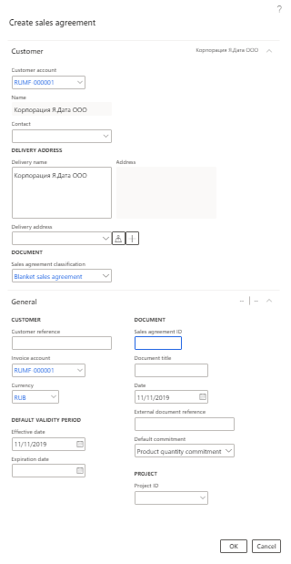
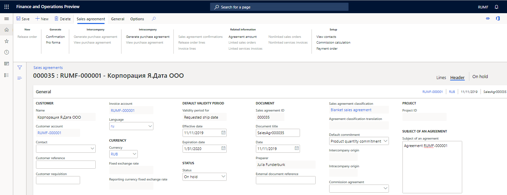
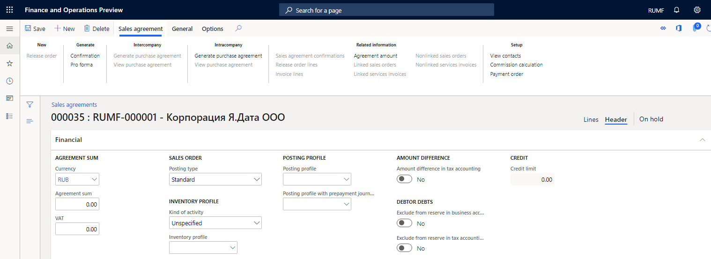
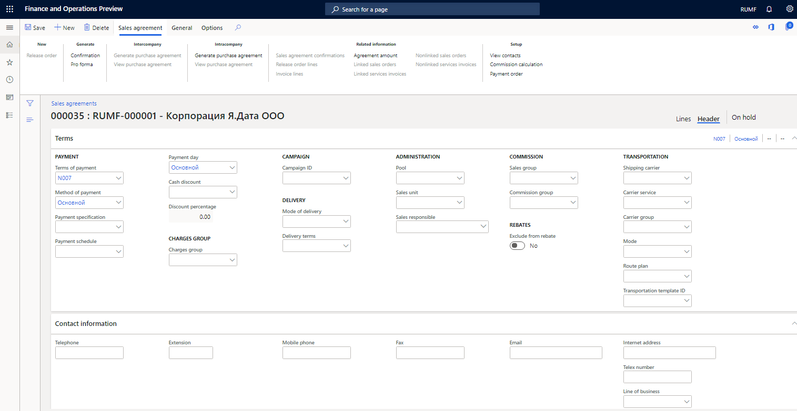
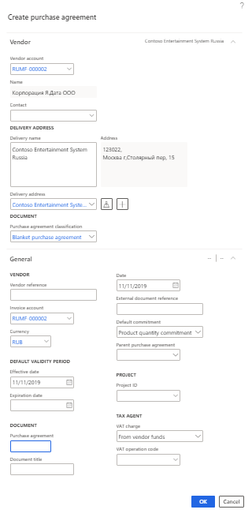

Set up and create agreements
============================

You can view all purchase agreements on the **Purchase agreements** list page
and all sales agreements on the **Sales agreements** list page. These list pages
store data such as the dates and amounts of the agreements, and the payment
terms. All agreements are grouped into agreement classifications.

Create sales agreement classifications
--------------------------------------

1.  Go to **Sales and marketing \> Setup \> Sales agreements \> Sales agreement
    classifications** or **Accounts receivable \> Setup \> Sales agreement
    classifications**.

2.  Create a sales agreement classification.

3.  On the **General** FastTab, in the **Associated classification** field,
    select the agreement classification group that is associated with the
    agreement classification.

4.  In the **Number sequence code** field, select the code for the number
    sequence that should be used to number agreements that belong to the
    agreement classification.

5.  Select **Save**.

*Note*. You can't delete an agreement classification that is used for existing
agreements.

Create purchase agreement classifications
-----------------------------------------

1.  Go to **Procurement and sourcing \> Setup \> Purchase agreement
    classification**.

2.  Specify the details as described in the previous section of this topic,
    [Create sales agreement
    classifications](#create-sales-agreement-classifications).

Create a sales agreement
------------------------

For more information about how to create sales agreements, see [Enter sales
agreements](https://docs.microsoft.com/dynamics365/supply-chain/sales-marketing/tasks/enter-sales-agreements).

1.  Go to **Accounts receivable \> Orders \> Sales agreements** or **Sales and
    marketing \> Sales agreements \> Sales agreements**.

2.  On the Action Pane, select **New** to create a sales agreement.

3.  In the **Create sales agreement** dialog box, on the **Customer** FastTab,
    specify the following details:

    -   In the **Customer account** field, select a customer account.

    -   In the **Document** section, in the **Sales agreement classification**
        field, select the sales agreement classification that the agreement belongs
        to.

>   On the **General** FastTab, in the **Document** section, the **Sales
>   agreement ID** field is set based on the number sequence that is specified
>   for the agreement classification.

4.  Select **OK**.

5.  On the **Sales agreements** page, on the **Sales agreement header** FastTab,
    specify the following details:

    -   In the **Currency** field, specify the currency for the agreement.

    -   In the **Effective date** field, specify the effective date for the
        agreement.

    -   In the **Expiration date** field, specify the expiration date for the
        agreement.

    -   In the **Status** field, select the status of the agreement: **On-hold**,
        **Effective**, or **Closed**.

>   *Note.* Transactions can be posted only for agreements that have a status of
>   **Effective**.

6.  Switch to the **Header** view, and then, on the **General** FastTab, follow
    these steps:

    -   In the **Document** section, specify the following details:

        -   In the **Document title** field, specify the title for the agreement.

        -   In the **Date** field, specify the date of the agreement.

    -   In the **Subject of an agreement** section, in the **Subject of an
        agreement** field, enter a comment or notes about the agreement.

7.  On the **Financial** FastTab, follow these steps:

    -   In the **Agreement sum** section, in the **Agreement sum** field,
        specify the sum of the agreement.

    -   In the **Credit** section, in the **Credit limit** field, specify the
        credit limit for the agreement. The credit limit is comprehensively
        checked for all counterparty agreements and for the total counterparty
        limit.

>   **\> Note:**

>   \> When you settle invoices with payments that belong to different
>   agreements, limit control is done according to the agreement that the
>   payment is assigned to.

>   \> If you cancel the settlement of invoices and payments that belong to
>   different agreements, limit control is done according to the agreement that
>   the invoice is assigned to.

>   \> When you settle invoices with payments that don't indicate that they
>   belong to the agreement, limit control is done by the counterparty.

>   \> When you settle invoices that don't indicate that they belong to the
>   agreement with payments that belong to the agreement, limit control is done
>   according to the agreement that the payment is assigned to.

>   \> If you cancel the settlement of invoices that don't indicate that they
>   belong to the agreement and payments that belong to the agreement, limit
>   control is done by a contractor. Invoices that have an open balance and
>   don't indicate an agreement are included.

    -   In the **Posting profile** section, specify the following details:

    -   In the **Posting profile** field, if you specify an agreement for
        transactions, you can select the counterparty posting profile that should be
        used when transactions are posted.

    -   In the **Posting profile with prepayment journal voucher** field, you can
        select a separate posting profile that should be used when a prepayment is
        registered for the agreement. If you don't set this field, a default value
        is taken from the **Accounts receivable parameters** page.

8.  On the **Terms** FastTab, in the **Payment** section, set the fields for
    payment terms. In the **Payment day** field, select a calendar of payment
    days.

9.  On the **Contact information** FastTab, specify contact information for the
    agreement.

10.  On the **Financial dimensions** FastTab, specify financial dimensions. When
    you specify an agreement in a document, the financial dimensions of the
    agreement are entered into the document dimension.

11.  Select **Save**.

### Set up a commission

1.  On the **Sales agreements** page, select the agreement that you want to set
    up a commission for.

2.  On the **Sales agreement** tab, in the **Setup** section, select
    **Commission calculation**.

3.  On the **Commission calculation** page, set up a commission for the selected
    agreement. For more information about how to set up commissions, see
    [Register sales
    commissions](https://docs.microsoft.com/dynamics365/supply-chain/sales-marketing/tasks/register-sales-commissions).

Create a purchase agreement
---------------------------

For more information about how to create purchase agreements, see [Create a
purchase
agreement](https://docs.microsoft.com/dynamics365/supply-chain/procurement/tasks/create-purchase-agreement).

1.  Go to **Accounts payable \> Purchase orders \> Purchase agreements** or
    **Procurement and sourcing \> Purchase agreements \> Purchase agreements**.

2.  On the Action Pane, select **New** to create an agreement.

3.  In the **Create purchase agreement** dialog box, on the **Vendor** FastTab,
    specify the following details:

    -   In the **Vendor account** field, select a vendor account.

    -   In the **Document** section, in the **Purchase agreement classification**
        field, select the purchase agreement classification that the agreement
        belongs to.

>   On the **General** FastTab, in the **Document** section, the **Purchase
>   agreement** field is set based on the number sequence that is specified for
>   the agreement classification.

4.  Select **OK**.

5.  On the **Purchase agreements** page, specify the details as described in the
    [Create a sales agreement](#create-a-sales-agreement) section earlier in
    this topic.

Set up agreement dimension control for settlements
--------------------------------------------------

You can set up dimension control for settlements. For more information, see [Set
up dimension control for
settlements](https://docs.microsoft.com/dynamics365/finance/localizations/rus-transactions-settlement-date).
To do settlement in the context of agreements, follow these steps.

1.  Go to **General ledger \> Ledger setup \> General ledger parameters**.

2.  On the **Agreements** tab, set the **Disable agreement dimension control**
    option to **No**.

Find more details in the following topics:

-   [Agreements](rus-agreements.md)

-   [Register transactions with reference to
    agreements](rus-register-transactions-with-reference-to-agreements.md)

-   [Inquiries and reports with
    agreements](rus-inquiries_and_reports_with_agreements.md)
