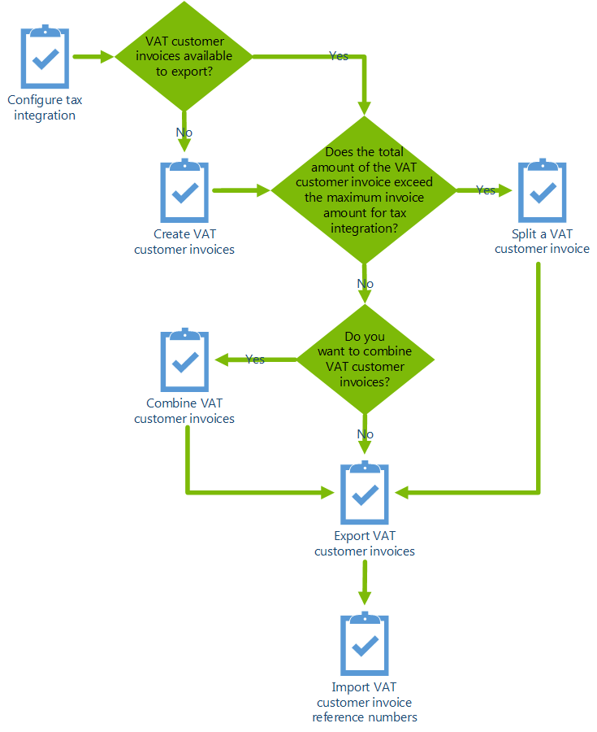

---
# required metadata

title: Configure tax integration for China
description: This topic describes the process for configuring tax integration for China.
author: ShylaThompson
manager: AnnBe
ms.date: 06/20/2017
ms.topic: article
ms.prod: 
ms.service: dynamics-ax-applications
ms.technology: 

# optional metadata

ms.search.form: CustParameters, VATInvoiceDescTable_CN, TaxProfileTable_CN
audience: Application User
# ms.devlang: 
ms.reviewer: shylaw
ms.search.scope: Core, Operations
# ms.tgt_pltfrm: 
ms.custom: 265264
ms.assetid: e5dbbbe1-935f-4fb4-a014-447916051628
ms.search.region: China (PRC)
# ms.search.industry: 
ms.author: leguo
ms.search.validFrom: 2016-11-30
ms.dyn365.ops.version: Version 1611

---

# Configure tax integration for China

[!include [banner](../includes/banner.md)]

This topic describes the process for configuring tax integration for China 
## What's new and changed in Dynamics 365 for Finance and Operations version 10.0.

In order to further optimize the tax service and meet the needs of the taxpayer's internal management information system and the VAT invoice tax control billing the State Administration of Taxation updated  the invoicing software data interface for the V3.0 version (invoicing software data interface specification V1.0 and V2.0 does not meet the needs of the full implementation of the national reform of the VAT invoice management system). 

In China, official tax invoice can only be issued via two government authorized invoicing software (Aisino and BaiWang). 
Dynamics 365 for Finance and Operations version 10.0 provides the function to export sales invoice into txt electronic file and xml file for import to authorized invoicing software of Aisino and BaiWang providers accordingly. 

The existing solution has been extended to integrate with both providers - Aisino and BaiWang – to export and import messages. Apart from there is maintain in the product the tax classification and codes in alignment with tax integration interface 3.0.

The following updates were implemented in Dynamics 365 for Finance and Operations:

1.	New interface with BaiWang provider software (export of sale invoices in xml file and import file with response from BaiWang software in txt format and also in xml format).
2.	Updating structure of sale invoice export and import of txt file for interface with Aisino provider software.

One of the main new elements in the export invoice file, is commodity code (classification of goods and services), which is mandatory in export file. For output of commodity codes in the node of invoice lines in the export file the system uses category hierarchy standard functionality settings. In order to the system may output this code in the export file, the following settings should be completed:

1.	First of all it is necessary to set up one category hierarchy for classification of goods and services and relate product items (good or service) with category note (see the article [Create a hierarchy of product classification](https://emea01.safelinks.protection.outlook.com/?url=https%3A%2F%2Fdocs.microsoft.com%2Fen-us%2Fdynamics365%2Funified-operations%2Fsupply-chain%2Fpim%2Ftasks%2Fcreate-hierarchy-product-classification&data=02%7C01%7Cv-oloski%40microsoft.com%7C57775aeaf8344fe8c46b08d6809a22d4%7C72f988bf86f141af91ab2d7cd011db47%7C1%7C0%7C636837796906771919&sdata=IuDk5ms0xSQvCCESzlz3gAMOjClEsPyuGL29M5iNows%3D&reserved=0)). Using this functionality, it is possible to set up any hierarchy, which necessary in a company.

2.	Then set this new category hierarchy in Tax integration profile (new field in this page – Commodity code hierarchy)

3.	For invoice lines which are not related with product items (Free text invoice lines and project invoice lines, created on the base of hour, expense and fee journals) a user may set up Commodity code, which will be used by default (new field in the Tax integration profile).

Dialog page for import of files from the software provider is updated (VAT invoice integration page list, Import button). A user should select model mapping for import file from one or another provider (Aisino or BaiWang) depending on which provider software the company integrates exported invoices with. This selection should be made only one time (the system saves selected value). 

To import txt file (<file name>_invoicing result.TXT) a user should set Import BaiWang txt file option to Yes and select BaiWang – txt file mapping in the Model mapping field.

To import txt file from Aisino or xml file from BaiWang (exported files from BaiWang software) a user should set Import BaiWang txt file option to No and select Aisino  or BaiWang – xml file mapping in the Model mapping field.

For integration with Aisino software it is necessary to import the following configuration from LCS:
•	GoldenTax model
•	GST Export model mapping (CN)
•	GTS Export format (Aisino) (CN)
•	GTS Import model mapping (CN)
•	GTS Import format (Aisino) (CN)
For integration with BaiWang software it is necessary to import the following configuration from LCS:
•	GoldenTax model
•	GST Export model mapping (CN)
•	GTS Import model mapping (CN)
•	GTS Export format (BaiWang) (CN)
•	GTS Import format (BaiWang)-txt) (CN)
•	GTS Import format (BaiWang-xml) (CN)
> [!NOTE] 
> 
 A user may import txt or xml files, received as response after import to BaiWang software or exported from BaiWang software.
 **Setup** > **Accounts receivable parameters** > **Ledger and sales tax** > **General** tab).

To configure tax integration for China, complete the following tasks.

1.  Create a new VAT invoice description on the **VAT invoice description** page. For example, you may need to set  the following parameters:
    -   **VAT invoice description ID** to InvoiceDescID01
    -   **Description** to 设备
    -   **Unit** to Box

2.  Create a new tax integration profile on the **Tax integration profiles** page. You can set up tax integration profiles to use when invoices are imported or exported. In the tax integration profile, you can specify the following:
    -   Sales tax code
    -   Maximum invoice amount
    -   Default description and unit for the golden tax invoice
    -   Whether to include non-deductible VAT invoices

The tax integration process is illustrated in the following diagram.

## Additional resources

- [Import the Chinese Golden Tax data entity](apac-chn-import-golden-tax-data-entity.md)

- [Chinese tax integration modification for VAT customer invoices FAQ](apac-chn-tax-integration-vat-customer-invoices.md)

- [Set up basic tax integration for China](./tasks/set-up-basic-tax-integration-profile-china.md)

