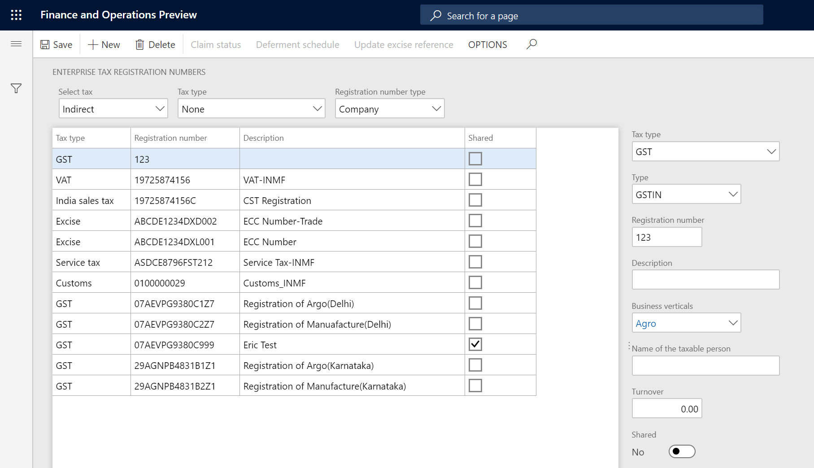
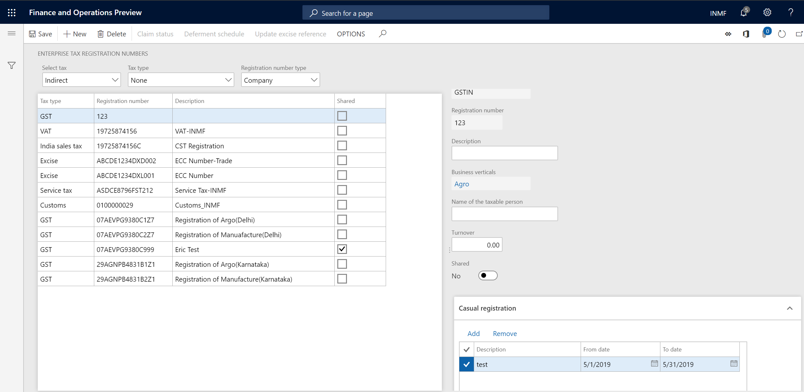
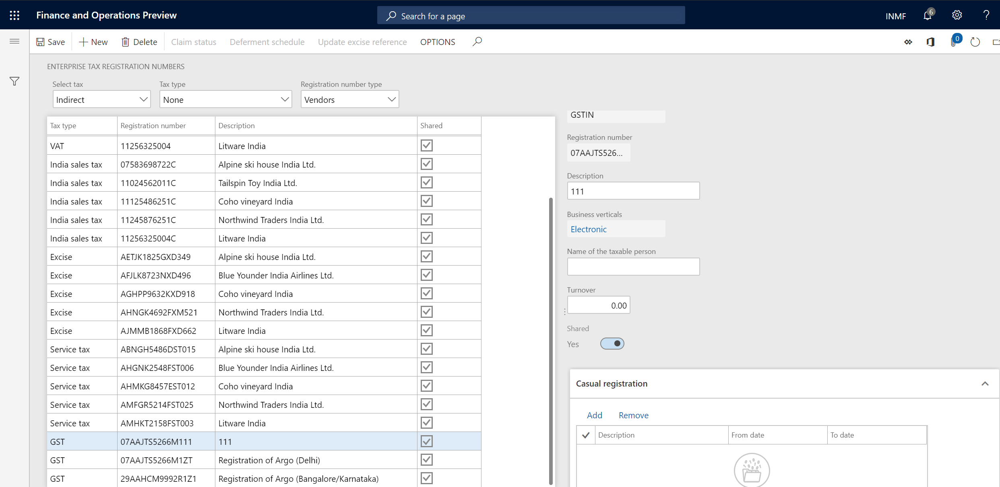
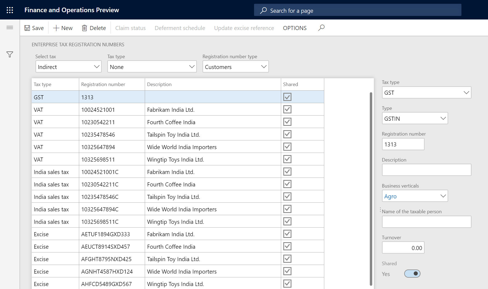

---
# required metadata

title: Create a GSTIN master
description:  This topic provides information about how to create a GSTIN master.
author: EricWang
manager: RichardLuan
ms.date: 06/04/2019
ms.topic: article
ms.prod: 
ms.service: dynamics-365-applications
ms.technology: 

# optional metadata

# ms.search.form: 
audience: Application User
# ms.devlang: 
ms.reviewer: kfend
ms.search.scope: Core, Operations
# ms.tgt_pltfrm: 
# ms.custom: 
ms.search.region: India
# ms.search.industry: 
ms.author: EricWang
ms.search.validFrom: 2019-06-01
ms.dyn365.ops.version: 10.0.4

---

# Create a GSTIN master

To enable the India localization solution for GST in Microsoft Dynamics 365 for Finance and Operation, the following master data setup configurations are required:

- Define business vertical
- Update the state code and union territory
- Create a GSTIN master
- Define GSTIN numbers for the legal entity, warehouse, vendor, or customer masters
- HSN codes and Service accounting codes
- Create main accounts for the GST posting type
- Create a tax settlement period
- Attach the GSTIN to a tax registration group

## Define company registration numbers for the GST tax type

1. Click **Tax** \> **Setup** \> **Sales Tax** \> **Enterprise tax registration numbers**.
2. Create a record, and in the **Tax type** field, select **GST**.
3. In the **Registration number type** field, select **Company** to create state-wide company registration numbers.
4. In the **Type** field, verify that **GSTIN**, **GDI**, and **UID** appear in the list, and then select a value.
5. In the **Registration number** field, enter a value.
6. In the **Description** field, enter a value.
7. In the **Business vertical** field, select a value.

8. On the **Casual registration** FastTab, click **Add**.
9. In the **From date** and **To date** fields, define the valid period for the casual registration number.
10. In the **Description** field, enter a value.
11. On the **Number sequences** FastTab, define number sequences for the **GST invoice** and **Bill of supply** references.

   - The **GST invoice** number sequence will be used when customer sales that have GST transactions are posted.
   - The **Bill of supply** number sequence will be used when customer sales that have non-GST transactions are posted.

## Define vendor registration numbers for the GST tax type

1. In the **Registration number type** field, select **Vendors** to create state-wide vendor registration numbers.
2. Click **New** to create a record, and in the **Tax type** field, select **GST**.
3. In the **Registration number field**, enter value.
4. In the **Description** field, enter a value.
5. In the **Business vertical** field, select a value.

## Define customer registration numbers for the GST tax type

1. In the **Registration number type** field, select **Customers** to create state-wide vendor registration numbers.
2. Click **New** to create a record, and in the **Tax type** field, select **GST**.
3. In the **Registration number field**, enter value.
4. In the **Description** field, enter a value.
5. In the **Business vertical** field, select a value.

