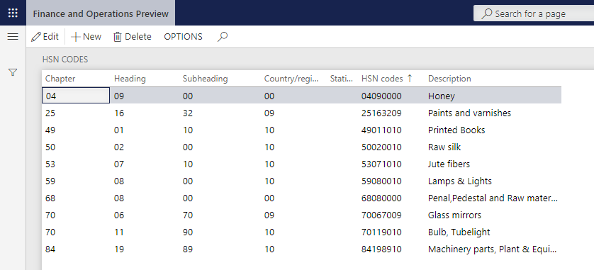
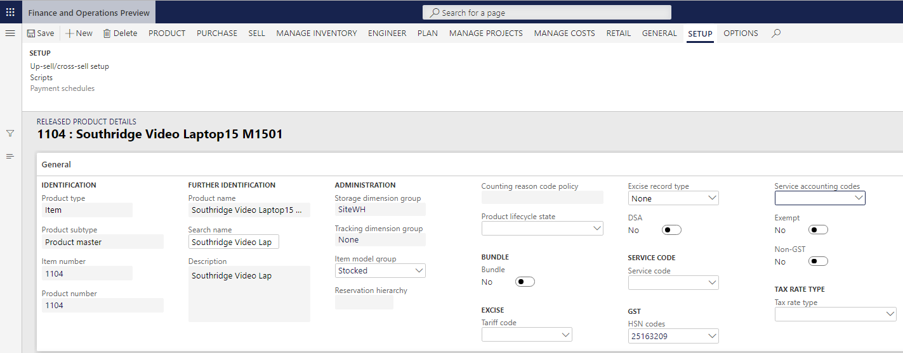

---
# required metadata

title: Define HSN and service accounting codes
description:  This topic provides information about how to define HSN codes and service accounting codes.
author: EricWang
manager: RichardLuan
ms.date: 06/04/2019
ms.topic: article
ms.prod: 
ms.service: dynamics-365-applications
ms.technology: 

# optional metadata

# ms.search.form: 
audience: Application User
# ms.devlang: 
ms.reviewer: kfend
ms.search.scope: Core, Operations
# ms.tgt_pltfrm: 
# ms.custom: 
ms.search.region: India
# ms.search.industry: 
ms.author: EricWang
ms.search.validFrom: 2019-06-01
ms.dyn365.ops.version: 10.0.4

---

# Define HSN and service accounting codes

To enable the India localization solution for GST in Microsoft Dynamics 365 for Finance and Operation, the following master data setup configurations are required:

- Define business vertical
- Update the state code and union territory
- Create a GSTIN master
- Define GSTIN numbers for the legal entity, warehouse, vendor, or customer masters
- HSN codes and Service accounting codes
- Create main accounts for the GST posting type
- Create a tax settlement period
- Attach the GSTIN to a tax registration group

## Define HSN codes

1. Click **Tax** \> **Setup** \> **Sales tax** \> **India** \> **HSN code** and create a new record. 
2. In the **Chapter** field, enter a value.
3. In the **Heading** field, enter a value.
4. In the **Subheading** field, enter a value.
5. In the **Country/region extension** field, enter a value.
6. In the **Statistical suffix** field, enter a value.
7. Save the record and verify that the **HSN code** field is updated.
8. In the **Description** field, enter a value.
9. Click **Close**.

## Define service accounting codes

1. Click **Tax** \> **Setup** \> **Sales tax** \> **India** \> **Service accounting codes**.
2. Create a record.
3. In the **SAC** field, enter a value.
4. In the **Description** field, enter a value.
5. Save the record and then click **Close**.

## Assign HSN codes and service accounting codes to products

1. Click **Product information management** \> **Products** \> **Released products**.
2. Select a product and click **Edit**.
4. On the **General** tab, in the **HSN code** or **Service accounting codes** fields, select a value based on whether the product type is **Item** or **Service**.
5. Save the record and then click **Close**.

The following setup is required for the calculation of GST:
- A Harmonized System of Nomenclature (HSN) code should be defined for the Item product type, or a Service accounting code (SAC) should be defined for the Service product type.
- Item sales tax group should be removed.

## Assign a Service accounting code to miscellaneous charges

1. Click **Accounts payable** \> **Charges Setup** \> **Charges code**.
2. Select a charges code, and on the **Tax information** FastTab, enter a value in the **SAC or HSN code** field.
3. Enter a value in the **Service category or ITC Category** field.
4. Select the **Exempt** check box to exempt these charges from the calculation of GST and then save the record.

When this charge code is selected for a transaction, the defined tax information is automatically entered, and GST is calculated accordingly.

5. Click **Accounts receivable > Charges Setup > Charges code**.
6. Select a charges code, and on the **Tax information** FastTab, enter a value in the **SAC or HSN code** field.
7. Select the **Exempt** check box to exempt this charges from the calculation of GST and save the record.

  > [!NOTE]
  > When this charge code is selected for a transaction, the defined tax information is automatically entered, and GST is calculated accordingly.

  > 
