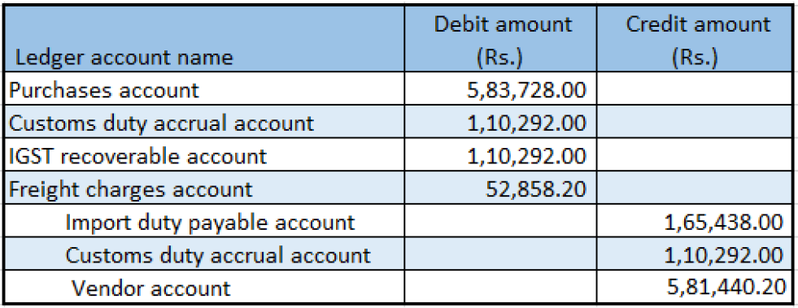

---
# required metadata

title: Import of goods that have GST
description:  This topic includes information about importing goods with GST.
author: EricWang
manager: RichardLuan
ms.date: 06/04/2019
ms.topic: article
ms.prod: 
ms.service: dynamics-365-applications
ms.technology: 

# optional metadata

# ms.search.form: 
audience: Application User
# ms.devlang: 
ms.reviewer: kfend
ms.search.scope: Core, Operations
# ms.tgt_pltfrm: 
# ms.custom: 
ms.search.region: India
# ms.search.industry: 
ms.author: EricWang
ms.search.validFrom: 2019-06-01
ms.dyn365.ops.version: 10.0.4

---

# Import goods that have GST

Complete the procedures in this topic to import goods that have GST.

1. Click **Accounts payable** \> **Purchase orders** \> **All purchase orders**.
2. Create a purchase order for a foreign vendor account and save the record.
3. Click **Tax information**.

   

4. Click the **GST** tab.
5. Click the **Customs** tab.

   

6. Click the **Vendor tax information** tab.

   

7. Click OK.
8. Click **Functions** \> **Maintain charges**.
9. Select a **Charges code**.
10. Select the **Assessable value** check box.
11. In the **Charges value** field, enter a value and then save the record.

    

12. Click Close

    

> [!NOTE]
> The assessable value is calculated as Net amount + Miscellaneous charges + 1% of Landing charges that are defined in Accounts payable parameters.

### Validate the tax details

1. On the **Purchase orders** page, on the Action Pane, on the **Purchase** tab, in the **Tax** group, click **Tax document**.
2. On the **Tax details** FastTab, review the tax calculation.

For example, it might look something like this:

- BCD: 10 percent
- LOI: 100 percent
- IGST: 20 percent
- Import exchange rate: 1 USD = 52 INR

 > [!NOTE]
 > IGST can be calculated on Assessable value + BCD tax amount, by extending the configuration.

3. Click **Close**.
4. Click **Confirm**.

### Update the invoice registration

1. On the **Purchase orders** page, on the Action Pane, on the **Customs** tab, in the **Maintain** group, click **Invoice registration**.
2. In the **Import invoice number** field, select a value.
3. Click **Update**.

### Post the bill of entry

1. On the **Purchase orders** page,on the Action Pane, on the **Customs** tab, in the **Generate** group, click **Bill of entry**.
2. In the **Import invoice number** field, select a value.
3. In the **Bill of entry number** field, select a value.
4. Click the **Lines** tab.
5. In the **Quantity** field, enter a value.
6. Close the message.
7. Click **Tax document**.
8. Click **Close**.
9. Click **OK**.

### Post the product receipt

1. On the **Purchase orders** page, on the Action Pane, on the **Receive** tab, in the **Generate** group, click **Product receipt**.
2. In the **Quantity** field, select **Bill of entry quantity**.
3. Enter the **Product receipt**.
4. Click **OK**.

The following graphic is a sample journal entry for an import purchase order that has GST.

