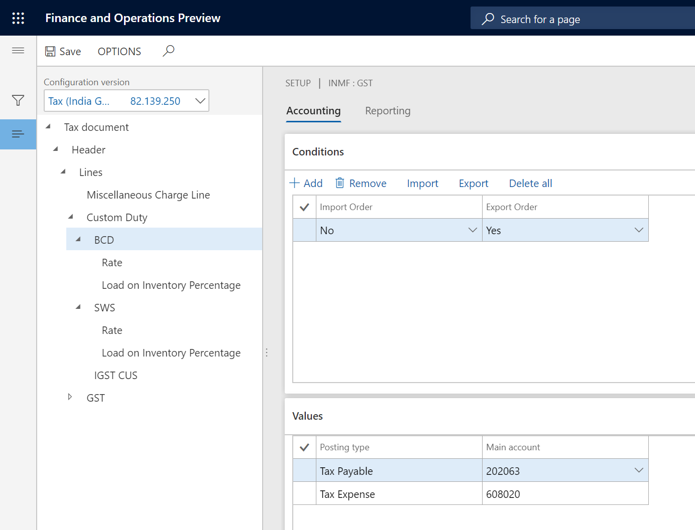
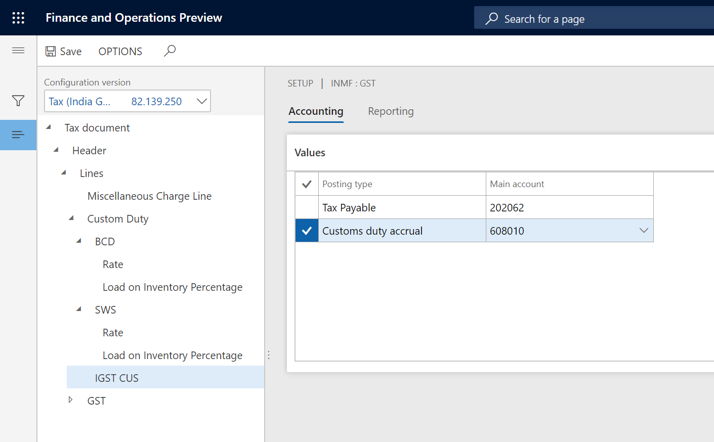
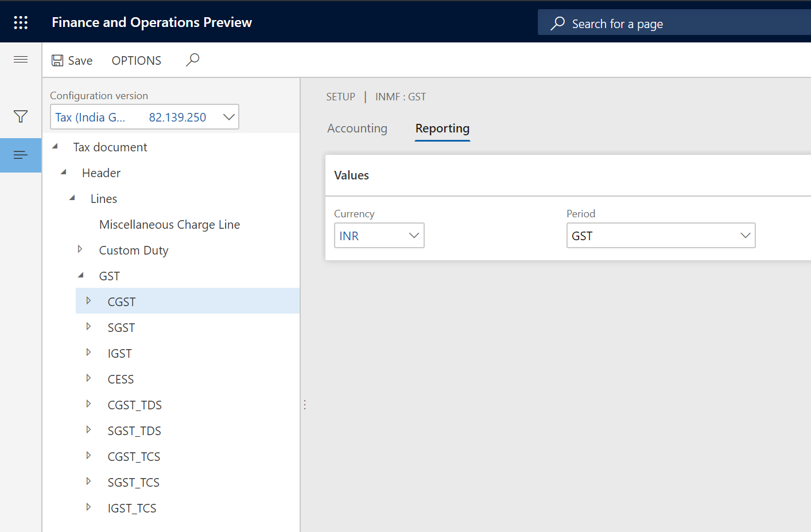
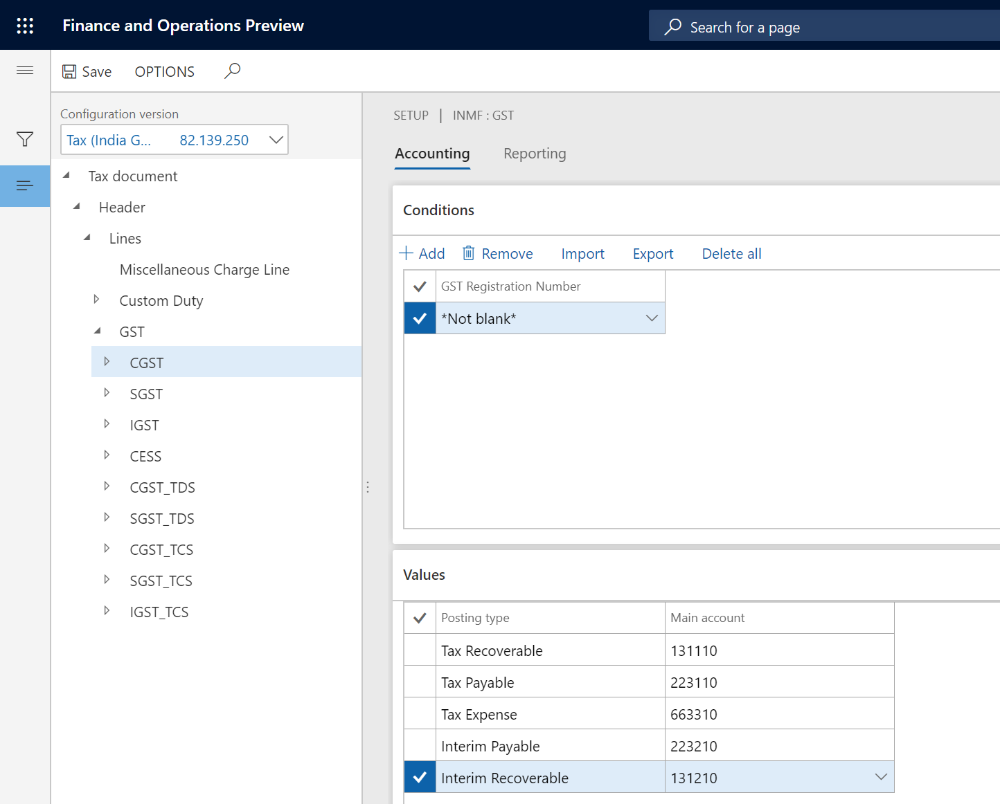

---
# required metadata

title: Map configuration tax types - Customs
description:  This topic provides information about mapping configuration tax types for customs.
author: EricWang
manager: RichardLuan
ms.date: 06/05/2019
ms.topic: article
ms.prod: 
ms.service: dynamics-365-applications
ms.technology: 

# optional metadata

# ms.search.form: 
audience: Application User
# ms.devlang: 
ms.reviewer: kfend
ms.search.scope: Core, Operations
# ms.tgt_pltfrm: 
# ms.custom: 
ms.search.region: India
# ms.search.industry: 
ms.author: EricWang
ms.search.validFrom: 2019-06-01
ms.dyn365.ops.version: 10.0.4

---

# Map configuration tax types - Customs

## Define tax type mapping

1. Click **Tax** \> **Setup** \> **Tax Configuration** \> **Tax Setup**.
2. Select a company and then click **Setup**.
3. Select the **Customs** node, and on the **Tax type mapping** tab, in the **Tax type** field, select **Customs**.

## Define tax period

For each node for the tax component , on the **Reporting** tab, in the **Period** field, select a value.

## Define main accounts

1. On the **Accounting** tab, on the **Conditions** FastTab, click **Add**.
2. In the **Import Order** field, select a value.
3. In the **Export order** field, select a value.
4. **Save** the record.
5. On the **Values** FastTab, in the **Main account** field, select a value.

> [!NOTE]
> The list of accounts is generated dynamically, based on the posting profile from the configuration. The selected Main account should have the posting type, **Customs**.

6. Select **IGST CUS** node.
7. On the **Values** FastTab, in the **Main account** field, select a value.

> [!NOTE]
> The Main account that is selected for C**ustoms duty accrual** should be the same account that is selected for the **Customs duty accrual** account of the **GST** \> **IGST** node.

## Tax type - GST
### Define tax type mapping 

1. Click **Tax** \> **Setup** \> **Tax Configuration** \> **Tax Setup**.
2. Select a company.
3. Click **Setup**.
4. Select the **GST** node.
5. On the **Tax type mapping** tab, in the **Tax type** field, select **GST**.

### Define tax period

For each node for the tax component, on the **Reporting** tab, in the **Period** field, select a value.

### Define main accounts

1. On the **Accounting** tab, on the **Conditions** FastTab, click **Add**.
2. In the **GST Registration Number** field, select a value.
3. **Save** the record.
4. On the **Values** FastTab, in the **Main account** field, select a value.

> [!NOTE]
> The list of accounts is generated dynamically based on the posting profile from the configuration.

> [!NOTE]
> Tax main accounts can be defined at level of the tax type or the tax component. The value at the tax component level will override the value at the tax type level. If the field is left blank for a posting type at the tax component level, the corresponding value from the tax type level will be used for posting. We recommend that you set up the tax accounts at the tax component level per registration.

