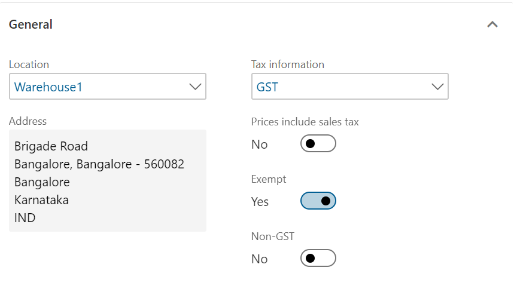
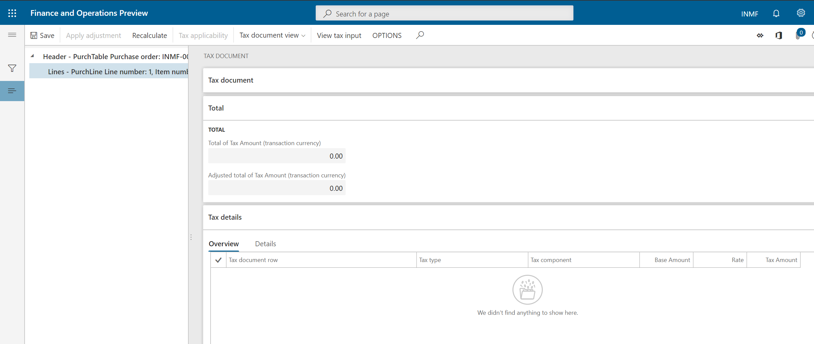

---
# required metadata

title: Purchase of exempted goods
description:  This topic provides information about the purchase of exempted goods.
author: EricWang
manager: RichardLuan
ms.date: 06/04/2019
ms.topic: article
ms.prod: 
ms.service: dynamics-365-applications
ms.technology: 

# optional metadata

# ms.search.form: 
audience: Application User
# ms.devlang: 
ms.reviewer: kfend
ms.search.scope: Core, Operations
# ms.tgt_pltfrm: 
# ms.custom: 
ms.search.region: India
# ms.search.industry: 
ms.author: EricWang
ms.search.validFrom: 2019-06-01
ms.dyn365.ops.version: 10.0.4

---

# Purchase of exempted goods

1. Click **Accounts payable** \> **Purchase orders** \> **All purchase orders**.
2. Create a purchase order for an exempted item and then save the record.
3. Click **Tax information**, and on the **GST** tab, verify that the **Exempted** check box is selected.
4. Click **OK**.

## Validate the tax details

1. On the Action Pane, on the **Purchase** tab, in the **Tax** group, click **Tax document**.
2. Verify that the **Exempt** field is set to **Yes** and that the **Tax computed** field is set to 0.00.
3. Click **Close**, and then click **Confirm**.

### Post the purchase invoice

1. On the Action Pane, on the **Invoice** tab, in the **Generate** group, click **Invoice**.
2. In the **Default quantity for lines** field, select **Ordered quantity**.
3. Enter the invoice number.
4. On the Action Pane, on the **Vendor invoice** tab, in the **Actions** group, click **Post** \> **Post**.
5. On the Action Pane, on the **Invoice** tab, in the **Journals** group, click **Invoice**. 
6. On the **Overview** tab, click **Voucher**.

