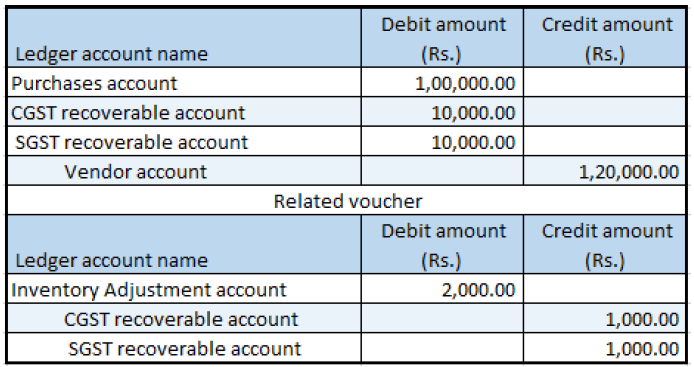

---
# required metadata

title: Quality order that involves destruction of the sampling item
description:  This topic provides information about quality orders that involve destroyed sample items.
author: EricWang
manager: RichardLuan
ms.date: 06/04/2019
ms.topic: article
ms.prod: 
ms.service: dynamics-365-applications
ms.technology: 

# optional metadata

# ms.search.form: 
audience: Application User
# ms.devlang: 
ms.reviewer: 
ms.search.scope: Core, Operations
# ms.tgt_pltfrm: 
# ms.custom: 
ms.search.region: India
# ms.search.industry: 
ms.author: EricWang
ms.search.validFrom: 2019-06-01
ms.dyn365.ops.version: 10.0.4

---

# Quality order that involves destruction of the sampling item

## Purchase order form

1. Click **Accounts payable** \> **Purchase orders** \> **All purchase orders**.
2. Create a purchase order.

## Validate the tax details

1. On the Action Pane, on the **Purchase** tab, in the **Tax** group, click **Tax document**. You should see something similar to the following:

- Taxable value: 10,000.00
- CGST: 10 percent
- SGST: 10 percent

2. Click **Close**.
3. Click **Confirm**.

## Post the packing slip

1. On the Action Pane, on the **Receive** tab, in the **Generate** group, click **Product receipt**.
2. In the **Quantity** field, select **Ordered quantity**.
3. In the **Product receipt** field, enter a value.
4. Click **OK**, and then click **Show**.

## Quality order form

1. Click **Results** and update the **Result quantity** field.
2. Click **Validate**, and then click **Close**.
3. Click **Tax document**.

  > [!NOTE]
  > Tax is calculated for the quantity that was used for the quality check and destroyed.
  
4. Click **Close** and then click **Validate**.
5. In the **Validate by** field, select a value.
6. Click **OK** and close the **Quality orders form**.

## Post the purchase invoice

1. On the Action Pane, on the **Invoice** tab, in the **Generate** group, click **Invoice**.
2. Enter the invoice number.
3. On the Action Pane, on the **Vendor invoice** tab, in the **Actions** group, click **Post** \> **Post**.
4. On the Action Pane, on the **Invoice** tab, in the **Journals** group, click **Invoice**. 
6. On the **Overview** tab, click **Voucher**.

