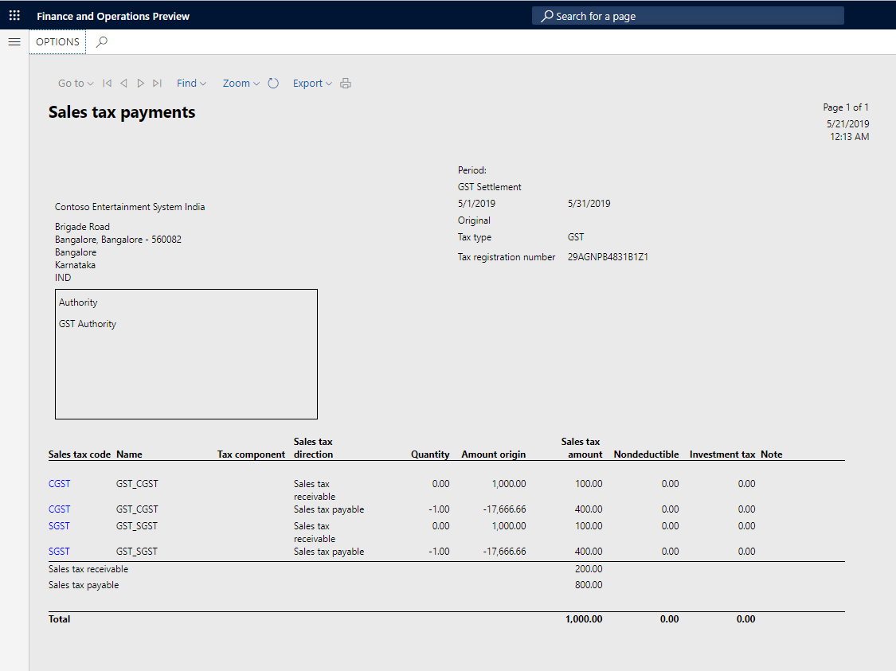

---
# required metadata

title: Set up rule-based tax settlement
description:  This topic provides information about how to work with rule-based tax settlements.
author: EricWang
manager: RichardLuan
ms.date: 06/05/2019
ms.topic: article
ms.prod: 
ms.service: dynamics-365-applications
ms.technology: 

# optional metadata

# ms.search.form: 
audience: Application User
# ms.devlang: 
ms.reviewer: kfend
ms.search.scope: Core, Operations
# ms.tgt_pltfrm: 
# ms.custom: 
ms.search.region: India
# ms.search.industry: 
ms.author: EricWang
ms.search.validFrom: 2019-06-01
ms.dyn365.ops.version: 10.0.4

---

# Rule-based tax settlement

1. Click **Tax** \> **Declarations** \> **Sales tax** \> **Settle and post sales tax**.
2. Enter the appropriate values and then click **OK**.

## Validate the tax settlement voucher entries

1. Click **Tax** \> **Indirect taxes** \> **Sales tax** \> **Sales tax settlement periods**.
2. Select the settlement period, and then click **Sales tax payments**.
3. Verify that the settlement for the selected registration for the period is posted successfully.
4. Click **Print report**.

## GST authority payment

1. Click **Accounts payable** \> **Payments** \> **Payment journal** and create a new journal.
2. Click **Lines**.
3. Create a journal voucher for the Authority account.
4. Click **Settle transactions**.
5. Select the appropriate transaction and click **Post** \> **Post**.
6. Click **Inquiries** \> **Voucher**

## Update challan information

To update challan information, click **Functions** \> **Challan information**.

## Manually adjust a tax settlement

1. Click **Tax** \> **Declarations** \> **Sales tax** \> **Settle and post sales tax**.
2. Enter the appropriate values.
3. Click **Tax adjustment**

## Exclude transactions from the settlement

1. Expand the **GST** node.
2. Select the **CGST** node, and then click **Transaction**.
3. Clear the selection of the transaction to exclude from the settlement.
4. Click **Update**.

> [!NOTE]
> When the tax setoff rule is recalculated, the components are adjusted.

## Partial settlement of the transactions

1. Select the **SGST** node, and then click **Transaction**.
2. Select the transaction, and then update the **Recoverable amount to settle** field.
3. Click **Update**.

> [!NOTE]
> - When the tax setoff rule is recalculated, the components are adjusted accordingly.
> - Excess recoverable, unsettled transactions, and partially settled transactions should be part of the next settlement period.

4. Click **Close**.
5. Select the **Update** check box.
6. Click **OK** and close the report.

## Validate the tax settlement voucher entries

1. Click **Tax** \> **Indirect taxes** \> **Sales tax** \> **Sales tax settlement periods**.
2. Select the settlement period, and then click **Sales tax payments**.
3. Verify that the settlement for the selected registration for the period is posted successfully.
