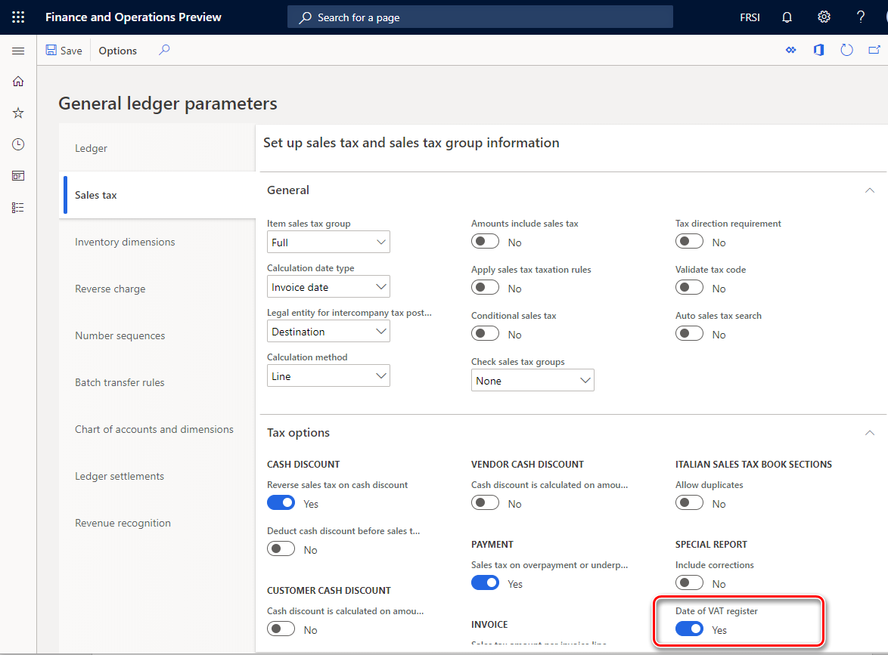
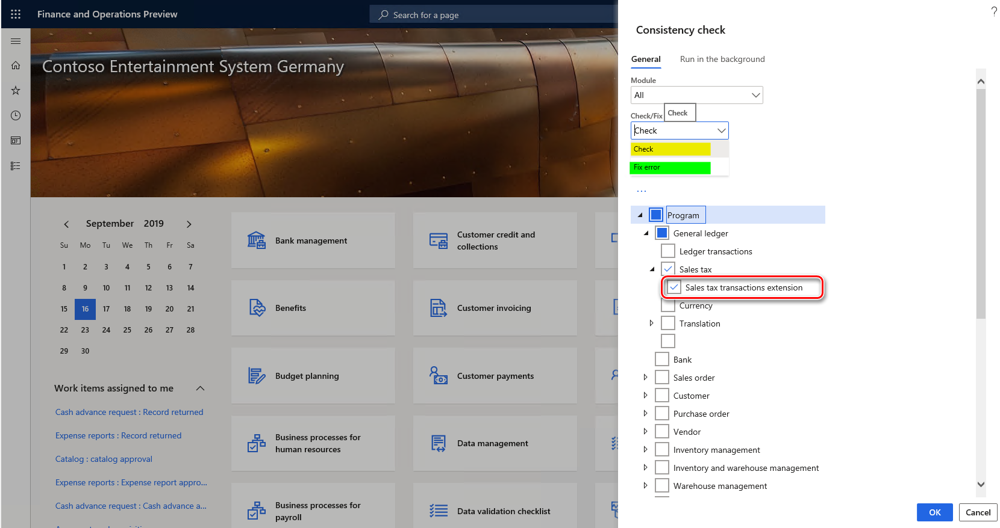

---
# required metadata

title: VAT management and reporting by tax point date (Date of VAT register
description: This topic provides information about the changes to value-added tax (VAT) management in Italy.
author: LizaGolub
manager: AnnBe
ms.date: 09/17/2019
ms.topic: article
ms.prod: 
ms.service: dynamics-ax-applications
ms.technology: 

# optional metadata

# ms.search.form:  [Operations AOT form name to tie this topic to]
audience: Application User
# ms.devlang: 
ms.reviewer: kfend
ms.search.scope: Core, Operations
# ms.tgt_pltfrm: 
# ms.custom: 
ms.search.region: Italy
# ms.search.industry: 
ms.author: v-elgolu
ms.search.validFrom: 2019-07-01 
ms.dyn365.ops.version:  
---

# VAT management and reporting by tax point date (Date of VAT register)

[!include [banner](../includes/banner.md)]

In Italy, on the 23rd of October 2018, the Law Decree 119 (L.D.119/2018) introduced a change in the Italian value-added tax (VAT) management that would go into effect on July 1, 2019. Here is a summary of the change:

-	VAT payers can recover input VAT in the monthly VAT settlement when the VAT point is triggered. This can occur even if the purchase invoice is received and recorded in the input VAT ledger before the fifteenth day of the following month. This rule doesn’t apply to transactions where the VAT point is triggered in a fiscal year that differs from the fiscal year in which the purchase invoice is received.
-	For the supply of services and goods, the invoice can be issued by the fifteenth day of the month after the month in which the VAT point was triggered. Invoices that are issued and booked before the fifteenth day of the month after the month in which the VAT point was triggered, must be included in the VAT settlement of the previous month.
-	Starting July 1, 2019, the invoice can be issued within 10 days of the VAT point. If the invoice isn’t issued at the VAT point, in addition to the invoice date, it should include a reference to the VAT point date.
- Invoices that are booked before the fifteenth day of the next month, but have a reference to the previous VAT settlement, should not interrupt the sequential posting. Invoices with a VAT point date in the previous month but invoice date in the current month, should be booked in a chronological sequence with the invoices in the current month that contain a reference that these invoices are related to the previous VAT settlement.
- Companies that issue the sales invoice on the same day without applying the change that is introduced by L.D.119/2018, remain compliant.

This feature is delivered to support the changes introduced by the L.D.119/2018 on **Microsoft Dynamics 365 for Finance and Operations** starting from version **10.0.6**.

Before you can use this feature, you must enable the **Date of VAT register** feature in **Feature management** workspace which introduces the new date-type field, **Date of VAT register** for VAT transactions. The additional date will serve as a VAT point determination criterion for including VAT transactions in the scope of the sales tax settlement period and, effectively, in VAT returns reporting.

> [!NOTE]
> The system doesn’t allow an invoice to be posted if it has the **Date of VAT register** field in a closed interval of the sales tax settlement period. 
> The system doesn’t allow the **Date of VAT register** field to be updated with a value in a closed interval of the sales tax settlement period.

For more information about the **Date of VAT register** feature, see [Tax point date (Date of VAT register)](emea-tax-point-date.md).

## “Date of VAT register” impact on VAT settlement and reporting

When the **Date of VAT register** feature is enabled, users in legal entity with **primary address in Italy** will be able to activate **Date of VAT register** parameter on **General ledger parameters** page.

When this parameter is enabled, the **Settle and post sales tax** process and the **Italian sales tax payment report** will consider sales tax transactions by the date the VAT was registered instead of the date the transaction was posted.

> [!NOTE]
> The system will not allow you to: 
> 
> - Enable the **Date of VAT register** parameter on the **General ledger parameters** page if there are tax transactions posted in open interval of sales tax settlement period if the value in the **Date of VAT register** field is in a closed interval of the sales tax settlement period.
> -	Disable the **Date of VAT register** parameter on the **General ledger parameters** page if there are tax transactions with value in the **Date of VAT register** field in a closed interval of the sales tax settlement period but posted in open interval of sthe sales tax settlement period.
> - Turn off the **Date of VAT register** feature in the **Feature management** workspace if there is at least one legal entity where the  **Date of VAT register** parameter on **General ledger parameters** page is enabled.

## “Sales tax transactions extension” consistency check

The **Date of VAT register** field is stored in a TaxTrans_W table which an extension of TaxTrans table. When a company switches on **Date of VAT register** parameter, data source queries on some pages in the system begin working differently, joining the TaxTrans_W table. It is possible that a user will not be able to see tax transactions that were posted in the past period. This is because the TaxTrans_W table was not used in the past and therefore there are no corresponding transactions in the table.

To avoid this issue, run the **Sales tax transactions extension** consistency check. Select **System administration** \> **Periodical tasks** \> **Database** \> **Consistency check**. On the **Consistency check** page, select **Program** \> **General ledger** \> **Sales tax**, and then mark the **Sales tax transactions extension** check box. You don’t need to mark the parent check boxes if you want to only run the sales tax transactions extension check.

Run the **Sales tax transactions extension** consistency check with the following options:

-	**Check**: Find out if there are missing transactions in the TaxTrans_W table. The system will inform you about the number of transactions in TaxTrans table that are missing corresponding records in TaxTrans_W table.
-	**Fix**: Compensate missing records in TaxTrans_W table. The system will insert corresponding records to the TaxTrans_W table and the  posted sales tax transactions in previous periods will be seen again everywhere in the system. 

Make sure that you have chosen the correct date in **From date** field on the dialog. Leave the **From date** field blank if you want to recover all of the tax transactions in the system.

The **Sales tax transactions extension** consistency check is available when the **Date of VAT register** feature is enabled in the **Feature management** workspace.

The **Sales tax transactions extension** consistency check is available in build versions starting from 10.0.234.21 for 10.0.6 version of the application and any version starting from 10.0.7.

## Changes in the Italian sales tax payment report

You can run the **Italian sales tax payment report** by using the following menu items:

-	**Tax** \> **Declarations** \> **Sales tax** \> **Sales tax (Italy)**
- **Tax** \> **Declarations** \> **Sales tax** \> **Report sales tax for settlement period**
- **Tax** \> **Inquires and reports** \> **Sales tax payments**, **Sales tax (Italy)** button
-	**Tax** \> **Inquires and reports** \> **Sales tax payments**, **Print report** button (when Italian report layout is defined for the **Sales tax authority** that is specified for the **Sales tax settlement period** of the selected sales tax payment line).

The **Date of VAT register** parameter on the **General ledger parameters** page doesn’t impact the list of invoices on the **Sales tax book sections** pages. All of the invoices posted in the related **Sales tax book sections** during the selected period will be included in the report. Nevertheless, the resulting amounts of VAT will be calculated depending on **Date of VAT register** parameter on **General ledger parameters** page.

-	When the **Date of VAT register** parameter on the **General ledger parameters** page is enabled, the VAT amounts are calculated based on the information in the **Date of VAT register** field for tax transactions in the period.

-	When the **Date of VAT register** parameter on the **General ledger parameters** page is not enabled, the VAT amounts are calculated based on the posting date of tax transactions in the period.

When the **Date of VAT register** parameter is enabled, the **Italian sales tax payment** report provides the following information:

- Pages of the sales tax books sections that include the new **Date of VAT point (Date of VAT register)** column (in Italian: “Momento di effettuazione dell’operazione”) which represents the value of the **Date of VAT register** field for the tax transaction.

- The totals by for each sales tax book section is represented in three groups:

     - Operations in the actual period with a competence date in the actual period
     - Operations in the actual period with a competence date in the previous period
     - Operations in the next period with a competence date in the actual period

- The totals by sales and purchase books are represented in three lines: 

     - Total operations in the actual period with a competence date in the actual period
     - Total operations in the actual period with a competence date in the previous period
     - Total operations in the next period with a competence date in the actual period

- A summary section that represents the total VAT amounts by sales tax books sections that are grouped by sales tax book sections. This is represented separately in three parts:

     - Operations in the actual period with competence date in the actual period
     - Operations in the actual period with competence date in the previous period
     - Operations in the next period with competence date in the actual period

- The totals in teh summary section which represent total VAT amounts by sales tax books sections that are grouped by sales tax book sections. This is represented separately in three lines:

     - Total operations in the actual period with competence date in the actual period
     - Total operations in the actual period with competence date in the previous period
     - Total operations in the next period with competence date in the actual period

- Additionally, the **Total calculated considering competence date** amount is provided in a separate line.

