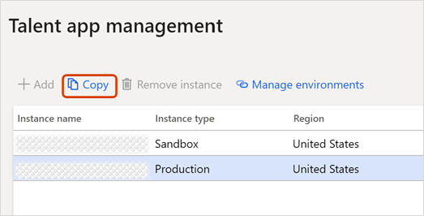
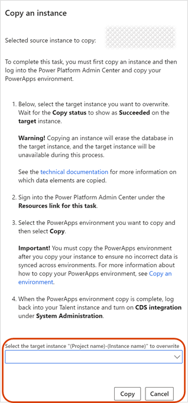

---
# required metadata

title: Copy an instance
description: 
author: andreabichsel
manager: AnnBe
ms.date: 02/01/2020
ms.topic: article
ms.prod: 
ms.service: dynamics-human-resources
ms.technology: 

# optional metadata

ms.search.form: 
# ROBOTS: 
audience: Application User
# ms.devlang: 
ms.reviewer: anbichse
ms.search.scope: Human Resources
# ms.tgt_pltfrm: 
ms.custom: 7521
ms.assetid: 
ms.search.region: Global
# ms.search.industry: 
ms.author: anbichse
ms.search.validFrom: 2020-02-01
ms.dyn365.ops.version: Human Resources April 2020 update

---

# Copy an instance

You can use Microsoft Dynamics Lifecycle Services (LCS) to copy a Microsoft Dynamics 365 Human Resources database to a sandbox environment. If you have another sandbox environment, you can also copy the database from that environment to a targeted sandbox environment.

To copy an instance, you need to ensure the following:

- The Human Resources instance you want to overwrite must be a sandbox environment.

- The environments you are copying from and to must be in the same region. You can't copy across regions.

- You must be an Administrator in the target environment so you can sign into it after copying the instance.

- When you copy the Human Resources database, you don't copy the elements (apps or data) that are contained in a Microsoft PowerApps environment. For information about how to copy elements in a PowerApps environment, see [Copy an environment](https://docs.microsoft.com/power-platform/admin/copy-environment). The PowerApps environment you want to overwrite must be a sandbox environment. You must be a global tenant admin to change a PowerApps production environment to a sandbox environment. For more information about changing a PowerApps environment, see [Switch an instance](https://docs.microsoft.com/dynamics365/admin/switch-instance).

## Effects of copying a Human Resources database

The following events occur when you copy a Human Resources database:

- The copy process erases the existing database in the target environment. After the copy process is completed, you can't recover the existing database.

- The target environment will be unavailable until the copy process is completed.

- Documents in Microsoft Azure Blob storage aren't copied from one environment to another. Therefore, any documents and templates that are attached won't be copied and will remain in the source environment.

- All users except the Admin user and other internal service user accounts will be unavailable. Therefore, the Admin user can delete or obfuscate data before other users are allowed back into the system.

- The Admin user must make required configuration changes, such as reconnecting integration endpoints to specific services or URLs.

## Copy the Human Resources database

To complete this task, you first copy an instance, and then sign in to the Microsoft Power Platform Admin Center to copy your PowerApps environment.

> [!WARNING]
> When you copy an instance, the database is erased in the target instance. The target instance is unavailable during this process.

1. Sign in to LCS, and select the LCS project that contains the instance that you want to copy.

2. In your LCS project, select the **Human Resources App Management** tile.

3. Select the instance to copy, and then select **Copy**.

   ](./media/copy-instance-copy-button.png)

4. In the **Copy an instance** task pane, select the instance to overwrite, and then select **Copy**. Wait for the value of the **Copy status** field to be updated to **Completed**.

   ](./media/copy-instance-select-target-instance.png)

5. Select **Power Platform**, and sign in to the Microsoft Power Platform Admin Center.

   ](./media/copy-instance-select-power-platform.png)

6. Select the PowerApps environment to copy, and then select **Copy**.

7. When the copy process is completed, sign in to the target instance, and enable Common Data Service integration. For more information and instructions, see [Configure Common Data Service integration](https://docs.microsoft.com/dynamics365/talent/hr-common-data-service-integration).

## Data elements and statuses

The following data elements aren't copied when you copy a Human Resources instance:

- Email addresses in the **LogisticsElectronicAddress** table

- The batch job history in the **BatchJobHistory**, **BatchHistory**, and **BatchConstraintHistory** tables

- The Simple Mail Transfer Protocol (SMTP) password in the **SysEmailSMTPPassword** table

- The SMTP Relay server in the **SysEmailParameters** table

- Print Management settings in the **PrintMgmtSettings** and **PrintMgmtDocInstance** tables

- Environment-specific records in the **SysServerConfig**, **SysServerSessions**, **SysCorpNetPrinters**, **SysClientSessions**, **BatchServerConfig**, and **BatchServerGroup** tables

- Document attachments in the DocuValue table. These attachments include any Microsoft Office templates that were overwritten in the source environment

- The connection string in the **PersonnelIntegrationConfiguration** table

Some of these elements aren't copied because they are environment-specific. Examples include **BatchServerConfig** and **SysCorpNetPrinters** records. Other elements aren't copied because of the volume of support tickets. For example, duplicate emails might be sent because SMTP is still enabled in the user acceptance testing (sandbox) environment, invalid integration messages might be sent because batch jobs are still enabled, and users might be enabled before admins can perform post-refresh cleanup actions.

In addition, the following statuses change when you copy an instance:

- All users except Admin are set to **Disabled**.

- All batch jobs, except for some system jobs, are set to **Withhold**.

## Environment admin

All users in the target sandbox environment, including Administrators, are replaced by the users of the source environment. Before you copy an instance, be sure that you're an Administrator in the target environment. If you aren't, you won't be able to sign in to the target sandbox environment after the copy has completed.

All non-Administrator users in the target sandbox environment are disabled to prevent unwanted sign-ins in the sandbox environment. Administrators can reenable users if needed.

## See also