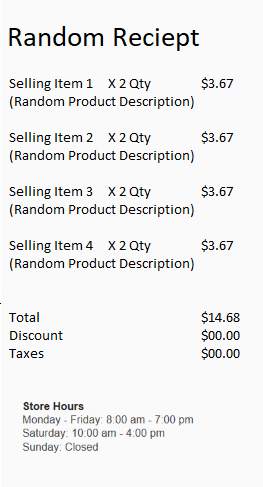

# Store hours

The new store hours feature provides the ability to capture and maintain multiple sets of store operating hours for a retailer. Dynamics 365 for Retail currently had no out-of-box solution to let retailers showcase their store operating hours across different channels like store, call center, mobile, e-commerce, and so on.

Retailers can now create and manage their store hours in Retail AX Headquarters and have cashiers look up store hours across various locations to assist customers in their shopping experience. It also allows retailers to print them at the footer of the receipt to notify customers when the stores are accessible to retail customers. 

## How to use the store hours feature
This feature is only available from Dynamics 365 Version 8.1.2 and latter

This configuration page is in AX Headquarters, **Retail** -> **Channel Setup** -> **Store hours**.

When the holiday and store hours are known, the admin can set the store hours for the whole year or to an even longer schedule.

The First step is to create a **Store hours template**, Click **New** , If you have an exisiting **Store hours template**, it will be listed on the left pane. 

  

After a template is created or selected, user needs to define the period of the date range, The store hours and holidays(if any)
1. If the store hours are constant and do not change - then select 'End Date' = Never ends. 
2. If the store hours are for a specific month/week/day - set the 'Start Date' & 'End Date'
3. Users can create mutliple templates with overlapping 'start Date' & 'End Date' - different store hours for stores in different time-zones. 

The next step, is to associate the 'Store hours' template to mutliple stores. Use the Organization Hierarchy table to select the stores/regions/orgs that the template needs to be associated with. 
- One store can have only one store hours template associated to it. 
- There will be a error if user attmpets to associate more than one 'Store hours' template to a Store / Region / Org
- Use the arrow keys to select the Stores / Region / Org that needs to be associated. 
- This calendar is now made available for the different store or store groups. 
- The calendar is set for all the stores and should be visible in the POS for reference.

 

Run the 1070 and 1090 jobs for the store hours to now flow through to the POS

If a customer has a pickup order for a different store, the cashier can select the right dates where the pickup will be available in that store. The store lookup will provide a reference to the dates and store times. The cashier will choose a date and location and print a pickup receipt with the store hours. 

 

### Adding Store hours to the printed receipts

To add 'Store Hours' to the Printed POS receipts.
- Open **Receipt Designer** 
- Select **Footer** TAB in the receipt template
- Drag the **Store hours** tab from the left navigation pane to the bottom of the receipt template in the footer. 
- If you need to change the label, edit the default label names in the 'Store hours' tab of the receipt designer. 
- Save the receipt and exit **Receipt designer** 
- Run 1070 & 1090 jobs in **Distribution Scehdule** 

- Log into POS. 
- Complete a sale and select printed receipt.

A cashier completing a sale prints the receipt, where the store hours are visible for the customer. If any Upcoming holidays were included in the template, then these also be visible on the receipt.

 

If a customer has a pickup order for a different store, the cashier can select the right dates where the pickup will be available in that store. The store lookup will provide a reference to the dates and store times. The cashier will choose a date and location and print a pickup receipt with the store hours. 

 

## Business value
All retail stores have store hours when they are open for retail customers. In many cases, store hours vary from weekdays to weekends, from various geographies, seasons, and times of the year. Customers need to be able to quickly glance and be aware of when the retail stores are open. 

Retailers can use the new store hours feature to create, maintain, and manage the store hours for different stores across geographies from a single point. Retailers can showcase the new store hours in POS terminals, letting the cashiers share store hours to customers and assist shoppers while looking for inventory in different stores. Customers also can see the new store hours printed on their receipts in case they wish to return to the store. 

Store hours functionality can be leveraged on e-commerce websites, mobile apps, kiosks, and so on. Future enhancements to this feature might be to enable the retailer to set an appropriate pickup date based on holiday hours and store closures.
