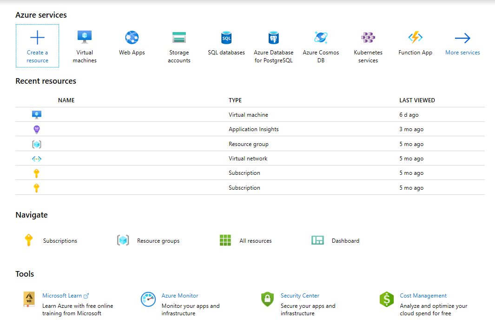
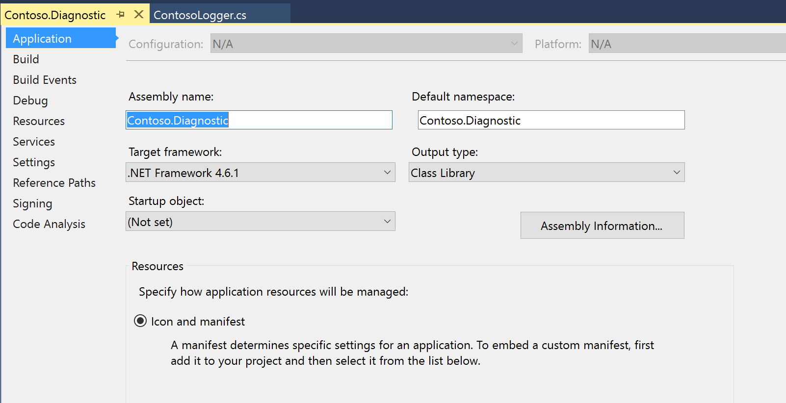
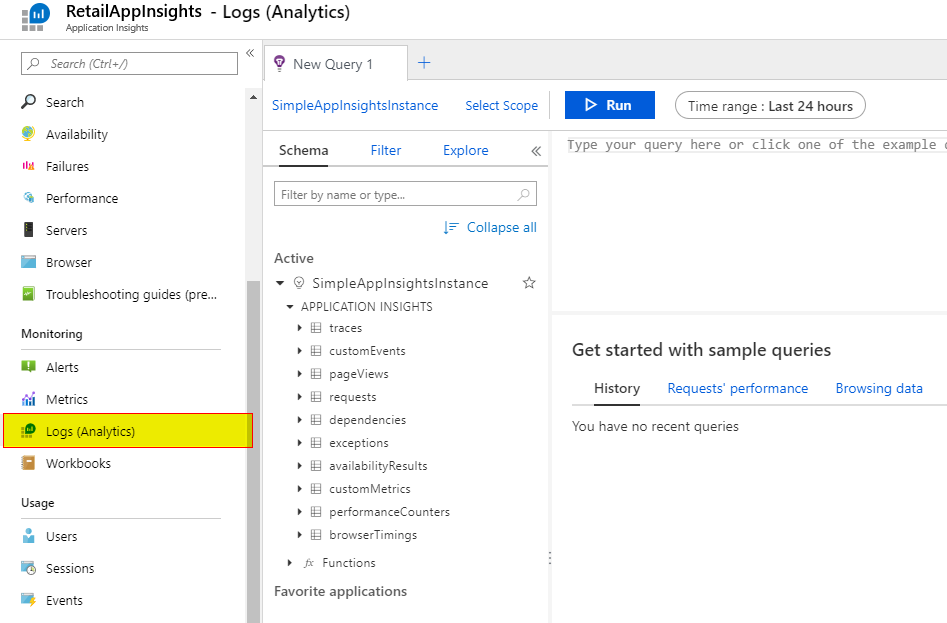
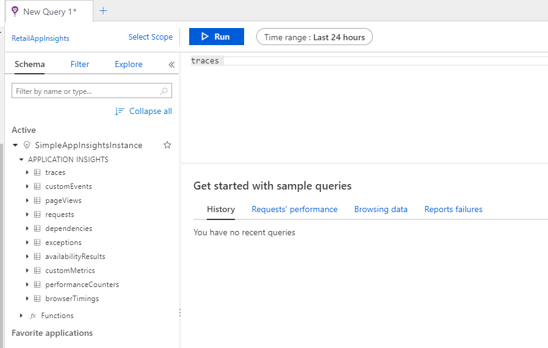

---
# required metadata

title: Log extension events to Application Insights
description: This document describes how to log events to Customer Application Insights from Commerce runtime (CRT) extensions.
author: mugunthanm
manager: AnnBe
ms.date: 11/15/2019
ms.topic: article
ms.prod: 
ms.service: dynamics-365-retail
ms.technology: 

# optional metadata

# ms.search.form: 
# ROBOTS: 
audience: Developer
# ms.devlang: 
ms.reviewer: rhaertle
ms.search.scope: Operations, Retail
# ms.tgt_pltfrm: 
ms.custom: 28021
ms.assetid: 
ms.search.region: Global
# ms.search.industry: 
ms.author: mumani
ms.search.validFrom: 2019-08-2019
ms.dyn365.ops.version: AX 10.0.7

---

# Log extension events to Application Insights

[!include [banner](../includes/banner.md)]

This document describes how to log events to [Customer Application Insights](https://docs.microsoft.com/azure/azure-monitor/app/app-insights-overview) from Commerce runtime (CRT) extensions.

## Log an event to Customer Application Insights

1. Set up the Application Insights in the Microsoft Azure portal and generate the instrumentation key.
2. Extend CRT to log events to the Application Insights using the instrumentation key generated during Application Insights creation.
    > [!NOTE]
    > The RetailLogger class is no longer supported. Existing extensions using this class must migrate to this new model.

## Setup and configure Application Insights in Azure

1. Go to https://portal.azure.com and log in using your Azure subscription credentials.
2. Click on **Create a resource**.
    > [!div class="mx-imgBorder"]
    > 
3. Search for **Application Insights**.
    > [!div class="mx-imgBorder"]
    > 
4. Click the **Create** button and fill out the form (Subscription, Resource group, Name, Region).
    > [!div class="mx-imgBorder"]
    > 
    > [!div class="mx-imgBorder"]
    > 
5. Click the **Review + create** button and then click the **Create** button and wait for the deployment to complete.
    > [!div class="mx-imgBorder"]
    > 

    > [!div class="mx-imgBorder"]
    > 
6. Go to the resource and copy the Instrumentation Key.  This value will be used in the CRT code or CRT ext configuration file.
    > [!div class="mx-imgBorder"]
    > 

## Extend Commerce Runtime extension project to log events to the Application Insights

1. Create a new C# class library project and name if **Contoso.Diagnostic**.
    > [!div class="mx-imgBorder"]
    > 
2. Add references to the below libraries:
    + Microsoft.ApplicationInsights
    + Netstandard
    + Microsoft.Dynamics.Commerce.Runtime.Framework

    > [!NOTE]
    > Install the [Application Insights SDK for ASP.NET Core](https://nuget.org/packages/Microsoft.ApplicationInsights.AspNetCore) to install the **Microsoft.ApplicationInsights** assembly reference. The reference to **Microsoft.Dynamics.Commerce.Runtime.Framework** can be added from the **..\\RetailSDK\\Reference** folder.
3. Add a new class file and name it **ContosoLogger**. Copy the following code into the file.
    ```C#
    using Microsoft.ApplicationInsights;
    using Microsoft.ApplicationInsights.Extensibility;
    using Microsoft.Dynamics.Commerce.Runtime;
    using Microsoft.Dynamics.Commerce.Runtime.Extensions;
    
    namespace Contoso.Diagnostic
    {
        public static class ContosoLogger
        {
            private static readonly object lockObject = new object();
            private static TelemetryClient client = null;
            public static TelemetryClient GetLogger(RequestContext context)
            {
                if (client == null)
                {
                    lock (lockObject)
                    {
                        if (client == null)
                        {
                            string key = context.Runtime.Configuration.GetSettingValue("ext.AppInsightsKey");
                            client = new TelemetryClient(new TelemetryConfiguration(key));
                        }
                    }
                }
                return client;
            }
        }
    }
    ```
4. Build this project and copy the output library and **Microsoft.ApplicationInsights.dll** to **..\\RetailServer\\webroot\\bin\\Ext** for manual deployment and testing.
5. Open the **CommerceRuntime.Ext.config** file in **..\\RetailServer\\webroot\\bin\\Ext** and update the `<settings>` section with the Applications Insights instrumentation key generated earlier. For example:
    ```xml
     <add name="ext.AppInsightsKey" value="b32fa526-7155-4e42-ac48"/>;
    ```
6. Restart your Retail Server.

## Consume the logger in CRT extension

1. To consume the **ContosoLogger** in the extension, add the **ContosoDiagnostic** and **Microsoft.ApplicationInsights** assembly reference to the extension project.
2. To log events, use the **TraceTelemetry** class and create the traces. For example:
    ```C#
    using Contoso.Diagnostic;
    using Microsoft.ApplicationInsights.DataContracts;

    var trace = new TraceTelemetry("CRT executing request", SeverityLevel.Information);
    trace.Properties.Add("CustomDimensionColumn1", request.RequestContext.GetTerminalId().ToString());
    trace.Properties.Add("CustomDimensionColumn2", "CRT demo - Save Cart request");
    ContosoLogger.GetLogger(request.RequestContext).TrackTrace(trace);
    ```

    > [!NOTE]
    > Trace properties are custom dimensions that that you can easily add to query the traces.

## Validate the trace events

1. Go to <https://portal.azure.com> and log in using your Azure subscription credentials
2. Navigate to the Application Insights instance and select **Logs (Analytics)** under **Monitoring** to open a new query editor.
    > [!div class="mx-imgBorder"]
    > 
3. Under the **Schema** menu, double-click on **Traces**.  This adds it to the query editor. The default Time range is **Last 24 hours**.
    > [!div class="mx-imgBorder"]
    > 
4. Click the **Run** button to execute the query. The logged event will show up in the results.
    > [!div class="mx-imgBorder"]
    > 

## Build the deployable package

For detailed information on building deployable packages, see [Create retail deployable packages](../retail-sdk-packaging).

1. Copy the **Contoso.Diagnostic** and **Microsoft.ApplicationInsights** assemblies to the **\\RetailSDK\\References** folder.
2. Update the **BuildTools\\Customization.settings** file and add the following entries in the `<ItemGroup>` section:
    ```xml
    <ISV_CommerceRuntime_CustomizableFile Include="$(SdkReferencesPath)\\Contoso.Diagnostic.dll" />
    <ISV_CommerceRuntime_CustomizableFile Include="$(SdkReferencesPath)\\Microsoft.ApplicationInsights.dll" />;
    ```    
3. Open an MSBuild Command Prompt for Visual Studio 2015 and execute the build command in the root of your RetailSDK folder.
4. Enter the following command to generate the RetailDeployablePackage: 
    ```console
    msbuild /t:rebuild
    ```
5. Locate the Retail deployable package in the **RetailSDK\\Packages\\RetailDeployablePackage** folder.  Navigate the **content.folder** folder and make sure that your three files made it into the package. (**Packages\\RetailDeployablePackage\\content.folder\\RetailServer\\Code\\bin\\ext**)
6. Upload the deployable package to your LCS shared asset library.
7. Go to your environment’s main page in LCS and click on **Environment Features** > **Retail** > **Manage**.
8. Click on Apply Extension and select the extension from your library.
9. After the extension has successfully deployed, open an instance of MPOS or CPOS that has been activated against that RCSU. 
10. Execute the extension scenario created with custom Application Insights logging.
11. Refresh the query in Application Insights to verify that the traces from the extension are logged correctly.
