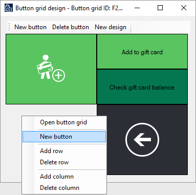

---
# required metadata

title: Gift card Cash out operation
description: This topic provides information about the new gift card cash out functionality that is now available in Microsoft Dynamics 365 for Retail.
author: rapraj
manager: AnnBe
ms.date: 02/08/2019
ms.topic: article
ms.prod:
ms.service: dynamics-365-retail
ms.technology: 

# optional metadata

# ms.search.form: 
 # ROBOTS: 
audience: Developer
ms.devlang: 
ms.reviewer: robinr
ms.search.scope: Operations, Retail
# ms.tgt_pltfrm: 
ms.custom: 
ms.assetid: 
ms.search.region: Global
ms.search.industry: retail
ms.author: ivanv
ms.search.validFrom: 2019-10-02
ms.dyn365.ops.version: Dynamics 365 10.0
---

# Cash out gift card balance for a retail customer

[!include [banner](../../includes/banner.md)]

This new feature gives retailers the option to set a new operation to cash out a gift card and to set the gift card balance limits under which the cash out operation can be enabled.

The purpose of this feature is to allow cashiers to cash out the remaining amount on a gift card. Retailers often must be able to exchange a low balance gift card for cash at the customer's request. In Washington state, for example, that threshold is $5.

The external gift card must be configured for both the Retail headquarters and the POS. Before the gift card can be configured, the retailer must have an account with an external gift card service provider.

## Retail headquarters configuration

1. Open the **All retail stores** page.
2. In the list, select the **Houston** store.
3. On the Action Pane, select **Set up** &gt; **Payment methods**.
4. Search for **payment methods** to open the **Payment methods** page.
5. Select **Gift Card** Payment method, and then follow these steps:

    1. In the **Amount** FastTab section, see the **Cash Out Gift Card** feild.
    2. In the **Cash Out Gift Card** field, enter **Gift card Cash out threshold** amount.
    3. Select **Save**.

    

6. Open the **Button grid** page.
7. In the navigation bar on the left side of the page, search for **F2S1M**, and select the filtered option.
8. On the Action Pane, select **Designer** to download the button designer application.
9. When the grid designer appears, right-click on an empty (gray) area, and then select **New button**.

    

10. Right-click the new button, and then select **Button properties**.
11. Set the **Action**, **Cash out gift card**, and **Text on button** properties according to the following matrix.

    | Action            | Payment type       | Text on button        |
    |-------------------|--------------------|-----------------------|
    |Cash out gift card |     Gift Card      | Cash out gift card    |

    When you've finished, your button layout should resemble the following illustration.

    

12. Click **Ok** and Close the designer.
13. Search for **Distribution Schedule**.
14. In the navigation bar on the left side of the page, search for **1090**, **1115**, and **1070**.
15. On the Action Pane, select **Run now**.
16. Check the status of the job by searching for **Download sessions**.
17. Wait until **Applied** appears next to all the jobs, and then close the browser.

## Reset IIS if you're using Retail Store Scale Unit

If you're using a Retail Store Scale Unit (RSSU) that is located in the store, open a Command Prompt window as an administrator, and enter **iisreset**. Otherwise, wait for the Retail Server to be updated.

## Update merchant properties

1. In File Explorer, go to **C:\\Program Files (x86)\\Microsoft Dynamics 365\\70\\Retail Hardware Station\\ConfigurationUtility**.
2. Run the **HardwareStationConfigurationUtility** executable program.
3. Configure the utility by entering the correct Retail Server URL, and then select **Install**.
4. To verify that the download was successful, go to **C:\\ProgramData\\Microsoft Dynamics AX\\Retail Hardware Station**, and look at the timestamp of the **MerchantInformation.xml** file. It should be very recent.

## Configure and test Retail Modern POS

1. Start the Retail Modern POS (MPOS) application.
2. Sign in by using the standard credentials.
3. When you're prompted, select **Perform a non-drawer operation**.
4. On the main screen, select **Select hardware station**.
5. On the bar on the right side of the page, select **Manage**.
6. Turn on **Virtual Peripherals**, and then select **OK**.
7. In the **Available paired stations** field, select **Virtual Peripherals**.
8. You're prompted to either open a new shift or perform non-drawer operations. You can now open a new shift.
9. On the main screen, select **Current transaction**.
10. Select **Gift cards**.
11. Select **Cash out gift card**.
12. Enter or scan the gift number.
13. The line for **gift card cash out** will be added to the **Current transaction** for cash out.
14. select the **Cash** payment method and the drawer will open once the transaction is completed. 

## Troubleshooting 

### Issue: An error occurs when you start the HardwareStationConfigurationUtility program

1. From an elevated command prompt, open the **HardwareStationConfigurationUtility.exe.config** file in Notepad.
2. In the file, follow these steps:

    1. Replace the **DataServiceUrl** value with the correct Retail Server URL.
    2. Verify that the **AADLogonUrl** value is correct.

3. Save and close the file.
4. Restart the utility.

### Issue: A token error occurs when you try to pair virtual peripherals

1. Exit MPOS.
2. Go to **C:\\Program Files (x86)\\Microsoft Dynamics 365\\70\\Retail Hardware Station\\Package**.
3. From an elevated command prompt, open the **Web.config** file in Notepad.
4. Replace the **RetailServer** value with the correct Retail Server value.
5. Save and close the file.
6. Restart MPOS.
7. If the issue persists, exit MPOS, use Task Manager to end any instances of dllhost.exe that are running, and then do another reset of Internet Information Services (IIS).
