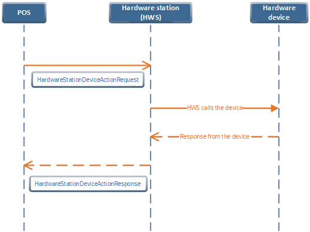

---
# required metadata

title: Integrate POS with a new hardware device
description: This topic explains how to integrate POS with a new hardware device.
author: mugunthanm
manager: AnnBe
ms.date: 08/03/2019
ms.topic: article
ms.prod: 
ms.service: dynamics-365-retail
ms.technology: 

# optional metadata

# ms.search.form: 
# ROBOTS: 
audience: Developer
# ms.devlang: 
ms.reviewer: rhaertle
ms.search.scope: Operations, Retail
# ms.tgt_pltfrm: 
ms.custom: 28021
ms.assetid: 
ms.search.region: Global
# ms.search.industry: 
ms.author: mumani
ms.search.validFrom: 2019-08-2019
ms.dyn365.ops.version: AX 7.3.0, Retail July 2017 update

---

# Integrate POS with a new hardware device

This topic explains how to integrate POS with a new hardware device. This topic applies to Dynamics 365 for Finance and Operations and Dynamics 365 for Retail platform update 8.

To call Hardware Station (HWS) from POS you use a request and a response:

+ **HardwareStationDeviceActionRequest**: Request sent from POS to Hardware Station.
+ **HardwareStationDeviceActionResponse**: Response received from Hardware Station to POS.

## HardwareStationDeviceActionRequest

```TypeScript
class HardwareStationDeviceActionRequest<TResponse extends HardwareStationDeviceActionResponse> extends Request<TResponse> {

  readonly device: string;
  readonly action: string;
  readonly actionData: any;
  constructor(device: string, action: string, actionData: any, correlationId?: string);

}
```

| Parameters | Data type | Description                     |
|------------|-----------|---------------------------------|
| device     | String    | Device name passed to the HWS request should be the same as the **Export** attribute added in the HWS Device extension controller class.                                          |
| action     | String    | Method to be called in the HWS extension. The method name should be passed as string value and the core POS hardware station layer will call the corresponding method from your HWS extension code. The method should exactly match the method name in your HWS extension.HWS extension should be passed as paremeter. |
| actionData | any       | Custom parameter for extension to pass.  |

###Sample code

```TypeScript
let hardwareStationDeviceActionRequest: HardwareStationDeviceActionRequest<HardwareStationDeviceActionResponse> =
    new HardwareStationDeviceActionRequest("Export attribute in HWS controller class",
    "extension method name in HWS", "Custom parameters/you can also pass custom object");
return this.extensionContextRuntime.executeAsync(hardwareStationDeviceActionRequest);
```

## HardwareStationDeviceActionResponse

```TypeScript
class HardwareStationDeviceActionResponse extends Response {
  readonly response: any;
  constructor(response: any);
}
```

| Parameters | Data type | Description                                       |
|------------|-----------|---------------------------------------------------|
| response   | any       | Response sent from the HWS extension code to POS. |

## End-to-end flow

The follow diagram shows the flow between POS, Hardware Station, and the hardware device.

[](./media/POSDeviceExtension.png)

## HWS extension

To call your new hardware device, you must implement the Hardware Station code. From the Hardware Station code call your hardware device.

To implement the HWS extension follow these steps:

1.  Create a new C# class library project.
2.  Add a new controller class that extends **HardwareStationController** and **IHardwareStationController**.
3.  Add the **Export** attribute to the controller class. The **Export** attribute must be in capital letters and you must pass this value as a parameter from POS extension. The device parameter passed from the POS **HardwareStationDeviceActionRequest** must match this value.
4.  Add your method in controller class to implement your custom logic to call the hardware device. This method will be passed as the second parameter (action parameter) to the POS **HardwareStationDeviceActionRequest**.
5.  Build the project.

To deploy the HWS extension in MPOS and test it using the local HWS

1. Copy the output library to the **C:\\Program Files (x86)\\Microsoft Dynamics 365\\70\\Retail Modern POS\\ClientBroker\\ext** folder.
2. Open the **HardwareStation.Extension.config**.
3. Add the extension library details under the composition section.

  ```Xml
  <add source="assembly" value="your extension library name" />
  ```
 
4. Save the file.
5. Close Modern POS if running.
6. Open Task Manager and end the **dllhost.exe** task.
7. Launch MPOS and configure it to use local hardware station
8. Validate your scenario.

To test with Cloud POS, deploy the HWS extension dll to shared HWS ext folder and update the HardwareStation.Extension.config with the custom library in the shared HWS folder.

**Note:** We have few samples in Retail SDK for refernce.
**POS -** \RetailSDK\POS\Extensions\FiscalRegisterSample
**HWS -** \RetailSDK\SampleExtensions\HardwareStation\Extension.FiscalRegisterSample

**Sample HWS code:**
```C#
namespace Contoso
{
  namespace Commerce.HardwareStation.ISVExtensionDevice
  {

  using System;
  using System.Composition;
  using System.Web.Http;
  using Microsoft.Dynamics.Commerce.HardwareStation;
  /// <summary>;
  /// Fiscal register peripheral web API controller class.
  /// </summary>

  [Export("ISVEXTENSIONDEVICE", typeof(IHardwareStationController))]
  [Authorize]
  public class ISVExtensionDeviceController : HardwareStationController, IHardwareStationController
  {
  /// <summary>
  /// Sample.
  /// </summary>

  /// <param name="request">Custom request.<param>
  /// <returns>Result of Custom response.</returns>

      [HttpPost]
      public CustomResponse Sample(CustomRequest request)
      {
        ThrowIf.Null(request, "request");
        try
        {
          return null;
        }

        catch (Exception ex)
          {
            throw ex;
          }
      }
   }
   }
 }

```
**Sample POS code on how to call the above HWS extension:**

From your POS extension call the HWS following similar pattern:
```C#
let hardwareStationDeviceActionRequest: HardwareStationDeviceActionRequest<HardwareStationDeviceActionResponse> =
new HardwareStationDeviceActionRequest("ISVEXTENSIONDEVICE",
 "Sample", "Custom parameters or custom object");
 return this.extensionContextRuntime.executeAsync(hardwareStationDeviceActionRequest);
 ```
