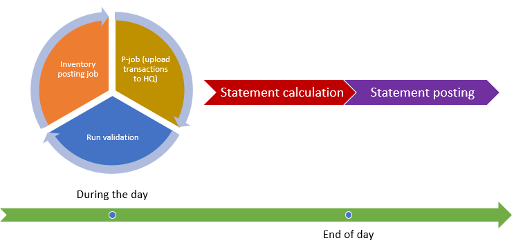

---
# required metadata

title: Retail transaction consistency checker
description: This topic describes the retail transaction consistency checker functionality in Dynamics 365 Commerce.
author: josaw1
manager: AnnBe
ms.date: 10/14/2019
ms.topic: index-page
ms.prod: 
ms.service: dynamics-365-retail
ms.technology: 

# optional metadata

# ms.search.form: 
# ROBOTS: 
audience: Application User
# ms.devlang: 
ms.reviewer: josaw
ms.search.scope: Core, Operations, Retail
# ms.tgt_pltfrm: 
ms.custom: 
ms.assetid: ed0f77f7-3609-4330-bebd-ca3134575216
ms.search.region: global
ms.search.industry: Retail
ms.author: josaw
ms.search.validFrom: 2019-01-15
ms.dyn365.ops.version: 10.0

---
# Retail transaction consistency checker

[!include [banner](includes/banner.md)]
[!include [preview banner](includes/preview-banner.md)]

This topic describes the retail transaction consistency checker functionality. The consistency checker identifies and isolates inconsistent transactions before they are picked up by the statement posting process.

When a statement is posted in Retail, posting can fail due to inconsistent data in the retail transaction tables. The data issue may be caused by unforeseen issues in the point of sale (POS) application, or if transactions were incorrectly imported from third-party POS systems. Examples of how these inconsistencies may appear include: 

- The transaction total on the header table does not match the transaction total on the lines.
- The line count on the header table does not match with the number of lines in the transaction table.
- Taxes on the header table do not match the tax amount on the lines. 

When inconsistent transactions are picked up by the statement posting process, inconsistent sales invoices and payment journals are created, and the entire statement posting process fails as a result. Recovering the statements from such a state involves complex data fixes across multiple transaction tables. The retail transaction consistency checker prevents such issues.

The following chart illustrates the posting process with the transaction consistency checker.

The **Validate store transactions** batch process checks the consistency of the retail transaction tables for the following scenarios.

- **Customer account** – Validates that the customer account in the retail transaction tables exists in the HQ customer master.
- **Line count** – Validates that the number of lines, as captured on the transaction header table, matches the number of lines in the sales transaction tables.
- **Price includes tax** – Validates that the **Price includes tax** parameter is consistent across transaction lines.
- **Payment amount** - Validates that the payment records match the payment amount on header.
- **Gross amount** – Validates that the gross amount on the header is the sum of the net amounts on the lines plus the tax amount.
- **Net amount** – Validates that the net amount on the header is the sum of the net amounts on the lines.
- **Under / Over payment** – Validates that the difference between the gross amount on the header and the payment amount doesn't exceed the maximum underpayment/overpayment configuration.
- **Discount amount** – Validates that the discount amount on the discount tables and the discount amount on the retail transaction line tables are consistent, and that the discount amount on the header is the sum of the discount amounts on the lines.
- **Line discount** – Validates that the line discount on the transaction line is the sum of all the lines in the discount table that corresponds to the transaction line.
- **Gift card item** – Retail doesn't support the return of gift card items. However, the balance on a gift card can be cashed out. Any gift card item that is processed as a return line instead of a cash-out line fails the statement posting process. The validation process for gift card items helps guarantee that the only return gift card line items on the retail transaction tables are gift card cash-out lines.
- **Negative price** – Validates that there are no negative price transaction lines.
- **Item & Variant** – Validates that items and variants on the transaction lines exist in the item and variant master file.
- **Tax amount** - Validates that tax records match the tax amounts on the lines.
- **Serial number** - Validates that the serial number is present in the transaction lines for items that are controlled by serial number.
- **Sign** - Validates that the sign on the quantity and the net amount are the same in all the transaction lines.
- **Business date** - Validates that the financial periods for all the business dates for the retail transactions are open.

## Set up the consistency checker

Configure the "Validate store transactions" batch process, at **Retail \> Retail IT \> POS posting**, for periodic runs. The batch job can be scheduled based on store organization hierarchy, similar to how the "Calculate statement in batch" and "Post statement in batch" processes are set up. We recommend that you configure this batch process to run multiple times in a day and schedule it so that it runs at the end of every P-job execution.

## Results of validation process

The results of the validation check by the batch process are tagged on the appropriate retail transaction. The **Validation status** field on the retail transaction record is either set to **Successful** or **Error**, and the date of the last validation run appears on the **Last validation time** field.

To view more descriptive error text relating to a validation failure, select the relevant retail store transaction record and click the **Validation errors** button.

Transactions that fail the validation check and transactions that have not yet been validated will not be pulled into statements. During the "Calculate statement" process, users will be notified if there are transactions that could have been included in the statement but weren't.

If a validation error is found, the only way to fix the error is to contact Microsoft Support. In a future release, capability will be added so that users can fix the records that failed through the user interface. Logging and auditing capabilities will also be made available to trace the history of the modifications.

> [!NOTE]
> Additional validation rules to support more scenarios will be added in a future release.
