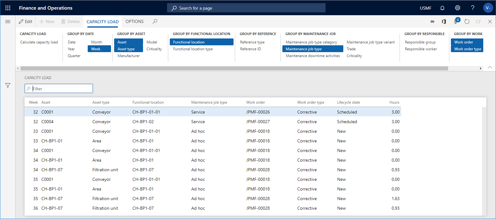

---
# required metadata

title: Calculate capacity load
description: This topic explains how to calculate capacity load in Enterprise Asset Management.
author: josaw1
manager: AnnBe
ms.date: 06/28/2019
ms.topic: article
ms.prod: 
ms.service: dynamics-ax-applications
ms.technology: 

# optional metadata

ms.search.form: CatProcureCatalogEdit, CatProcureCatalogListPage
# ROBOTS: 
audience: Application User
# ms.devlang: 
ms.reviewer: josaw
ms.search.scope: Core, Operations
# ms.tgt_pltfrm: 
ms.custom: 2214
ms.assetid: 2f3e0441-414d-402b-b28b-7ab0d650d658
ms.search.region: Global
# ms.search.industry: 
ms.author: mkirknel
ms.search.validFrom: 2016-02-28
ms.dyn365.ops.version: AX 7.0.0

---

# Calculate capacity load

This topic explains how to calculate capacity load in Enterprise Asset Management.

In Enterprise Asset Management, you can calculate capacity load on

- Object calendar lines  
- Work orders that have not yet been scheduled  
- Scheduled work orders

This is useful if you want to get an overview of expected capacity load for a specific period. Calculation of capacity load can be done on all objects or selected objects. You can also make a calculation on a maintenance stop (**All maintenance stops** or **Active maintenance stops** or **Maintenance stop**), or on a work order pool (**All work order pools** or **Active work order pools**).

1. Click **Enterprise asset management** > **Inquiries** > **Capacity load**, or **Enterprise asset management** > **Common** > **Work order pools** > **All work order pools** / **Active work order pools** > select work order pool in the list > **Capacity load** button, or **Enterprise asset management** > **Common** > **Maintenance stops** > **All maintenance stops** / **Active maintenance stops** > select maintenance stop in the list > **Capacity load** button.

2. Click the **Calculate capacity load** button.

3. Select a period for the calculation in the **Start date/time** and **End date/time** fields.

4. Select "Yes" on the **Include object calendar** toggle button if you want to include object calendar lines in the calculation.

5. Select "Yes" on the **Include work order** toggle button if you want to include work order lines in the calculation.

6. You can use the **Level** field to indicate how detailed you want the capacity load lines to be regarding functional locations. For example, if you insert the number "1" in the field, and you have a multi-level functional location hierarchy, all object calendar lines and work orders for a functional location will be shown on the top level, and therefore the hours on a line may be added up from functional locations located at a lower level. If you insert the number "0" in the **Level** field, you will see a detailed result showing all object calendar lines and all work orders on all the functional location level to which they are related.

7. Click **OK** to start the calculation.

8. In the **Group by...** action pane groups, click the relevant buttons to show the required detail level of the calculation. In the figure below, you will see a calculation example in which three worker order lines and 15 object calendar lines are shown. The selected action pane group buttons are highlighted in orange color. Click on a button to activate or deactivate it.

The figure below shows a screenshot of the interface.

>[!NOTE]
>If you want to focus only on capacity planning regarding scheduled work orders, refer to [Calculate capacity load on scheduled work orders](../work-order-scheduling/calculate-capacity-load-on-scheduled-work-orders.md).
