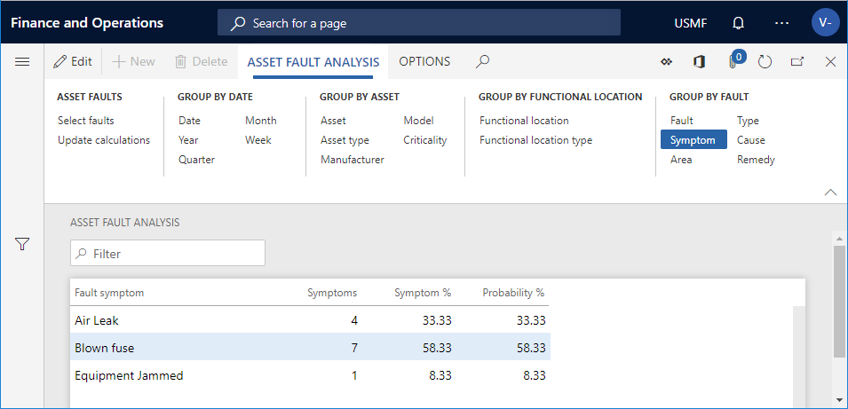
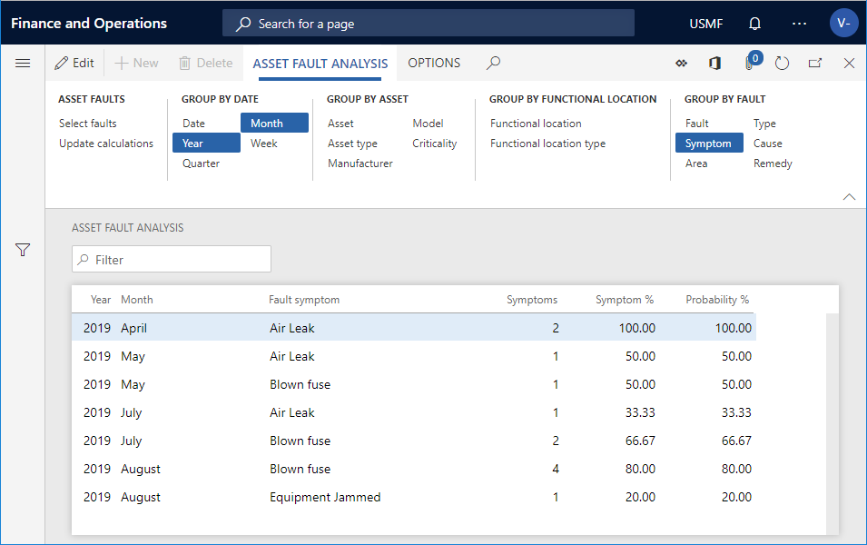
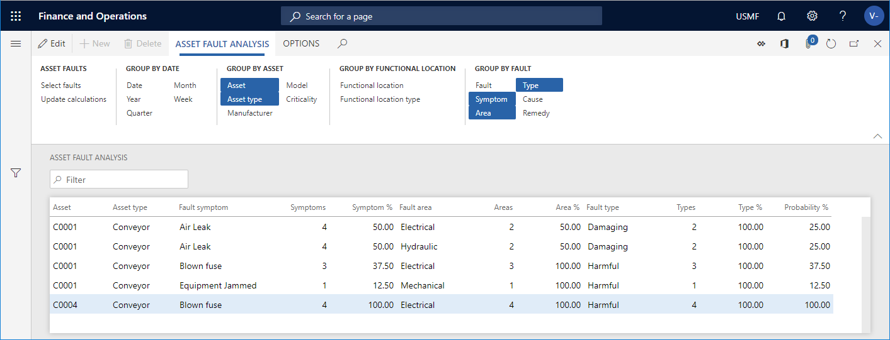

---
# required metadata

title: Asset fault analysis
description: This topic explains asset fault analysis in Asset Management.
author: josaw1
manager: AnnBe
ms.date: 08/23/2019
ms.topic: article
ms.prod: 
ms.service: dynamics-ax-applications
ms.technology: 

# optional metadata

ms.search.form: 
# ROBOTS: 
audience: Application User
# ms.devlang: 
ms.reviewer: josaw
ms.search.scope: Core, Operations
# ms.tgt_pltfrm: 
ms.custom: 
ms.assetid: 
ms.search.region: Global
# ms.search.industry: 
ms.author: mkirknel
ms.search.validFrom: 2019-08-31
ms.dyn365.ops.version: 10.0.5

---

# Asset fault analysis

[!include [banner](../../includes/banner.md)]

[!include [banner](../../includes/preview-banner.md)]

In Asset Management, you can analyze asset fault registrations to get an overview of the total number of faults registered during a specific period. Fault registrations can be analyzed from different perspectives, for example with focus on assets, asset types, functional locations, fault symptoms, or fault types.

1. Click **Asset management** > **Inquiries** > **Asset fault** > **Asset fault analysis**.

2. In the **Asset fault analysis calculation** dialog, you can use the **Level** field to indicate how detailed you want the asset fault lines to be regarding functional locations. For example, if you insert the number "1" in the field, and you have a multi-level functional location structure, all asset fault lines for a functional location will be shown on the top level, and therefore the hours on a line may be added up from functional locations located at a lower level. If you insert the number "0" in the **Level** field, you will see a detailed result showing all asset fault lines on all the functional location level to which they are related.

3. If you want to limit the search, you can select specific assets, fault dates, fault causes, and fault remedies on the **Records to include** FastTab.

4. Click **OK** to start the calculation.

5. On the **Asset fault analysis** tab, click one or more buttons in the **Group by...** action pane groups to display the detail level you want to see. Activated buttons are highlighted. Activate or deactivate buttons by clicking on them.

6. Click **Update calculations** to show your selections on the screen. 

>[!NOTE]
>Every time you activate or deactivate buttons in the **Group by...** action pane groups, remember to click the **Update calculations** button after you changed the selections. This is required because a large amount of data is processed as you are recalculating fault probability.

There are many ways to analyze fault registrations. Below you see examples in five screenshots of how different data selections provide different pieces of information. You will see how different selections provide more insight and detail when analyzing asset fault registrations.

In the screenshot below, only the **Symptom** button is selected.

- Fault registrations have been made on three fault symptoms: "Air leak", "Blown fuse", and "Equipment jammed".  
- In the **Probability %** column, all percentages add up to 100%. Probability is based on all **Symptom** registrations in this fault analysis.

In the screenshot below, **Year** and **Month** are added to show how you can view fault registrations during a selected period.

- The fault symptoms are now shown as registrations per year/month.  
- In the **Probability %** column, if you add all percentages for each month, they add up to 100%. Probability is based on the **Symptom** registrations in this fault analysis. If you have a large number of lines on an asset, but a large percentage stands out on a line, that would be an indication of a fault symptom to examine more closely to find a way to limit the number of registrations for that fault symptom.

- The combination of assets and an asset type is used as a basis for the calculations shown in the three screenshots below, which will increase in detail level.  
- Generally, the buttons in the **Group by date**, **Group by asset**, **Group by functional location** action pane groups, as well as the **Fault** button (Fault ID), contain periods or asset relations. The **Symptom**, **Area**, **Type**, **Cause**, and **Remedy** buttons are categorizations used in fault management to analyze asset fault registrations and pinpoint problem areas.  

In the screenshot below, **Asset** and **Asset type** were added to provide more detail regarding fault registrations.

- The fault symptoms are now split up in **Asset** / **Asset type** / **Symptom** combinations.  
- In the **Probability %** column, if you add all percentages for the combination of **Asset** / **Asset type** / **Symptom** respectively, they each add up to 100%. Probability is based on **Symptom** registrations in this fault analysis. If you have a large number of lines on an asset, but a large percentage stands out on a line, that would be an indication of a fault symptom to examine more closely to find a way to limit the number of registrations for that fault symptom.

In the screenshot below, **Area** was added to **Symptom**, **Asset**, and **Asset type** to provide more detail regarding fault registrations.

- In the **Probability %** column, if you add all percentages for the combination of **Asset** / **Asset type** / **Symptom** on an asset, they each add up to 100%. Probability is based on the combination of **Symptom** and **Area** in this fault analysis. If you have a large number of lines on an asset, but a large percentage stands out on a line, that would be an indication of a fault area to examine more closely to find a way to limit the number of registrations for that fault area.  

In the screenshot below, **Type** was added, and the most detailed calculation in this example is shown.
 
- In the **Probability %** column, if you add all percentages for the combination of **Asset** / **Asset type** / **Symptom** on an asset, they each add up to 100%. Probability is based on the combination of **Symptom**, **Area**, and **Type** in this fault analysis. If you have a large number of lines on an asset, but a large percentage stands out on a line, that would be an indication of a fault type to examine more closely to find a way to limit the number of registrations on that fault type.

>[!NOTE]
>For an overview of all fault registrations created on work orders and maintenance requests, click **Asset management** > **Inquiries** > **Asset fault** > **Asset faults**. On the **Asset faults** page, select an asset fault registration and expand the **Related information** pane to see information regarding the related work order or maintenance request.

