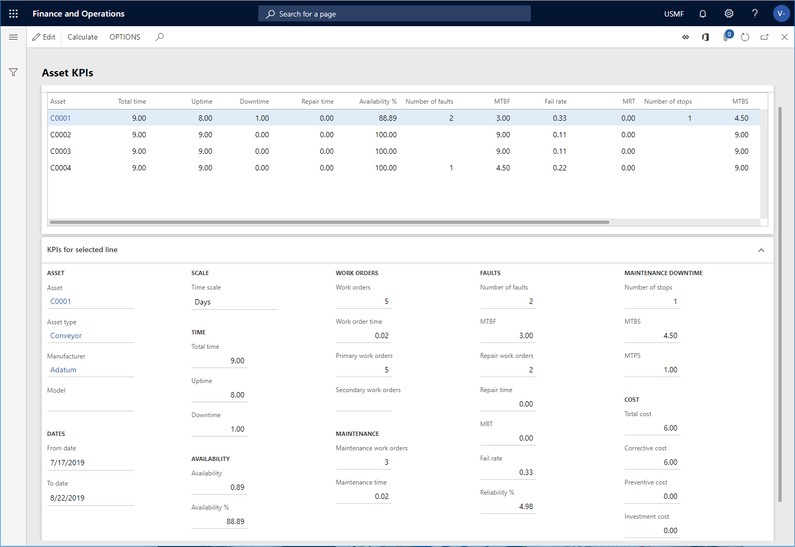
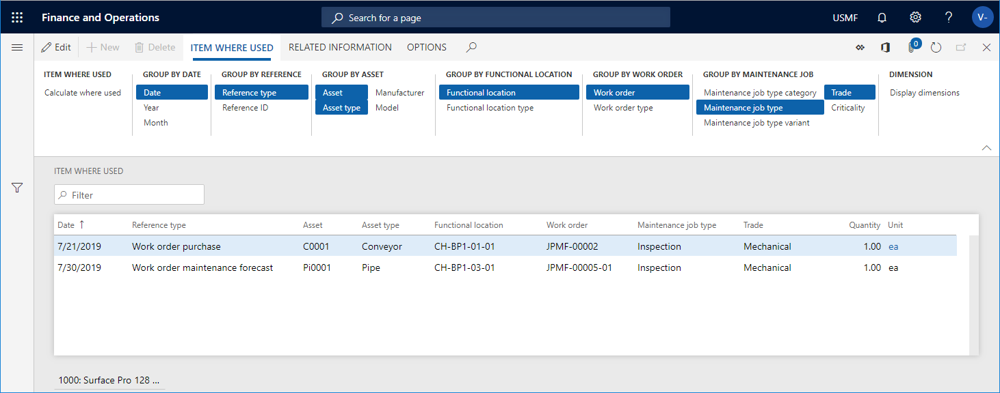

---
# required metadata

title: Asset fault control
description: This topic explains asset fault control in Asset Management.
author: josaw1
manager: AnnBe
ms.date: 07/01/2019
ms.topic: article
ms.prod: 
ms.service: dynamics-ax-applications
ms.technology: 

# optional metadata

ms.search.form: CatProcureCatalogEdit, CatProcureCatalogListPage
# ROBOTS: 
audience: Application User
# ms.devlang: 
ms.reviewer: josaw
ms.search.scope: Core, Operations
# ms.tgt_pltfrm: 
ms.custom: 2214
ms.assetid: 2f3e0441-414d-402b-b28b-7ab0d650d658
ms.search.region: Global
# ms.search.industry: 
ms.author: mkirknel
ms.search.validFrom: 2016-02-28
ms.dyn365.ops.version: AX 7.0.0

---

# Asset fault control

In Asset Management, you can analyze asset fault registrations to get an overview of the total number of faults registered during a specific period. Fault registrations can be analyzed from different perspectives, for example with focus on assets, asset types, functional locations, fault symptoms, or fault types.

1. Click **Asset management** > **Inquiries** > **Asset fault** > **Asset fault control**.

2. Click **Object fault control** > **Select faults**.

3. If you want to limit the search, you can select specific objects, fault dates, fault causes, and fault remedies on the **Records to include** FastTab.

4. You can use the **Level** field to indicate how detailed you want the fault control lines to be regarding functional locations. For example, if you insert the number "1" in the field, and you have a multi-level functional location hierarchy, all object fault control lines for a functional location will be shown on the top level, and therefore the hours on a line may be added up from functional locations located at a lower level. If you insert the number "0" in the **Level** field, you will see a detailed result showing all object fault control lines on all the functional location level to which they are related.

5. Click **OK** to start the calculation.

6. Click **Edit**.

7. On the **Object fault control** tab, click one or more buttons in the **Group by...** action pane groups to display the detail level you want to see. Activated buttons are highlighted. You can activate or deactivate a button by clicking on it.

8. On the **Object fault control** tab, click **Update**.

>[!NOTE]
>Every time you activate or deactivate buttons in the **Group by...** action pane groups, remember to click the **Update** button after you have changed the selections. This is required because a large amount of data is processed as you are recalculating fault probability.

There are many ways to analyze fault registrations. Below you will see examples in five screenshots of how different data selections provide different pieces of information. You will see how different selections provide more insight and detail when analyzing object fault registrations.

In the screenshot below, the **Symptom** button is selected.

- There are six registrations on the fault symptom "Poor fuel economy".  
- In the **Probability %** column, all percentages add up to 100%. Probability is based on all **Fault symptom** registrations in this fault control calculation.

The figure below shows a screenshot of the interface.

In the screenshot below, **Year** and **Month** are added to show how you can view fault registrations during a selected period.

- The fault symptoms are now shown as registrations per year/month.  
- In the **Probability %** column, if you add all percentages for each month, they add up to 100%. Probability is based on **Fault symptom** registrations in this fault control calculation. If you have a large number of lines on an object, but a large percentage stands out on a line, that would be an indication of a fault symptom to examine more closely to find a way to limit the number of registrations for that fault symptom.

- The combination objects and an object type is used as a basis for the calculations shown in the three screenshots below, which will increase in detail level.  
- Generally, the buttons in the **Group by date**, **Group by object**, **Group by functional location** action pane groups, as well as the **Fault** button (Fault ID), contain periods or object relations. The **Fault symptom**, **Fault area**, **Fault type**, **Fault cause**, and **Fault remedy** buttons are categorizations used in Enterprise Asset Management fault management to analyze object fault registrations and pinpoint problem areas.  

In the screenshot below, **Object** and **Object type** were added to provide more detail regarding fault registrations.

- The six fault symptoms on "Poor fuel economy" are now split up in **Object** / **Object type** / **Fault symptom** combinations.  
- In the **Probability %** column, if you add all percentages for the combination of **Object** / **Object type** / **Fault symptom** respectively, they each add up to 100%. Probability is based on **Fault symptom** registrations in this fault control calculation. If you have a large number of lines on an object, but a large percentage stands out on a line, that would be an indication of a fault symptom to examine more closely to find a way to limit the number of registrations for that fault symptom.

In the screenshot below, **Area** was added to **Symptom**, **Object**, and **Object type** to provide more detail regarding fault registrations.

- We have added further specification to the calculation, in the form of **Fault area**.  
- In the **Probability %** column, if you add all percentages for the combination of **Object** / **Object type** / **Fault symptom** on an object, they each add up to 100%. Probability is based on the combination of **Fault symptom** and **Fault area** in this fault control calculation. If you have a large number of lines on an object, but a large percentage stands out on a line, that would be an indication of a fault area to examine more closely to find a way to limit the number of registrations for that fault area.  

In the screenshot below, **Type** has been added, and the most detailed calculation in this example is shown.

- We have added further specification to the calculation, in the form of **Fault type**.  
- In the **Probability %** column, if you add all percentages for the combination of **Object** / **Object type** / **Fault symptom** on an object, they each add up to 100%. Probability is based on the combination of **Fault symptom**, **Fault area**, and **Fault type** in this fault control calculation. If you have a large number of lines on an object, but a large percentage stands out on a line, that would be an indication of a fault type to examine more closely to find a way to limit the number of registrations on that fault type.

