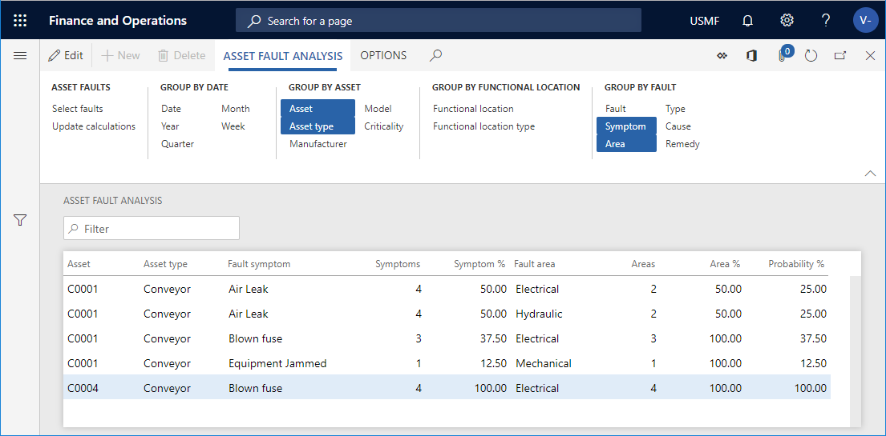

---
# required metadata

title: Object fault cost control
description: This topic explains object fault cost control in Enterprise Asset Management.
author: josaw1
manager: AnnBe
ms.date: 07/01/2019
ms.topic: article
ms.prod: 
ms.service: dynamics-ax-applications
ms.technology: 

# optional metadata

ms.search.form: CatProcureCatalogEdit, CatProcureCatalogListPage
# ROBOTS: 
audience: Application User
# ms.devlang: 
ms.reviewer: josaw
ms.search.scope: Core, Operations
# ms.tgt_pltfrm: 
ms.custom: 2214
ms.assetid: 2f3e0441-414d-402b-b28b-7ab0d650d658
ms.search.region: Global
# ms.search.industry: 
ms.author: mkirknel
ms.search.validFrom: 2016-02-28
ms.dyn365.ops.version: AX 7.0.0

---

# Object fault cost control

This topic explains object fault cost control in Enterprise Asset Management. In Enterprise Asset Management, you can calculate costs on object fault registrations to get an overview of actual costs compared to budget costs on faults. Actual costs are based on posted transactions. The date is the fault date on which the symptom was recorded.

1. Click **Enterprise asset management** > **Inquiries** > **Object fault** > **Object fault cost control**.

2. Click **Object fault cost control** > **Calculate cost**.

3. In the **Object fault cost control** drop-down, select a financial dimension set to be included in the calculation, if required.

4. Select the **Skip zero** check box if you do not want to show results with a cost of zero.

5. If you want to limit the search, you can select specific objects, fault dates, or fault causes on the **Records to include** FastTab.

6. You can use the **Level** field to indicate how detailed you want the cost control lines to be regarding functional locations. For example, if you insert the number "1" in the field, and you have a multi-level functional location  hierarchy, all object fault cost control lines for a functional location will be shown on the top level, and therefore the hours on a line may be added up from functional locations located at a lower level. If you insert the number "0" in the **Level** field, you will see a detailed result showing all object fault cost control lines on all the functional location level to which they are related.

7. Click **OK** to start the calculation.

8. In the **Group by...** action pane groups, click the relevant buttons to show the required detail level of the calculation. The selected action pane group buttons are highlighted in orange color. Click on a button to activate or deactivate it.

The figure below shows a screenshot of the interface.

Refer to the [Fault management](../setup-for-work-orders/fault-management.md) section for information on how to set up faults.

>[!NOTE]
>The **Original budget** field shows budget costs from the work order forecast. The **Actual cost** field shows posted costs on work orders. The **Committed cost** field shows total costs that your company is committed to in relation to work orders.
