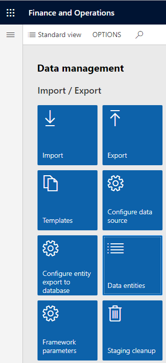
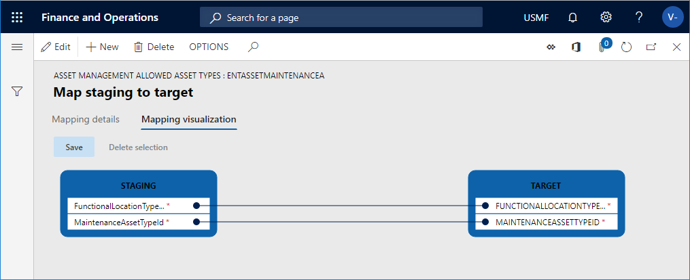

---
# required metadata

title: Target entities
description: This topic explains how to get an overview of target entities in Asset Management.
author: josaw1
manager: AnnBe
ms.date: 09/26/2019
ms.topic: article
ms.prod: 
ms.service: dynamics-ax-applications
ms.technology: 

# optional metadata

ms.search.form: 
# ROBOTS: 
audience: Application User
# ms.devlang: 
ms.reviewer: josaw
ms.search.scope: Core, Operations
# ms.tgt_pltfrm: 
ms.custom: 
ms.assetid: 
ms.search.region: Global
# ms.search.industry: 
ms.author: mkirknel
ms.search.validFrom: 2019-08-31
ms.dyn365.ops.version: 10.0.5

---

# Target entities

[!include [banner](../../includes/banner.md)]

 

In **Dynamics 365 for Finance and Operations** > **Data management** workspace, you can get an overview of target entities, related entity types and staging tables related to the **Asset management** module. 

1. Click the **Finance and Operations** button in the upper-left corner of the screen, and click **Data management**.

2. In the **Import / Export** section, click **Data entities**. 

3. On the **Target entities** page, search for "asset management" in the filter, and press Enter to see a list of the entities related to Asset management.

The figure below shows some of the Asset management entities.

4. Select an entity and click **Modify target mapping**.

5. On the **Map staging to target** page, you see a list of the staging fields related to the selected entity. Click **Mapping visualization** to see a graphic overview of how staging data and target data are related. 

In the figure below, a visualization of the fields related to the asset types entity is shown.

