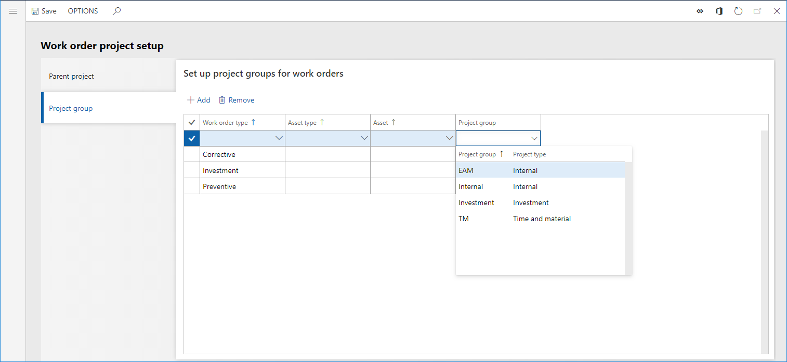
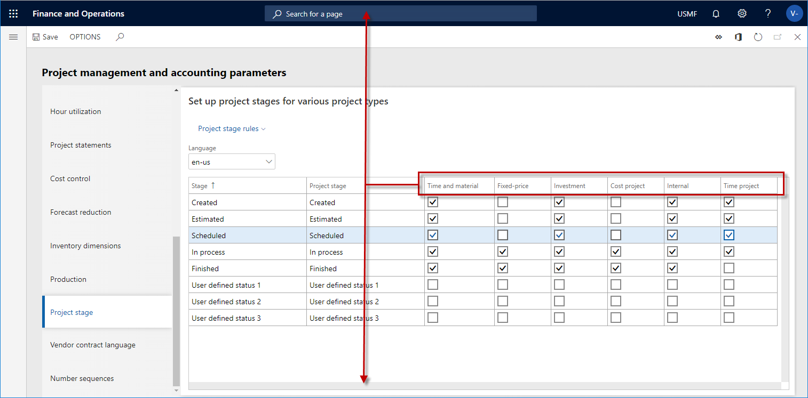

---
# required metadata

title: Assets and projects
description: This topic explains asset projects in Asset Management.
author: josaw1
manager: AnnBe
ms.date: 06/28/2019
ms.topic: article
ms.prod: 
ms.service: dynamics-ax-applications
ms.technology: 

# optional metadata

ms.search.form: CatProcureCatalogEdit, CatProcureCatalogListPage
# ROBOTS: 
audience: Application User
# ms.devlang: 
ms.reviewer: josaw
ms.search.scope: Core, Operations
# ms.tgt_pltfrm: 
ms.custom: 2214
ms.assetid: 2f3e0441-414d-402b-b28b-7ab0d650d658
ms.search.region: Global
# ms.search.industry: 
ms.author: mkirknel
ms.search.validFrom: 2016-02-28
ms.dyn365.ops.version: AX 7.0.0

---

# Assets and projects

In the **Asset management** module, assets can be related to a project. A project related to an asset is called an asset project. Using an asset project means that all work order projects, which are related to the asset, will be created as sub projects to the asset project. Sub projects may have different project types compared to the parent project, meaning that it is possible to have projects of type "Internal", "Time and Material", or "Investment" related to the same asset project.

Asset projects can be set up on the assets manually in **Asset management** > **Common** > **Assets** > **All assets** > select asset > **Edit** button > **Project** FastTab > **Project ID** field. An asset project can also be created automatically, either when the asset is created, or manually by using the "Create project integration" function (**Asset management** > **Common** > **Assets** > **All Assets** > select asset > **Edit** button > **Project** FastTab > **Create project integration** button). If you want asset projects to be created automatically when creating objects, select "Yes" on the **Auto create projects** toggle button in **Asset management parameters** > **Setup** > **Asset management parameters** > **Assets** link > **Auto create projects** toggle button.

## Top level assets

You can create object projects for objects without a parent project, also called top level objects. This means that for the top level object, the project created will be a sub-project to the main object project set up in **Enterprise asset management parameters** (**Enterprise asset management** > **Setup** > **Enterprise asset management parameters** > **Objects** link > **Main project** field). Project type and other related settings will be inherited from the parent project.

## Sub projects

In **Enterprise asset management parameters** \> **Objects** link \> **Project hierarchy** field, the parent project when creating object projects for sub objects is determined. If "No hierarchy" is selected, the parent project will be the main project setup in parameters, same as top-level objects. If "Hierarchy" is selected, the parent project will be the object project set up on the parent object. With the "Hierarchy" option, the project structure will be identical to the object structure. If using "Hierarchy", it is recommended that you expand length of the project ID data type, as you can easily exceed the 20 characters allocated.

## Project format

The project format for object projects is set up in **Enterprise asset management** > **Setup** > **Enterprise asset management parameters** > **Objects** link > **Work order project mask** field. This format determines how many sub projects an object project can have, meaning how many work orders can be related to the object. If the "Hierarchy" option is used, the setup in the **Work order project mask** field determines how many sub objects and work orders can be related to an object.

## Projects, sub projects, and project activities for objects

Objects and work order lines that are created in the **Enterprise Asset Management** module are created in the **Project management and accounting** module as projects, sub projects, and project activities.

In the **Project management and accounting** module, you set up the main project to be used for **Enterprise Asset Management**. In **Enterprise asset management** > **Setup** > **Enterprise asset management parameters** > **Objects** link > **Main project** field, you select the primary maintenance project, and once that parameter is set up, there is full integration with the project module (see also the figure below showing relations between **Enterprise asset management parameters** and **All projects**).

**Note:** Regarding object data setup: If you want to build an object / project structure based on location (or another classification), you create an object as a location, and the sub-objects you create will then become sub-locations (or another classification type that you have selected).

Object projects may be useful if your company manages large, specialized projects, for example, construction projects for a bridge or a large piece of production equipment. In the figure below, you will see a graphic overview of object integration with the **Project management and accounting** module if you have decided to use the project hierarchy.

In the figure below, you will see a graphic overview of object integration with the Project management and accounting module if you have decided not to use the project hierarchy.

The two figures below show the relation between the setup in **Enterprise asset management parameters** (**Enterprise asset management** > **Setup** > **Enterprise asset management parameters**), an object created as a sub-object, which is displayed in the **All objects** list page (**Enterprise asset management** > **Common** > **Objects** > **All Objects** > select object in list page), and the related object project in **All projects** (**Project management and accounting** > **Projects** > **All projects** > select project in the list > **Edit**).

**Note:** In **Enterprise asset management parameters** displayed above, the **Auto create projects** toggle button defines how projects are created. If the toggle button is set to "Yes", an object project is automatically created on a new object. If the **Auto create projects** toggle button is set to "No", the user must manually create project integration when the object is created. This is done in **All objects** > **Project** FastTab. Select the **Create project integration** button if you want to manually create a project for the object. The figure below shows a screenshot of the interface.

