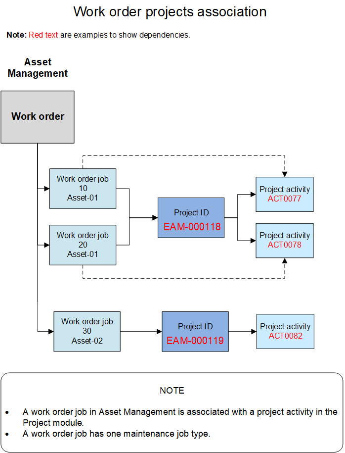
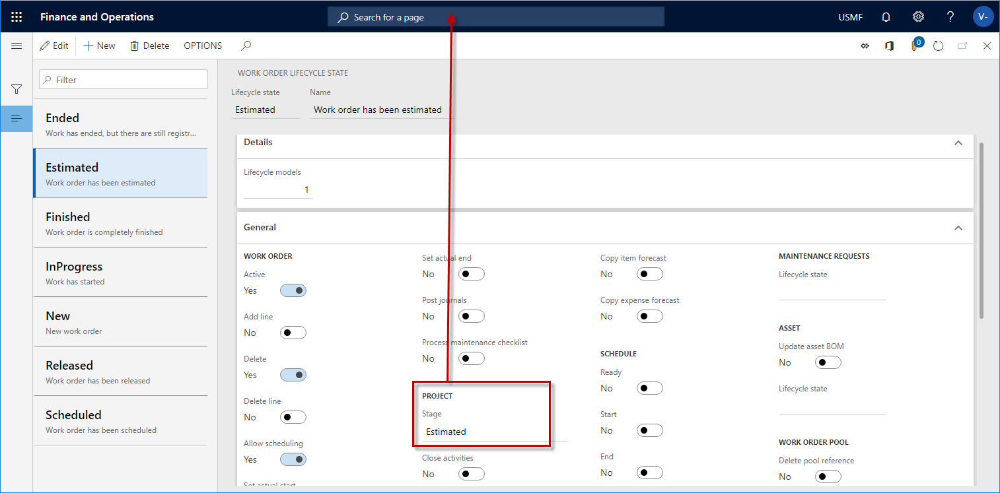

---
# required metadata

title: Forecasts, work orders, and projects
description: This topic explains forecasts and work order integration with the Project management and accounting module in Asset Management.
author: josaw1
manager: AnnBe
ms.date: 08/16/2019
ms.topic: article
ms.prod: 
ms.service: dynamics-ax-applications
ms.technology: 

# optional metadata

ms.search.form: 
# ROBOTS: 
audience: Application User
# ms.devlang: 
ms.reviewer: josaw
ms.search.scope: Core, Operations
# ms.tgt_pltfrm: 
ms.custom: 
ms.assetid: 
ms.search.region: Global
# ms.search.industry: 
ms.author: mkirknel
ms.search.validFrom: 2019-08-31
ms.dyn365.ops.version: 10.0.5

---

# Forecasts, work orders, and projects

[!include [banner](../../includes/banner.md)]

[!include [banner](../../includes/preview-banner.md)]

In Asset Management, integration to the **Project management and accounting** module is done to optimize cost control, allowing users to track costs on maintenance job type forecasts and work order jobs.

To track maintenance job type forecasts, two settings must be made:

1. Select a project in **Asset management** > **Setup** > **Asset management parameters** > **Assets** link > **Project** FastTab > **Maintenance forecast project** field.

2. In **Maintenance job type defaults**, when you create a mainteance job type default line, an activity number is automatically created for the line (**Asset management** > **Setup** > **Jobs** > **Maintenance job type defaults**).

Maintenance job type forecasts serve two purposes: You are able to track costs on maintenance job type forecasts in the **Project management and accounting** module. Furthermore, forecasts are automatically transferred to a work order job project when you select a maintenance job type on a work order job.

To track costs on work order jobs, you must first set up work order projects. Refer to the [Work order project setup](../setup-for-work-orders/work-order-project-setup.md) section for a description of the procedure.

## Work order job projects

When you create a work order job on a work order, the work order project is determined by the setup of the parent project for work orders in **Asset management** > **Setup** > **Work orders** > **Project setup**.

Work order job projects are created by using a combination of the following work order information:

- The Work order type selected on the work order 
- The functional location related to the asset on the work order job
- The Asset type related to the asset on the work order job  
- The Expected start and end time set on the work order  

It is possible that not all of the information mentioned above is found on a work order. Therefore, the search for a work order parent project is done by using the available combination of data and selecting the project ID that corresponds with work order data.

Example: In the figure below, the setup of asset type "Truck Engine" means that every work order job created with that asset type will be a sub project of Project ID "000186".

The purpose of the project ID on the work order job, and the related activity number (**Asset management** > **Common** > **Work orders** > **All Work orders** > select work order in list > **Line details** FastTab > **Project ID** field and **Activity number** field), is to track costs related to the work order job, and the asset selected on the work order job, in the **Project management and accounting** module. 

In the figure below, you see a graphic overview of work order projects and related project activities.

When a new work order job is created on a work order, a work order project is automatically created for the job. The financial dimensions for the asset related to the work order job are automatically transferred to the work order project. The project activity created for a work order job has related information attached to it regarding maintenance job type, maintenance job type variant, and trade. Those data are useful if, for example, you create a purchase order from a work order (see [Procurement](../work-orders/procurement.md)), or if you use the **Project management and accounting** module for time registration.  

If the asset was installed on a functional location, and that asset is later installed on another functional location, the financial dimensions related to the new functional location is automatically updated on the asset. Subsequently, when you create a work order job for the asset, the work order project for the work order job automatically gets the financial dimensions that are now related to the asset. This means that when you use functional locations, costs can always be tracked on the functional locations on which an asset was installed at any given time. The automatic update of financial dimensions ensures complete traceability of costs for project controlling and reporting.  

## Work order projects, work order lifecycle states, project stages, and project types

To ensure correct use of work order lifecycle states and related project stages on work orders, consider the dependencies in relation to the **Project management and accounting** module:

- In the **Project management and accounting** module, project stages are set up on project types in **Project management and accounting parameters**.  
- In **Project management and accounting parameters**, remember to select relevant project stage check boxes for all the project types you are going to use. In the figure below, five stages **Created** - **Estimated** - **Scheduled** - **In process** - **Finished** have been selected for the project types "Time and material" and "Internal". Those five stages are relevant for both internal maintenance and service maintenance jobs.  
- In **Asset Management**, project types are defined by the project groups you set up in the **Work order project setup** form > **Project group** link.  
- The project groups setup in **Work order project setup** are used when you create work orders. When a work order is created, a work order project is automatically created for the work order.  
- Work order lifecycle states must each have a related project stage.  
- The project stage related to a work order lifecycle state must be defined as an active stage for the project group defined in the work order project. The work order project is automatically created on a work order.  
- When you create a new work order, the automatic allocation of a work order project is based on the setup in **Work order project setup** (**Asset management** > **Setup** > **Work orders** > **Project setup**).  

Associations between work order project groups, related project types, project stages, and work order lifecycle states are shown in the figures below.  

Refer to [Work order project setup](../setup-for-work-orders/work-order-project-setup.md) regarding how to set up work order projects, and to [Work order lifecycle states](../setup-for-work-orders/work-order-lifecycle-states.md) regarding how to create work order lifecycle states.

The figure below shows a graphic overview of the various projects that are created in the **Asset management** module to allow integration with the **Project management and accounting** module, as well as the work processes to which the projects are related.

