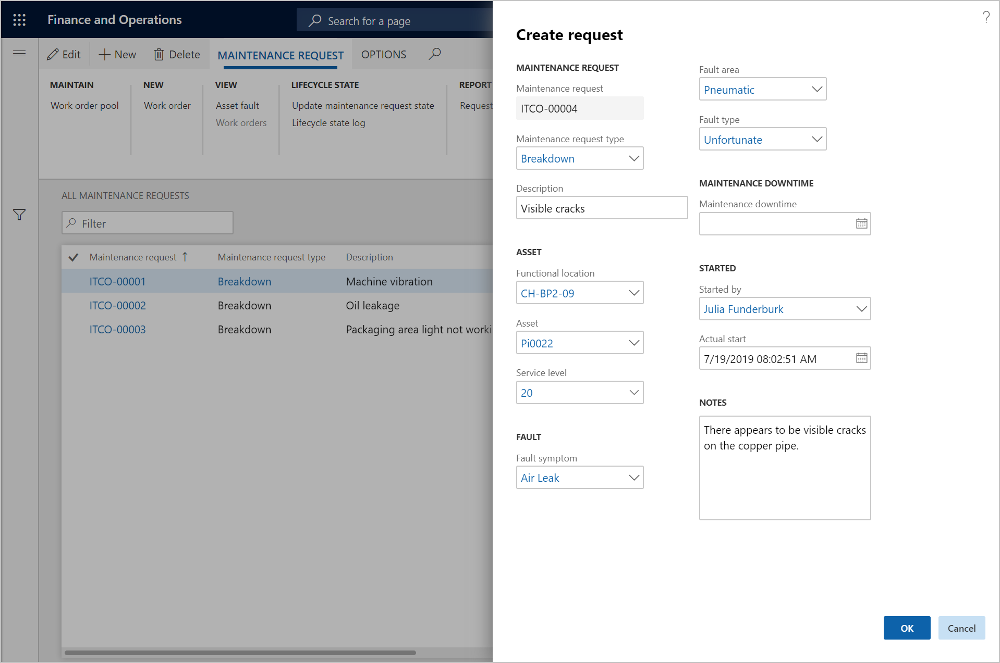

---
# required metadata

title: Create a request
description: This topic explains how to create a maintenance request in Asset Management.
author: josaw1
manager: AnnBe
ms.date: 06/26/2019
ms.topic: article
ms.prod: 
ms.service: dynamics-ax-applications
ms.technology: 

# optional metadata

ms.search.form: CatProcureCatalogEdit, CatProcureCatalogListPage
# ROBOTS: 
audience: Application User
# ms.devlang: 
ms.reviewer: josaw
ms.search.scope: Core, Operations
# ms.tgt_pltfrm: 
ms.custom: 2214
ms.assetid: 2f3e0441-414d-402b-b28b-7ab0d650d658
ms.search.region: Global
# ms.search.industry: 
ms.author: mkirknel
ms.search.validFrom: 2016-02-28
ms.dyn365.ops.version: AX 7.0.0

---

# Create a maintenance request

Maintenance requests can be used if maintenance workers or production workers discover a need for equipment repair, and it is not possible to carry out that repair job right away.

**Example:** A maintenance worker is making a repair. During this repair he discovers that another asset at the same location needs to be serviced, but he has no time or spare parts to carry out the repair job. Therefore, he creates a maintenance request on the asset containing a short description of the problem.

In **All assets** or **Active assets** (**Asset management** > **Common** > **Assets** > **All assets** or **Active assets**), you can see the active maintenance requests attached to the selected asset in the **Related information** pane > **Active maintenance requests** section, placed on the right side of the screen.

1. Click **Asset management** > **Common** > **Maintenance requests** > **All maintenance requests** or **Active maintenance requests**.
2. Click the **New** button.
3. In the **Create request** drop-down dialog, select the maintenance request type in the **Maintenance request type** field. A default type is suggested.
4. Insert a name or title that briefly describes the maintenance request in the **Description** field.
5. Select **Functional location** or **Asset**, or a combination, as required. It is possible to create a maintenance request without selecting an asset. Then the asset is added to the maintenance request later. If the maintenance worker who is logged in to Dynamics 365 for Finance and Operations is related to a resource, which is related to an asset, the **Asset** field is automatically filled out.

- If the selected asset already has maintenance requests attached to it, an info message is shown at the top of the **Create request** drop-down dialog, showing the maintenance request ID of an existing maintenance request. If the asset is covered by a warranty, an info message is also shown.  
- When you select an asset, two or three tabs are available: The **My assets** tab contains assets related to the functional locations to which you (the maintenance worker who is logged on the system) may be allocated. If no functional locations are set up on a maintenance worker in [Maintenance workers and worker groups](../setup-for-objects/workers-and-worker-groups.md), the **My assets** tab will not be visible. The **Active assets** tab contains a list of all assets with asset lifecycle state "Active". 

6. Select a service level regarding the urgency of the request in the **Service level** field.
7. If you have selected an asset, you can create a fault registration by selecting fault data in the **Fault symptom**, **Fault area**, and **Fault type** fields.
8. If the maintenance request has caused a maintenance downtime, insert start date and time.
9. Your name is automatically inserted in the **Started by** field.
10. The **Actual start** field is automatically filled out with current date and time, but you can change it, if required.
11. If required, insert further notes in the **Notes** field.
12. Click **OK**.

## Subsequent processing of the maintenance request

After the maintenance request has been created, and before it is converted to a work order, various data should be updated on the maintenance request. This is typically done by a planner or another administrative employee. In **All maintenance requests** or **Active maintenance requests**, select the request you want to work with, and click **Edit**.

In the Details view, you can update various information. For example you can

- select and verify the asset. If, required it is possible to set the **Asset verified** toggle button to "No" later, to select another object.  
- select responsible group and/or responsible worker. For more information on how to set up responsible workers and worker groups, refer to [Responsible workers](../setup-for-requests/responsible-workers.md).  
- select a job type and, if relevant, the related job variant and job trade.  
- insert geographic coordinates in the **Latitude** and **Longitude** fields. If coordinates are added to a request, they are automatically transferred to a related work order. This information is useful if you work with linear asset management.

The figure below shows a screenshot of the interface.

>[!NOTE]
>If you select an object when you create the request, you can add one fault to the object. After the request has been created, you can add more faults, if required, by clicking the **Object fault** button in **All Requests**.
