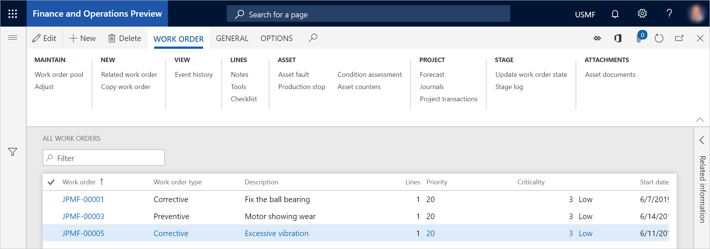

---
# required metadata

title: Create work order from a maintenance request
description: This topic explains how to create a work order from a maintenance request in Asset Management.
author: josaw1
manager: AnnBe
ms.date: 06/26/2019
ms.topic: article
ms.prod: 
ms.service: dynamics-ax-applications
ms.technology: 

# optional metadata

ms.search.form: CatProcureCatalogEdit, CatProcureCatalogListPage
# ROBOTS: 
audience: Application User
# ms.devlang: 
ms.reviewer: josaw
ms.search.scope: Core, Operations
# ms.tgt_pltfrm: 
ms.custom: 2214
ms.assetid: 2f3e0441-414d-402b-b28b-7ab0d650d658
ms.search.region: Global
# ms.search.industry: 
ms.author: mkirknel
ms.search.validFrom: 2016-02-28
ms.dyn365.ops.version: AX 7.0.0

---
# Create work order from a maintenance request

When you have created maintenance requests, you can easily convert the maintenance requests to work orders. The quickest way to work with maintenance requests, update several maintenance requests at a time and subsequently create a work order for several maintenance requests at a time, is described in this procedure. If required, you can also work with one maintenance request at a time and convert one maintenance request to one work order in **Active maintenance requests** or **My functional location maintenance requests**.

>[!NOTE]
>One maintenance request can only be related to one work order, but several maintenance requests can be included in one work order even if the maintenance requests have different assets.

1. Click **Asset management** > **Common** > **maintenance requests** > **All maintenance requests**.
2. Before you can create a work order from a maintenance request, you must as a minimum select a maintenance job type and, if required, a maintenance job type variant and a trade for the maintenance requests for which you want to create a work order. In grid view, you can easily update data for a maintenance request.  
3. When you are ready to create a work order, select the maintenance requests you want to include in one work order.

- If you multi-select several maintenance requests to be converted to one work order, the **Asset** and **Maintenance job type** fields must be filled out before you start creating the work order. If you select one maintenance request to be converted to a work order, the **Asset** field must be filled out before you start creating the work order, but **Maintenance job type** (and if relevant, related **Maintenance job type variant** and **Trade** fields) can be selected in the **Create work order** drop-down dialog box when you create the work order.  

4. Click the **Work order** button.
5. In the **Create work order** drop-down dialog, fill in the fields, and click **OK**.
6. A message may be shown that a new work order has been created.

- If you create a work order based on a maintenance request, and the asset related to the maintenance request is included in a warranty agreement, a message informing you of the warranty agreement will be shown on the screen.  

7. Open the new work order in **Asset management** > **Common** > **Work orders** > **All work orders**.

