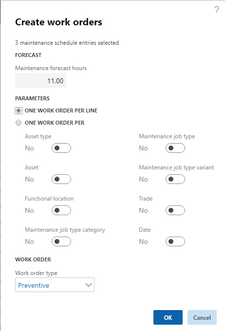

---
# required metadata

title: Creating work orders
description: This topic explains how to create work orders in Asset Management.
author: josaw1
manager: AnnBe
ms.date: 08/27/2019
ms.topic: article
ms.prod: 
ms.service: dynamics-ax-applications
ms.technology: 

# optional metadata

ms.search.form: 
# ROBOTS: 
audience: Application User
# ms.devlang: 
ms.reviewer: josaw
ms.search.scope: Core, Operations
# ms.tgt_pltfrm: 
ms.custom: 
ms.assetid: 
ms.search.region: Global
# ms.search.industry: 
ms.author: mkirknel
ms.search.validFrom: 2019-08-31
ms.dyn365.ops.version: 10.0.5

---

# Creating work orders

[!include [banner](../../includes/banner.md)]

 

When you have scheduled preventive maintenance jobs, next step is to create work orders for the jobs. This is done in one of the maintenance schedules. The scheduled jobs in a maintenance schedule can have different reference types:

| Reference type | Description                    |
|-----------------------|------------------------------------------------------------------------------------------------------------|
| Maintenance plans     | Preventive maintenance jobs based on maintenance plan types "Time" or "Counter".                       |
| Maintenance rounds    | Preventive maintenance jobs containing several assets that require a similar type of maintenance.           |
| Maintenance request   | Manually created request for maintenance or repair of an asset, which can be converted into a work order. |

1. Click **Asset management** > **Common** > **All maintenance schedule** or **Open maintenance schedule lines** or **Open maintenance schedule pools**.

2. Select the scheduled maintenance jobs for which you want to create a work order and click **Work order**. In the **Create work orders** dialog, the total number of forecast hours for the selected lines is shown in the **Maintenance forecast hours** field.

3. In the **Parameters** section, select how many work orders should be created. You can create one work order per maintenance schedule line, or a number of work orders based on your selections in the **One work order per** section.

4. Select a **Work order type** that will be used on all the work orders you create. The illustration below shows an example of the **Create work orders** dialog.

5. Click **OK**. One or more work orders are created.

