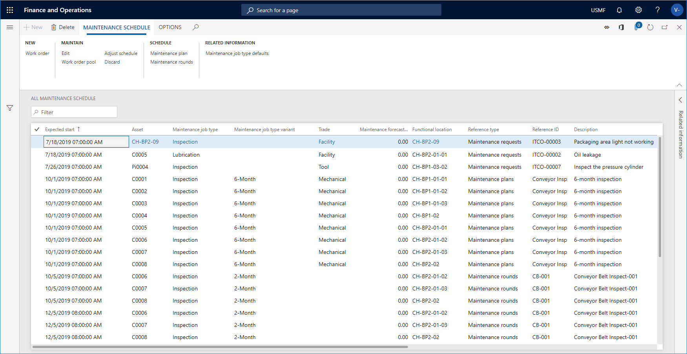

---
# required metadata

title: Objects calendar cost
description: This topic explains object calendar cost in Enterprise Asset Management.
author: josaw1
manager: AnnBe
ms.date: 06/28/2019
ms.topic: article
ms.prod: 
ms.service: dynamics-ax-applications
ms.technology: 

# optional metadata

ms.search.form: CatProcureCatalogEdit, CatProcureCatalogListPage
# ROBOTS: 
audience: Application User
# ms.devlang: 
ms.reviewer: josaw
ms.search.scope: Core, Operations
# ms.tgt_pltfrm: 
ms.custom: 2214
ms.assetid: 2f3e0441-414d-402b-b28b-7ab0d650d658
ms.search.region: Global
# ms.search.industry: 
ms.author: mkirknel
ms.search.validFrom: 2016-02-28
ms.dyn365.ops.version: AX 7.0.0

---

# Object calendar cost

This topic explains object calendar cost in Enterprise Asset Management. In Enterprise Asset Management, you can calculate budget costs on object calendar lines. This is useful if you want to get an overview of expected costs, for example, costs relating to planned preventive maintenance jobs for the next year. The calculations are based on existing object calendar lines of type "Maintenance sequence" or "Round" or "Request".

1. Click **Enterprise asset management** > **Inquiries** > **Objects** > **Object calendar cost**.

2. On the **Object calendar cost** tab, click **Calculate cost**.

3. In the **Object calendar cost control** form, you can select a financial dimension set if you want to see costs grouped in financial dimensions.

>[!NOTE]
>Financial dimension sets are set up in **General ledger** > **Setup** > **Financial dimensions** > **Financial dimension set**.

4. You can use the **Level** field to indicate how detailed you want the object calendar lines to be regarding functional locations. For example, if you insert the number "1" in the field, and you have a multi-level functional location hierarchy, all object calendar lines for a functional location will be shown on the top level, and therefore the hours on a line may be added up from functional locations located at a lower level. If you insert the number "0" in the **Level** field, you will see a detailed result showing all object calendar lines on all the functional location level to which they are related.

5. If you want to make a calculation for specific objects, click **Filter** on the **Records to include** FastTab, and select the relevant objects.

6. Click **OK** to start the calculation.

7. On the **Object calendar cost** tab > the **Group by...** action pane groups, click the relevant buttons to show the required detail level of the calculation. The selected action pane group buttons are highlighted in orange color. Click on a button to activate or deactivate it.

The figure below shows a screenshot of the interface.

